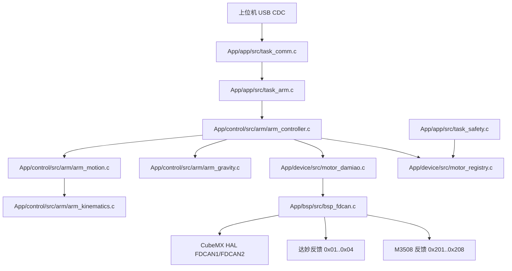

# 达妙机械臂移植设计与开发文档

本文档描述如何把 `/Users/leon/Desktop/damiao_new1` 中的达妙机械臂代码移植到 FengMH，并保持当前项目的分层风格、解耦方式和可测试性。

目标不是把 `damiao_new1/Core/Src/main.c` 里的逻辑整体复制进 FengMH，而是保留已经验证过的电机协议、运动学、重力补偿和安全移动策略，重新拆成 FengMH 的 `bsp / device / service / app` 结构。

## 1. 移植目标

机械臂移植后的能力：

| 能力 | 说明 |
|---|---|
| 达妙电机驱动 | 支持 J1/J2 DM4340、J3/J4 DM4310 的反馈解析、使能、位置速度模式、MIT 模式和零点保存指令 |
| 机械臂运动学 | 支持末端 `x/y/z` 到 4 关节角的 IK，支持当前关节到末端位姿的 FK |
| 重力补偿 | 按当前 J2/J3/J4 几何角计算前馈力矩 |
| 非阻塞安全移动 | 把源工程的阻塞式分阶段移动改成 200Hz 任务中的增量状态机 |
| 上位机控制 | 使用 FengMH 现有 USB CDC 帧协议，新增机械臂下行命令和上行状态 |
| 安全集成 | 接入 `task_safety` 的急停、离线检测、温度/错误码监控 |
| 分阶段上板 | 支持先只收反馈，再单电机使能，再保持，再走目标点 |

不做的事：

- 不复制 `damiao_new1` 的 `main.c` 主循环。
- 不复制 `HAL_FDCAN_RxFifo0Callback()`，继续使用 FengMH 的 `bsp_fdcan_hal_rxfifo0_cb()`。
- 不让协议解析层直接调用 HAL 或直接发电机帧。
- 不在正常启动中自动执行 `DM_Save_Zero()`，防止每次上电覆盖电机零点。
- 不把视觉坐标转换直接接到主控制链路，除非先确认上位机坐标系、相机安装方向和单位。

## 2. 源工程代码清单

| 源文件 | 作用 | 移植策略 |
|---|---|---|
| `Core/Inc/dm4310_posvel.h` | 达妙电机 ID、范围、反馈结构和控制 API | 拆到 `App/device/include/motor_damiao.h` |
| `Core/Src/dm4310_posvel.c` | CAN 发送、MIT 打包、PV 打包、反馈解析、FDCAN 过滤器 | 保留协议打包/解析，去掉 HAL 直接依赖 |
| `Core/Inc/arm_kinematics.h` | 机械臂参数、位姿、关节角、偏移定义 | 改名并放入 `App/control/include/arm/arm_types.h` 与 `arm_kinematics.h` |
| `Core/Src/arm_kinematics.c` | FK/IK，包含背越姿态和限位 | 基本保留数学逻辑，统一命名和错误码 |
| `Core/Inc/gravity_comp.h` | 连杆质量、质心、重力补偿接口 | 移到 `App/control/include/arm/arm_gravity.h` |
| `Core/Src/gravity_comp.c` | J2/J3/J4 重力补偿力矩计算 | 基本保留，参数改成可配置结构 |
| `Core/Src/main.c` | 初始化、保存零点、使能、分阶段安全移动、保持、反馈上报 | 只迁移算法思路，不迁移主循环 |
| `Core/Inc/protocol_handler.h` | 源工程私有协议定义 | 不直接移植，改为扩展 FengMH `proto_defs/task_comm` |
| `Core/Src/protocol_handler.c` | 字节流解析和 USB 发送 | 不移植，FengMH 已有 `proto_frame/proto_dispatch/task_comm` |
| `Core/Inc/vision_transform.h` | 相机坐标转机械臂坐标 | 可选模块，先不进入主控制链路 |
| `Core/Src/vision_transform.c` | m 到 mm、相机偏置、绕 J1 旋转变换 | 后续确认视觉坐标系后移植 |
| `Core/Inc/arm_controller.h` | 很薄的控制器封装 | 不直接移植，重新设计 |
| `Core/Src/arm_controller.c` | 只把协议目标写到全局 `target_pose` | 不直接移植 |

## 3. 当前 FengMH 约束

现有 FengMH 分层：

```text
App/
├── app/{include,src}/       # FreeRTOS 任务和系统初始化
├── control/{include,src}/   # 步态、底盘、运动学、姿态、机械臂控制
├── service/{include,src}/   # 协议、PID 等通用服务
├── device/{include,src}/    # 电机、IMU 等设备驱动
├── bsp/{include,src}/       # HAL 适配和 mock 能力
└── common/{include,src}/    # 公共类型、错误码、日志、配置
```

已经存在的相关能力：

| 模块 | 当前状态 | 机械臂移植影响 |
|---|---|---|
| `bsp_fdcan` | 支持 FDCAN1/FDCAN2，发送 Classic CAN 8B | 需要支持同一总线多个 RX 订阅者 |
| `motor_if` | 已有 `MOTOR_DAMIAO` 枚举 | 需要新增 `motor_damiao` vtable 实现 |
| `motor_registry` | 已预留 `MOTOR_ID_ARM_J1..J6` | J1-J4 当前 bus=3/can_id=0，是无效占位，需要改成真实映射 |
| `task_comm` | 已解析底盘和步态命令 | 需要新增机械臂命令缓存和 handler |
| `proto_defs` | 已有 `PROTO_FUNC_ARM_CMD = 0x11` | 应使用 0x11，不使用源工程的 0x12 |
| `task_safety` | 会遍历 registry，急停时调用 `disable` | 达妙驱动要实现 disable 或明确返回 unsupported |
| `cmake/firmware.cmake` | `APP_INCLUDE_DIRS` / `APP_SOURCE_DIRS` 显式列出 App 模块 | 新增机械臂后必须加入 `control/include/arm` 和 `control/src/arm` |

关键注意点：

1. `damiao_new1` 使用 `FUNC_ARM_CONTROL = 0x12`，但 FengMH 里 `0x12` 已经是 `PROTO_FUNC_GAIT_CMD`。机械臂必须使用 FengMH 已预留的 `PROTO_FUNC_ARM_CMD = 0x11`。
2. `bsp_fdcan_attach_rx()` 目前每条总线只有一个回调槽。M3508 已经在 FDCAN1/FDCAN2 上注册了回调，如果达妙再注册，会覆盖前者。移植前必须把 FDCAN RX 改成多订阅。
3. `bsp_fdcan.c` 当前过滤器代码注释写“接收 0x200~0x20F”，但实际 `FilterID1=0x000, FilterID2=0x700` 按掩码规则更像接收 `0x000~0x0FF`，不能同时干净覆盖 M3508 `0x201/0x202` 和达妙 `0x001..0x004`。移植时要一起修正。
4. 源工程启动时对 1-4 号电机逐个 `DM_Save_Zero()`，正常固件中不能这样做。保存零点必须是专用标定命令，且上位机显式触发。
5. 当前 `/Users/leon/Desktop/damiao_new1` 磁盘源码中 `.ioc/fdcan.c/main.c` 显示的是 `FDCAN1/hfdcan1/PD0-PD1`；但按实机接线和本次移植目标，达妙机械臂接入 FengMH 的 CAN2，也就是 `BSP_FDCAN_2` / `hfdcan2` / `PB5-PB6`。本文档后续实现以 CAN2 为准。

## 4. 目标架构



依赖原则：

- `motor_damiao.c` 只知道 CAN 协议和 motor vtable，不知道机械臂几何尺寸。
- `arm_kinematics.c`、`arm_gravity.c` 不 include HAL，不碰电机对象。
- `arm_motion.c` 只负责目标关节的分阶段轨迹推进，不直接解析 USB。
- `arm_controller.c` 汇总电机反馈、运动规划、重力补偿、保持和安全状态。
- `task_comm.c` 只解析并缓存机械臂命令。
- `task_arm.c` 以固定周期取命令并调用 controller。

## 5. 目标文件结构

新增文件：

```text
App/
├── device/
│   ├── motor_damiao.h
│   └── motor_damiao.c
├── service/
│   └── arm/
│       ├── arm_types.h
│       ├── arm_kinematics.h
│       ├── arm_kinematics.c
│       ├── arm_gravity.h
│       ├── arm_gravity.c
│       ├── arm_motion.h
│       ├── arm_motion.c
│       ├── arm_controller.h
│       ├── arm_controller.c
│       ├── arm_vision_transform.h      # 可选，后续确认视觉坐标系再接入
│       └── arm_vision_transform.c      # 可选
└── app/
    ├── task_arm.h
    └── task_arm.c
```

需要修改的文件：

```text
App/bsp/include/bsp_fdcan.h
App/bsp/src/bsp_fdcan.c
App/common/include/config.h
App/device/src/motor_registry.c
App/service/include/protocol/proto_defs.h
App/app/include/task_comm.h
App/app/src/task_comm.c
App/app/src/app_init.c
App/app/src/app_tasks.c
cmake/firmware.cmake
CMakeLists.txt                  # 如果继续维护根 CMake 的 include_directories 列表，也要加 control/arm
```

## 6. 达妙电机驱动设计

### 6.1 电机映射

从源工程继承的硬件逻辑：

| 关节 | 电机型号 | 达妙 ID | 反馈 CAN ID | 控制基础 ID | 推荐 FengMH logical id |
|---|---|---:|---:|---:|---|
| J1 底座 yaw | DM4340 | 1 | `0x01` | `0x01` | `MOTOR_ID_ARM_J1` |
| J2 大臂 pitch | DM4340 | 2 | `0x02` | `0x02` | `MOTOR_ID_ARM_J2` |
| J3 小臂 | DM4310 | 3 | `0x03` | `0x03` | `MOTOR_ID_ARM_J3` |
| J4 腕部水平补偿 | DM4310 | 4 | `0x04` | `0x04` | `MOTOR_ID_ARM_J4` |

本次移植目标按实机接线使用 `BSP_FDCAN_2`。达妙 ID `0x01..0x04 / 0x101..0x104` 与当前 M3508 反馈 `0x201/0x202` 不冲突，但因为同一条 FDCAN2 上还可能有右侧轮电机反馈，所以仍然必须先完成 FDCAN RX 多订阅和过滤器修正。

如果后续硬件改接 FDCAN1，只需要改 `motor_registry.c` 和 `motor_damiao` 的映射表，不改 service 层。

`motor_registry.c` 中当前机械臂占位是无效的：

```c
{ MOTOR_ID_ARM_J1, MOTOR_DAMIAO, 3, 0x000, ... }
```

应改成实际总线和 ID。本次达妙使用 CAN2：

```c
{ MOTOR_ID_ARM_J1, MOTOR_DAMIAO, BSP_FDCAN_2, 0x001, +1, 0.0f, 1.0f, 0.0f, 0.0f,       DEG2RAD(315.0f), "ARM_J1" },
{ MOTOR_ID_ARM_J2, MOTOR_DAMIAO, BSP_FDCAN_2, 0x002, +1, 0.0f, 1.0f, 0.0f, 0.0f,       PI_F,            "ARM_J2" },
{ MOTOR_ID_ARM_J3, MOTOR_DAMIAO, BSP_FDCAN_2, 0x003, +1, 0.0f, 1.0f, 0.0f, -PI_F,      0.0f,            "ARM_J3" },
{ MOTOR_ID_ARM_J4, MOTOR_DAMIAO, BSP_FDCAN_2, 0x004, +1, 0.0f, 1.0f, 0.0f, -PI_F,      PI_F,            "ARM_J4" },
```

`DEG2RAD` 不能直接用于 `motor_registry.c` 的静态初始化，实际实现时要么用 `PI_F` 表达，要么增加本地宏。

### 6.2 协议常量

目标文件：`App/device/include/motor_damiao.h`

```c
#define DAMIAO_MOTOR_COUNT          4u
#define DAMIAO_PV_MODE_OFFSET       0x100u

#define DAMIAO_CMD_ENABLE_LAST      0xFCu
#define DAMIAO_CMD_DISABLE_LAST     0xFDu
#define DAMIAO_CMD_SAVE_ZERO_LAST   0xFEu

#define DAMIAO_KP_MIN               0.0f
#define DAMIAO_KP_MAX               500.0f
#define DAMIAO_KD_MIN               0.0f
#define DAMIAO_KD_MAX               5.0f
```

电机范围：

```c
typedef struct {
    float p_min_rad;
    float p_max_rad;
    float v_min_rad_s;
    float v_max_rad_s;
    float tau_min_nm;
    float tau_max_nm;
} damiao_range_t;

extern const damiao_range_t DAMIAO_RANGE_DM4310;
extern const damiao_range_t DAMIAO_RANGE_DM4340;
```

范围值来自源工程：

| 型号 | 位置 rad | 速度 rad/s | 力矩 Nm |
|---|---|---|---|
| DM4310 | `[-12.5, 12.5]` | `[-30, 30]` | `[-10, 10]` |
| DM4340 | `[-12.5, 12.5]` | `[-10, 10]` | `[-28, 28]` |

### 6.3 数据结构

```c
typedef enum {
    DAMIAO_MODEL_DM4310 = 0,
    DAMIAO_MODEL_DM4340,
} damiao_model_t;

typedef enum {
    DAMIAO_ERR_NONE           = 0x0,
    DAMIAO_ERR_OVERVOLT       = 0x8,
    DAMIAO_ERR_UNDERVOLT      = 0x9,
    DAMIAO_ERR_OVERCURRENT    = 0xA,
    DAMIAO_ERR_MOS_OVERTEMP   = 0xB,
    DAMIAO_ERR_COIL_OVERTEMP  = 0xC,
    DAMIAO_ERR_COMM_LOST      = 0xD,
    DAMIAO_ERR_OVERLOAD       = 0xE,
} damiao_error_t;

typedef struct {
    uint8_t motor_id;
    damiao_error_t error;
    uint16_t raw_position;
    uint16_t raw_velocity;
    uint16_t raw_torque;
    float position_rad;
    float position_deg;
    float velocity_rad_s;
    float torque_nm;
    uint8_t temp_mos;
    uint8_t temp_rotor;
    uint8_t updated;
} damiao_feedback_t;

typedef struct {
    motor_logical_id_t logical_id;
    damiao_model_t model;
    bsp_fdcan_bus_t bus;
    uint8_t motor_id;
    uint32_t base_can_id;
    uint32_t feedback_can_id;
    damiao_range_t range;
    float zero_offset_raw_rad;
    uint8_t enabled;
    uint32_t tx_cnt;
    uint32_t rx_cnt;
    uint32_t err_cnt;
    damiao_feedback_t feedback;
} damiao_drv_ctx_t;
```

### 6.4 对外 API

```c
app_err_t motor_damiao_init_all(void);

void motor_damiao_fdcan_rx_cb(bsp_fdcan_bus_t bus,
                              const bsp_fdcan_frame_t* frame,
                              void* user);

app_err_t motor_damiao_save_zero(motor_dev_t* dev);

app_err_t motor_damiao_get_feedback(motor_logical_id_t id,
                                    damiao_feedback_t* out);
```

vtable 内部实现：

```c
static int damiao_set_current(motor_dev_t* dev, float iq_a);
static int damiao_set_torque(motor_dev_t* dev, float tau_nm);
static int damiao_set_position(motor_dev_t* dev,
                               float pos_rad,
                               float vel_rad_s,
                               float kp,
                               float kd,
                               float tau_ff_nm);
static int damiao_set_velocity(motor_dev_t* dev, float vel_rad_s);
static int damiao_enable(motor_dev_t* dev);
static int damiao_disable(motor_dev_t* dev);
static int damiao_reset_fault(motor_dev_t* dev);
static int damiao_feed_rx(motor_dev_t* dev, const uint8_t* data, uint8_t dlc);
```

达妙私有函数：

```c
static app_err_t damiao_send_packet(damiao_drv_ctx_t* ctx,
                                    uint32_t can_id,
                                    const uint8_t data[8]);

static app_err_t damiao_send_special(damiao_drv_ctx_t* ctx,
                                     uint8_t last_byte);

static app_err_t damiao_send_posvel(damiao_drv_ctx_t* ctx,
                                    float pos_rad,
                                    float vel_rad_s);

static app_err_t damiao_send_mit(damiao_drv_ctx_t* ctx,
                                 float pos_rad,
                                 float vel_rad_s,
                                 float kp,
                                 float kd,
                                 float tau_ff_nm);

static void damiao_pack_posvel(float pos_rad,
                               float vel_rad_s,
                               uint8_t out[8]);

static void damiao_pack_mit(const damiao_range_t* range,
                            float pos_rad,
                            float vel_rad_s,
                            float kp,
                            float kd,
                            float tau_ff_nm,
                            uint8_t out[8]);

static app_err_t damiao_parse_feedback(damiao_drv_ctx_t* ctx,
                                       const uint8_t data[8]);

static uint16_t damiao_float_to_uint(float x,
                                     float x_min,
                                     float x_max,
                                     uint8_t bits);

static float damiao_uint_to_float(uint16_t x,
                                  float x_min,
                                  float x_max,
                                  uint8_t bits);

static void put_f32_le(uint8_t* dst, float v);
```

### 6.5 源函数映射

| 源函数 | 目标函数 | 说明 |
|---|---|---|
| `DM_PosVel_Init(FDCAN_HandleTypeDef*)` | `motor_damiao_init_all()` | 不再接收 HAL 句柄，使用 `bsp_fdcan` |
| `DM_CAN_Filter_Init()` | `bsp_fdcan_init()` 中统一处理 | 不放在达妙驱动里 |
| `DM_Send_Packet()` | `damiao_send_packet()` | 改为 `bsp_fdcan_send()` |
| `DM_Motor_Enable()` | `damiao_enable()` | vtable `enable` |
| `DM_Save_Zero()` | `motor_damiao_save_zero()` | 只允许标定/调试命令调用 |
| `DM_PosVel_Control()` | `damiao_send_posvel()` | 位置速度模式，位置单位统一为 rad |
| `DM_MIT_Control_4310()` | `damiao_send_mit()` | 型号由 ctx 决定 |
| `DM_MIT_Control_4340()` | `damiao_send_mit()` | 型号由 ctx 决定 |
| `DM_Parse_Feedback()` | `damiao_parse_feedback()` + `motor_damiao_fdcan_rx_cb()` | 反馈写入 `motor_dev_t.state` |
| `float_to_bytes_le()` | `put_f32_le()` | 保留小端 float |
| 源工程 `HAL_FDCAN_RxFifo0Callback()` | 不移植 | 使用 FengMH 现有 HAL 回调桥 |

### 6.6 反馈解析逻辑

源工程反馈格式：

```text
rx[0] high nibble = motor_id
rx[0] low  nibble = error
rx[1:2]           = position raw, uint16
rx[3] + rx[4:7:4] = velocity raw, uint12
rx[4:3:0] + rx[5] = torque raw, uint12
rx[6]             = MOS temp
rx[7]             = rotor temp
```

移植后的解析：

```c
uint16_t raw_pos = ((uint16_t)data[1] << 8) | data[2];
uint16_t raw_vel = ((uint16_t)data[3] << 4) | (data[4] >> 4);
uint16_t raw_tau = (((uint16_t)data[4] & 0x0Fu) << 8) | data[5];

feedback.position_rad = ((float)((int32_t)raw_pos - 32768)) * range->p_max_rad / 32768.0f;
feedback.velocity_rad_s = ((float)((int32_t)raw_vel - 2048)) * range->v_max_rad_s / 2048.0f;
feedback.torque_nm = ((float)((int32_t)raw_tau - 2048)) * range->tau_max_nm / 2048.0f;
```

写回 `motor_dev_t.state`：

```c
dev->state.online = 1;
dev->state.angle_rad = feedback.position_rad;
dev->state.velocity_rads = feedback.velocity_rad_s;
dev->state.torque_nm = feedback.torque_nm;
dev->state.temperature_c = (float)feedback.temp_rotor;
dev->state.last_rx_tick = bsp_time_now_ms();
dev->state.rx_cnt++;
if (feedback.error != DAMIAO_ERR_NONE) {
    dev->state.err_cnt++;
}
```

## 7. FDCAN BSP 必要改造

### 7.1 多 RX 订阅

当前 `bsp_fdcan_attach_rx()` 每条总线只有一个回调。目标是保持外部 API 不变，把内部存储改成每条总线多个槽。

目标头文件补充：

```c
#ifndef BSP_FDCAN_RX_SUB_MAX
#define BSP_FDCAN_RX_SUB_MAX 4u
#endif

typedef struct {
    uint32_t psr;
    uint32_t ecr;
    uint8_t bus_off;
} bsp_fdcan_status_t;

app_err_t bsp_fdcan_get_status(bsp_fdcan_bus_t bus, bsp_fdcan_status_t* out);
app_err_t bsp_fdcan_recover(bsp_fdcan_bus_t bus);
```

目标实现逻辑：

```c
static rx_slot_t s_rx[BSP_FDCAN_BUS_MAX][BSP_FDCAN_RX_SUB_MAX];

app_err_t bsp_fdcan_attach_rx(bsp_fdcan_bus_t bus, bsp_fdcan_rx_cb_t cb, void* user) {
    if (bus >= BSP_FDCAN_BUS_MAX || !cb) return APP_ERR_INVALID_ARG;

    for (uint32_t i = 0; i < BSP_FDCAN_RX_SUB_MAX; i++) {
        if (s_rx[bus][i].cb == cb && s_rx[bus][i].user == user) return APP_OK;
    }

    for (uint32_t i = 0; i < BSP_FDCAN_RX_SUB_MAX; i++) {
        if (s_rx[bus][i].cb == NULL) {
            s_rx[bus][i].cb = cb;
            s_rx[bus][i].user = user;
            return APP_OK;
        }
    }

    return APP_ERR_NO_MEM;
}
```

RX 回调中分发给所有订阅者：

```c
for (uint32_t i = 0; i < BSP_FDCAN_RX_SUB_MAX; i++) {
    if (s_rx[bus][i].cb) {
        s_rx[bus][i].cb(bus, &frame, s_rx[bus][i].user);
    }
}
```

这样 M3508 与达妙可以共用 FDCAN1 或 FDCAN2。

### 7.2 FDCAN 过滤器

达妙需要接收 `0x01..0x04`，M3508 需要接收 `0x201..0x208`。

实现选项：

| 方案 | CubeMX 要求 | 代码复杂度 | 建议 |
|---|---|---|---|
| 接收所有标准帧，驱动层自行筛选 | `StdFiltersNbr=1` 即可 | 低 | 首版推荐 |
| 配置两个标准过滤器：一个 `0x000~0x0FF`，一个 `0x200~0x20F` | `StdFiltersNbr>=2` | 中 | 后续优化 |

首版推荐把 `bsp_fdcan_init()` 中的标准过滤器改成 accept-all：

```c
filter.FilterID1 = 0x000;
filter.FilterID2 = 0x000;  /* mask=0 表示接收所有标准 ID */
HAL_FDCAN_ConfigGlobalFilter(hfdcan,
                             FDCAN_REJECT, FDCAN_REJECT,
                             FDCAN_REJECT_REMOTE,
                             FDCAN_REJECT_REMOTE);
```

驱动层用 `can_id` 筛选自身帧，不会误解析。

## 8. 机械臂通用类型

目标文件：`App/control/include/arm/arm_types.h`

```c
#ifndef APP_SERVICE_ARM_TYPES_H_
#define APP_SERVICE_ARM_TYPES_H_

#include "types.h"
#include "err.h"

#ifdef __cplusplus
extern "C" {
#endif

#define ARM_JOINT_NUM 4u
#define ARM_PI_F 3.1415926535f
#define ARM_DEG2RAD(x) ((x) * ARM_PI_F / 180.0f)
#define ARM_RAD2DEG(x) ((x) * 180.0f / ARM_PI_F)

typedef struct {
    float l2_mm;
    float l3_mm;
} arm_params_t;

typedef struct {
    float theta1_offset_rad;
    float theta2_offset_rad;
    float theta3_offset_rad;
    float theta4_offset_rad;
} arm_offset_config_t;

typedef struct {
    float x_mm;
    float y_mm;
    float z_mm;
    float pitch_rad;
} arm_pose_t;

typedef struct {
    float theta1_geo_rad;
    float theta2_geo_rad;
    float theta3_geo_rad;
    float theta4_geo_rad;
    float theta1_motor_rad;
    float theta2_motor_rad;
    float theta3_motor_rad;
    float theta4_motor_rad;
} arm_joint_angles_t;

typedef enum {
    ARM_STATE_UNINIT = 0,
    ARM_STATE_IDLE,
    ARM_STATE_ENABLING,
    ARM_STATE_HOLD,
    ARM_STATE_MOVING,
    ARM_STATE_ERROR,
    ARM_STATE_ESTOP,
} arm_state_t;

typedef enum {
    ARM_ERR_NONE = 0,
    ARM_ERR_IK_UNREACHABLE,
    ARM_ERR_IK_LIMITED,
    ARM_ERR_MOTOR_OFFLINE,
    ARM_ERR_MOTOR_FAULT,
    ARM_ERR_TIMEOUT,
    ARM_ERR_ESTOP,
    ARM_ERR_BAD_CMD,
} arm_error_t;

typedef struct {
    arm_state_t state;
    arm_error_t error;
    uint8_t online_mask;
    uint8_t enabled_mask;
    uint8_t moving;
    uint8_t reserved;
    arm_pose_t current_pose;
    arm_joint_angles_t current_joint;
    arm_joint_angles_t target_joint;
    uint32_t cmd_seq;
    uint32_t err_flags;
} arm_status_t;

#ifdef __cplusplus
}
#endif

#endif
```

默认参数来自源工程：

```c
static const arm_params_t k_arm_params_default = {
    .l2_mm = 350.0f,
    .l3_mm = 300.0f,
};

static const arm_offset_config_t k_arm_offset_default = {
    .theta1_offset_rad = ARM_DEG2RAD(-157.5f),
    .theta2_offset_rad = ARM_DEG2RAD(8.2f),
    .theta3_offset_rad = ARM_DEG2RAD(171.8f),
    .theta4_offset_rad = ARM_DEG2RAD(90.0f),
};
```

## 9. 运动学模块

目标文件：

```text
App/control/include/arm/arm_kinematics.h
App/control/src/arm/arm_kinematics.c
```

### 9.1 对外 API

```c
app_err_t arm_fk(const arm_params_t* params,
                 const arm_joint_angles_t* angles,
                 arm_pose_t* pose);

app_err_t arm_ik(const arm_params_t* params,
                 const arm_offset_config_t* offset,
                 const arm_pose_t* target,
                 arm_joint_angles_t* angles);

float arm_wrap_to_2pi(float rad);
float arm_wrap_to_pi(float rad);
float arm_clampf(float v, float min_v, float max_v);
```

### 9.2 FK 逻辑

输入是几何角：

```c
float theta23 = angles->theta2_geo_rad + angles->theta3_geo_rad;
float r = params->l2_mm * cosf(angles->theta2_geo_rad)
        + params->l3_mm * cosf(theta23);
pose->x_mm = r * cosf(angles->theta1_geo_rad);
pose->y_mm = r * sinf(angles->theta1_geo_rad);
pose->z_mm = params->l2_mm * sinf(angles->theta2_geo_rad)
           + params->l3_mm * sinf(theta23);
pose->pitch_rad = 0.0f;
```

### 9.3 IK 逻辑

保留源工程的核心能力：

- 先尝试背越姿态，再尝试正向姿态。
- J1 电机角归一化到 `[0, 2PI)`，接近 360 度时并回 0 度。
- J1/J2/J3/J4 都做电机角限位。

限位继承源工程：

| 关节 | 电机角限位 |
|---|---|
| J1 | `0 deg .. 315 deg` |
| J2 | `0 deg .. 180 deg` |
| J3 | `-180 deg .. 0 deg` |
| J4 | `-180 deg .. 180 deg` |

返回值：

| 返回 | 含义 |
|---|---|
| `APP_OK` | IK 成功 |
| `APP_ERR_INVALID_ARG` | 参数为空 |
| `APP_ERR_UNSUPPORTED` | 目标超出臂展 |
| `APP_ERR_PROTO` | 两种姿态都受限或不可达 |

如果需要更明确的错误，可以让 `arm_ik()` 返回 `arm_error_t`，controller 再转成 `app_err_t`。首版建议统一使用 `app_err_t`，并在 `arm_status_t.error` 中保存细分错误。

## 10. 重力补偿模块

目标文件：

```text
App/control/include/arm/arm_gravity.h
App/control/src/arm/arm_gravity.c
```

### 10.1 参数结构

```c
typedef struct {
    float g_m_s2;
    float mass_l2_kg;
    float mass_l3_kg;
    float mass_ee_kg;
    float len_l2_m;
    float len_l3_m;
    float com_r2_x_m;
    float com_r2_y_m;
    float com_r3_x_m;
    float com_r3_y_m;
    float com_r4_m;
    float tau2_sign;
    float tau3_sign;
    float tau4_sign;
} arm_gravity_params_t;

typedef struct {
    arm_gravity_params_t params;
    float com_r2_dist_m;
    float com_r2_angle_rad;
    float com_r3_dist_m;
    float com_r3_angle_rad;
} arm_gravity_ctx_t;
```

默认值来自源工程：

```c
#define ARM_GRAVITY_G_CONST    9.81f
#define ARM_MASS_L2_KG         1.1495f
#define ARM_MASS_L3_KG         0.9438f
#define ARM_MASS_EE_KG         0.1696f
#define ARM_LEN_L2_M           0.35f
#define ARM_LEN_L3_M           0.30f
#define ARM_COM_R2_X_M         0.3003f
#define ARM_COM_R2_Y_M        -0.0059f
#define ARM_COM_R3_X_M         0.2778f
#define ARM_COM_R3_Y_M         0.0246f
#define ARM_COM_R4_M           0.1679f
```

### 10.2 对外 API

```c
app_err_t arm_gravity_init(arm_gravity_ctx_t* ctx,
                           const arm_gravity_params_t* params);

app_err_t arm_gravity_calc(const arm_gravity_ctx_t* ctx,
                           float theta2_rad,
                           float theta3_rad,
                           float theta4_rad,
                           float* tau2_nm,
                           float* tau3_nm,
                           float* tau4_nm);
```

### 10.3 计算逻辑

保留源工程模型：

```c
float theta23 = theta2_rad + theta3_rad;
float theta_ee_abs = theta23 - theta4_rad;

float ee_common = mass_ee * g;
float ee_tau2 = ee_common * (len_l2 * cosf(theta2_rad)
                          + len_l3 * cosf(theta23)
                          + com_r4 * cosf(theta_ee_abs));
float ee_tau3 = ee_common * (len_l3 * cosf(theta23)
                          + com_r4 * cosf(theta_ee_abs));
float ee_tau4 = -ee_common * com_r4 * cosf(theta_ee_abs);
```

controller 中再按关节写入前馈：

| 关节 | 前馈 |
|---|---|
| J1 | `0.0f` |
| J2 | `tau2_nm` |
| J3 | `tau3_nm` |
| J4 | `tau4_nm` |

## 11. 非阻塞安全移动模块

源工程 `Arm_Safe_Move_To_Target()` 是阻塞式：

1. IK 解目标点。
2. J3 单独去 `-45 deg`。
3. J1/J2 移到目标，J3 保持 `-45 deg`，J4 保持当前。
4. J3 到最终角。
5. J4 到最终角。
6. 每步内部 `HAL_Delay(20/25ms)`。

FengMH 中必须改成非阻塞状态机，由 `task_arm` 每 5ms 调一次。

目标文件：

```text
App/control/include/arm/arm_motion.h
App/control/src/arm/arm_motion.c
```

### 11.1 参数

```c
typedef struct {
    float j3_transit_rad;
    float joint_reached_tol_rad;
    uint32_t max_iters_per_stage;

    float stage1_step_j3_rad;
    uint32_t stage1_period_ms;

    float stage2_step_j1_rad;
    float stage2_step_j2_rad;
    uint32_t stage2_period_ms;

    float stage3_step_j3_rad;
    uint32_t stage3_period_ms;

    float stage4_step_j4_rad;
    uint32_t stage4_period_ms;
} arm_motion_params_t;
```

默认值来自源工程：

```c
static const arm_motion_params_t k_arm_motion_default = {
    .j3_transit_rad = ARM_DEG2RAD(-45.0f),
    .joint_reached_tol_rad = ARM_DEG2RAD(2.5f),
    .max_iters_per_stage = 600u,
    .stage1_step_j3_rad = ARM_DEG2RAD(1.0f),
    .stage1_period_ms = 20u,
    .stage2_step_j1_rad = ARM_DEG2RAD(0.8f),
    .stage2_step_j2_rad = ARM_DEG2RAD(0.25f),
    .stage2_period_ms = 25u,
    .stage3_step_j3_rad = ARM_DEG2RAD(0.8f),
    .stage3_period_ms = 20u,
    .stage4_step_j4_rad = ARM_DEG2RAD(0.8f),
    .stage4_period_ms = 20u,
};
```

### 11.2 状态与 API

```c
typedef enum {
    ARM_MOTION_IDLE = 0,
    ARM_MOTION_SOLVE_IK,
    ARM_MOTION_STAGE_J3_TRANSIT,
    ARM_MOTION_STAGE_J1_J2,
    ARM_MOTION_STAGE_J3_FINAL,
    ARM_MOTION_STAGE_J4_FINAL,
    ARM_MOTION_DONE,
    ARM_MOTION_ERROR,
} arm_motion_stage_t;

typedef struct {
    arm_motion_params_t params;
    arm_motion_stage_t stage;
    arm_pose_t target_pose;
    arm_joint_angles_t q_target;
    arm_joint_angles_t q_cmd;
    arm_joint_angles_t q_stage;
    uint32_t last_step_ms;
    uint32_t iter;
    arm_error_t last_error;
    uint8_t active;
} arm_motion_ctx_t;
```

```c
app_err_t arm_motion_init(arm_motion_ctx_t* ctx,
                          const arm_motion_params_t* params);

app_err_t arm_motion_start_pose(arm_motion_ctx_t* ctx,
                                const arm_params_t* arm_params,
                                const arm_offset_config_t* offset,
                                const arm_pose_t* target,
                                const arm_joint_angles_t* current);

app_err_t arm_motion_start_joints(arm_motion_ctx_t* ctx,
                                  const arm_joint_angles_t* target,
                                  const arm_joint_angles_t* current);

app_err_t arm_motion_step(arm_motion_ctx_t* ctx,
                          uint32_t now_ms,
                          const arm_joint_angles_t* feedback,
                          arm_joint_angles_t* cmd_out);

void arm_motion_stop(arm_motion_ctx_t* ctx);

uint8_t arm_motion_busy(const arm_motion_ctx_t* ctx);
arm_motion_stage_t arm_motion_stage(const arm_motion_ctx_t* ctx);
arm_error_t arm_motion_error(const arm_motion_ctx_t* ctx);
```

### 11.3 每步推进逻辑

工具函数：

```c
static float arm_clamp_step(float target, float current, float max_step) {
    float diff = target - current;
    if (diff > max_step) diff = max_step;
    if (diff < -max_step) diff = -max_step;
    return current + diff;
}

static uint8_t arm_joint_close_enough(const arm_joint_angles_t* a,
                                      const arm_joint_angles_t* b,
                                      float tol_rad);
```

`arm_motion_step()` 行为：

1. 如果 `ctx->active == 0`，返回 `APP_ERR_BUSY` 或 `APP_OK` 且不输出新命令。
2. 如果当前阶段未到发送周期，返回 `APP_OK` 且 `cmd_out` 标记无更新。
3. 用反馈判断是否到位。
4. 到位后进入下一阶段，重新读取当前反馈作为新阶段起点。
5. 未到位时按当前阶段允许的关节步长推进 `q_cmd`。
6. 超过 `max_iters_per_stage` 后进入 `ARM_MOTION_ERROR`。

阶段生成方式：

| 阶段 | 目标关节 |
|---|---|
| `ARM_MOTION_STAGE_J3_TRANSIT` | 当前 J1/J2/J4，J3=`-45 deg` |
| `ARM_MOTION_STAGE_J1_J2` | J1/J2=目标，J3=`-45 deg`，J4=当前 |
| `ARM_MOTION_STAGE_J3_FINAL` | J1/J2/J3=目标，J4=当前 |
| `ARM_MOTION_STAGE_J4_FINAL` | J4=目标，其余保持反馈或目标 |

这个模块不发送 CAN，只输出下一帧应发送的关节命令。

## 12. 机械臂控制器

目标文件：

```text
App/control/include/arm/arm_controller.h
App/control/src/arm/arm_controller.c
```

### 12.1 配置

```c
typedef struct {
    arm_params_t arm_params;
    arm_offset_config_t offset;
    arm_gravity_params_t gravity;
    arm_motion_params_t motion;
    float kp_dm4340;
    float kd_dm4340;
    float kp_dm4310;
    float kd_dm4310;
    float default_speed_rad_s;
    uint32_t hold_resend_ms;
    uint8_t enable_on_start;
    uint8_t allow_save_zero;
} arm_controller_config_t;
```

默认值：

```c
static const arm_controller_config_t k_arm_controller_default = {
    .kp_dm4340 = 100.0f,
    .kd_dm4340 = 1.5f,
    .kp_dm4310 = 100.0f,
    .kd_dm4310 = 1.5f,
    .default_speed_rad_s = 0.0f,
    .hold_resend_ms = 20u,
    .enable_on_start = 0u,
    .allow_save_zero = 0u,
};
```

### 12.2 对外 API

```c
app_err_t arm_controller_init(const arm_controller_config_t* cfg);

app_err_t arm_controller_enable(void);
app_err_t arm_controller_disable(void);
app_err_t arm_controller_stop(void);
app_err_t arm_controller_hold_current(void);

app_err_t arm_controller_set_target_pose(const arm_pose_t* pose,
                                         float speed_scale,
                                         uint32_t seq);

app_err_t arm_controller_set_target_joints(const float joint_rad[ARM_JOINT_NUM],
                                           float speed_scale,
                                           uint32_t seq);

app_err_t arm_controller_set_suction(uint8_t on);

app_err_t arm_controller_request_save_zero(uint8_t joint_mask);

app_err_t arm_controller_step(uint32_t now_ms);

app_err_t arm_controller_get_status(arm_status_t* out);

app_err_t arm_controller_get_feedback_payload(payload_arm_state_t* out);
```

### 12.3 内部函数

```c
static app_err_t arm_controller_read_feedback(arm_joint_angles_t* out);

static app_err_t arm_controller_send_setpoint_safe_order(const arm_joint_angles_t* cmd);

static app_err_t arm_controller_send_joint(motor_logical_id_t id,
                                           float pos_rad,
                                           float vel_rad_s,
                                           float kp,
                                           float kd,
                                           float tau_ff_nm);

static app_err_t arm_controller_calc_gravity(const arm_joint_angles_t* cmd,
                                             float* tau2,
                                             float* tau3,
                                             float* tau4);

static uint8_t arm_controller_all_motors_online(void);
static uint8_t arm_controller_any_motor_fault(void);
static void arm_controller_update_pose_from_feedback(void);
```

### 12.4 控制器周期逻辑

`task_arm` 每 5ms 调用：

```c
void task_arm_entry(void* arg) {
    for (;;) {
        uint32_t now = (uint32_t)bsp_time_now_ms();
        task_comm_arm_cmd_t cmd;

        if (task_comm_get_arm(&cmd) && cmd.seq != s_last_seq) {
            arm_controller_apply_cmd(&cmd);
            s_last_seq = cmd.seq;
        }

        arm_controller_step(now);
        task_arm_maybe_send_state(now);
        osDelay(5);
    }
}
```

`arm_controller_step()`：

1. 检查 `task_safety_estop_active()`，若急停则进入 `ARM_STATE_ESTOP` 并 disable。
2. 读取 J1-J4 反馈，更新 `arm_status_t`。
3. 如果有正在执行的 motion，调用 `arm_motion_step()` 得到下一组关节命令。
4. 如果 motion 输出了新命令，则计算重力补偿并按安全顺序发电机。
5. 如果 idle 且有 last command，则每 `hold_resend_ms` 重发保持命令。
6. 如果电机离线或达妙错误码非 0，进入 `ARM_STATE_ERROR`。

安全发送顺序继承源工程：

```text
J3 -> J2 -> J1 -> J4
```

对应函数：

```c
static app_err_t arm_controller_send_setpoint_safe_order(const arm_joint_angles_t* cmd) {
    float tau2 = 0.0f;
    float tau3 = 0.0f;
    float tau4 = 0.0f;

    arm_controller_calc_gravity(cmd, &tau2, &tau3, &tau4);

    arm_controller_send_joint(MOTOR_ID_ARM_J3, cmd->theta3_motor_rad, 0.0f, kp4310, kd4310, tau3);
    arm_controller_send_joint(MOTOR_ID_ARM_J2, cmd->theta2_motor_rad, 0.0f, kp4340, kd4340, tau2);
    arm_controller_send_joint(MOTOR_ID_ARM_J1, cmd->theta1_motor_rad, 0.0f, kp4340, kd4340, 0.0f);
    arm_controller_send_joint(MOTOR_ID_ARM_J4, cmd->theta4_motor_rad, 0.0f, kp4310, kd4310, tau4);
    return APP_OK;
}
```

这里不使用 `HAL_Delay(1)`。四帧在同一个 5ms 周期内顺序调用 `bsp_fdcan_send()`，由 FDCAN TX FIFO 排队。若后续实测需要 1ms 间隔，可把 controller 增加一个 `send_substage`，跨多个 task tick 分开发。

## 13. 任务层设计

目标文件：

```text
App/app/include/task_arm.h
App/app/src/task_arm.c
```

### 13.1 对外 API

```c
void task_arm_init(void);
void task_arm_entry(void* arg);

uint32_t task_arm_cmd_seq(void);
uint32_t task_arm_last_cmd_ms(void);
void task_arm_get_status(arm_status_t* out);
```

### 13.2 app_init 修改

`App/app/src/app_init.c`：

```c
#include "motor_damiao.h"
#include "arm_controller.h"

...
motor_registry_init();
motor_go_init_all();
motor_m3508_init_all();
motor_damiao_init_all();
...
arm_controller_init(NULL);
```

当前固件不再保留按编译期 stage 宏切换的板级验证路径。
机械臂接入时应进入正常 `app_init()` 初始化链路，调试限制放在上位机命令、
`task_arm` 状态机或安全层里做运行期 gating。

### 13.3 app_tasks 修改

`App/app/src/app_tasks.c`：

```c
#include "task_arm.h"

static const osThreadAttr_t s_attr_arm = {
    .name = "t_arm",
    .stack_size = 2048,
    .priority = osPriorityHigh,
};

...
task_arm_init();
...
osThreadNew(task_arm_entry, NULL, &s_attr_arm);
```

机械臂任务优先级建议与底盘相同或略低。首版推荐 `osPriorityHigh`，周期 `5ms`。

## 14. 上位机协议设计

FengMH 帧格式保持不变：

```text
0x55 0xAA | FuncID | Len | Payload | Checksum
Checksum = Byte0..Byte(4+Len-1) 累加低 8 位
```

### 14.1 FuncID

| 方向 | FuncID | 名称 | 说明 |
|---|---:|---|---|
| 下行 | `0x11` | `PROTO_FUNC_ARM_CMD` | 机械臂统一命令，使用 FengMH 已预留 ID |
| 上行 | `0x86` | `PROTO_FUNC_ARM_STATE` | 机械臂状态 |

不要使用源工程的 `FUNC_ARM_CONTROL = 0x12`，因为 `0x12` 在 FengMH 已经是步态命令。

需要在 `App/service/include/protocol/proto_defs.h` 添加：

```c
#define PROTO_FUNC_ARM_STATE 0x86
```

### 14.2 下行 payload

目标结构：

```c
#define PROTO_ARM_CMD_STOP        0u
#define PROTO_ARM_CMD_POSE_MM     1u
#define PROTO_ARM_CMD_JOINT_RAD   2u
#define PROTO_ARM_CMD_HOLD        3u
#define PROTO_ARM_CMD_ENABLE      4u
#define PROTO_ARM_CMD_DISABLE     5u
#define PROTO_ARM_CMD_SAVE_ZERO   6u
#define PROTO_ARM_CMD_SUCTION     7u

typedef struct __attribute__((packed)) {
    uint8_t cmd_type;
    uint8_t flags;
    uint8_t joint_mask;
    uint8_t reserved;
    float a;
    float b;
    float c;
    float d;
    float speed_scale;
} payload_arm_cmd_t;  /* len = 24 */
```

字段解释：

| `cmd_type` | `a` | `b` | `c` | `d` | `speed_scale` | 说明 |
|---|---|---|---|---|---|---|
| `STOP` | 忽略 | 忽略 | 忽略 | 忽略 | 忽略 | 停止 motion，进入 hold 或 disable 由 flags 决定 |
| `POSE_MM` | x mm | y mm | z mm | pitch rad，首版可忽略 | `0..1` | 上位机发末端目标点 |
| `JOINT_RAD` | J1 rad | J2 rad | J3 rad | J4 rad | `0..1` | 直接关节目标 |
| `HOLD` | 忽略 | 忽略 | 忽略 | 忽略 | 忽略 | 保持当前位置或上一条命令 |
| `ENABLE` | 忽略 | 忽略 | 忽略 | 忽略 | 忽略 | 使能 J1-J4 |
| `DISABLE` | 忽略 | 忽略 | 忽略 | 忽略 | 忽略 | 失能 J1-J4 |
| `SAVE_ZERO` | 忽略 | 忽略 | 忽略 | 忽略 | 忽略 | 仅对 `joint_mask` 中的关节保存零点 |
| `SUCTION` | `0/1` | 忽略 | 忽略 | 忽略 | 忽略 | 吸盘开关 |

`joint_mask`：

```text
bit0 = J1
bit1 = J2
bit2 = J3
bit3 = J4
```

`SAVE_ZERO` 必须同时满足：

- 当前固件处于专用标定 stage，或 `arm_controller_config_t.allow_save_zero=1`。
- 上位机明确发送 `SAVE_ZERO`。
- 不在正常启动自动执行。

### 14.3 task_comm 修改

`App/app/include/task_comm.h` 添加：

```c
typedef struct {
    uint8_t cmd_type;
    uint8_t flags;
    uint8_t joint_mask;
    float a;
    float b;
    float c;
    float d;
    float speed_scale;
    uint32_t seq;
    uint32_t rx_ms;
} task_comm_arm_cmd_t;

void task_comm_get_arm(task_comm_arm_cmd_t* out);
```

`App/app/src/task_comm.c` 添加 handler：

```c
static task_comm_arm_cmd_t s_arm;

static int handle_arm(const uint8_t* p, uint8_t len) {
    if (len != sizeof(payload_arm_cmd_t)) return -1;

    payload_arm_cmd_t cmd;
    memcpy(&cmd, p, sizeof(cmd));

    s_arm.cmd_type = cmd.cmd_type;
    s_arm.flags = cmd.flags;
    s_arm.joint_mask = cmd.joint_mask;
    s_arm.a = cmd.a;
    s_arm.b = cmd.b;
    s_arm.c = cmd.c;
    s_arm.d = cmd.d;
    s_arm.speed_scale = cmd.speed_scale;
    s_arm.seq++;
    s_arm.rx_ms = (uint32_t)bsp_time_now_ms();
    s_last_rx_ms = s_arm.rx_ms;
    return 0;
}
```

分发表加入：

```c
static const proto_entry_t s_tbl[] = {
    { PROTO_FUNC_CHASSIS_CMD, 0, handle_chassis, "chassis" },
    { PROTO_FUNC_ARM_CMD, sizeof(payload_arm_cmd_t), handle_arm, "arm" },
    { PROTO_FUNC_GAIT_CMD, sizeof(payload_gait_cmd_t), handle_gait, "gait" },
};
```

### 14.4 上行状态 payload

保持 payload 不超过当前 `PROTO_MAX_PAYLOAD = 64`。

```c
typedef struct __attribute__((packed)) {
    uint8_t state;
    uint8_t error;
    uint8_t online_mask;
    uint8_t moving;
    uint32_t cmd_seq;
    float pose_x_mm;
    float pose_y_mm;
    float pose_z_mm;
    float joint_rad[4];
    uint32_t err_flags;
} payload_arm_state_t;  /* len = 44 */
```

发送周期建议 `20Hz`，与电机状态轮询频率一致。速度、力矩和温度不放在此帧里，继续由 `PROTO_FUNC_MOTOR_STATE = 0x81` 逐电机上报；如果后续上位机需要完整 4 关节遥测，可以再加一个 `PROTO_FUNC_ARM_DETAIL_STATE`。

## 15. 视觉坐标转换模块

源工程 `vision_transform` 目前存在单位和使用链路不一致：

- 注释说上位机相机输入是 `m`。
- `Protocol_ApplyArmTarget()` 同时把 `x/y/z` 写给 `arm_target` 和 `vision_camera_data`。
- 主循环实际调用 `Arm_Safe_Move_To_Target(mac_cmd.x, mac_cmd.y, mac_cmd.z)`，没有稳定使用 `vision_world_data`。

因此首版不把视觉转换接入机械臂主控制。

后续如果上位机发送的是相机坐标目标，可新增：

```text
App/control/include/arm/arm_vision_transform.h
App/control/src/arm/arm_vision_transform.c
```

API：

```c
typedef struct {
    float camera_offset_x_mm;
    float camera_offset_y_mm;
    float camera_offset_z_mm;
} arm_vision_transform_config_t;

app_err_t arm_vision_camera_to_base(const arm_vision_transform_config_t* cfg,
                                    const arm_pose_t* camera_target_m,
                                    const arm_joint_angles_t* current_joint,
                                    const arm_pose_t* current_end_pose_mm,
                                    arm_pose_t* base_target_mm);
```

接入前必须确认：

1. 上位机发送的是机械臂基座坐标、机身坐标、相机坐标，还是世界坐标。
2. 单位是 `m` 还是 `mm`。
3. 相机光心相对末端的真实安装偏置。
4. 机械臂 J1 角和整机 yaw 是否同时参与坐标变换。

## 16. CubeMX 手动调整清单

这一节是需要你在 CubeMX 里人工确认或修改的内容。

### 16.1 本次机械臂接 FDCAN2

当前 FengMH 已经配置 FDCAN2，按本次达妙实机接线应使用它：

| 项 | 当前 FengMH | 本次移植建议 |
|---|---|---|
| 外设 | FDCAN2 | 使用 CAN2 |
| 引脚 | PB5 RX / PB6 TX | 保持，并确认机械臂 CAN 收发器接在 PB5/PB6 |
| Nominal bitrate | 1 Mbps | 保持 |
| Prescaler | 3 | 保持 |
| Seg1/Seg2/SJW | 29 / 10 / 10 | 保持 |
| Frame | Classic CAN | 保持 |
| Rx FIFO0 elements | 4 | 首版保持，若反馈丢帧可加到 8 |
| Tx FIFO queue elements | 4 | 首版保持，若 J1-J4 同周期发送拥塞可加到 8 |
| NVIC priority | 5 | 保持 5 |

如果采用“接收所有标准帧，驱动层筛选”的过滤方式，CubeMX 中 `StdFiltersNbr=1` 可以不改。

如果采用“两条精确标准过滤器”的方式，需要在 CubeMX 里把对应 FDCAN 的 `StdFiltersNbr` 改为至少 `2`，否则运行时配置第二个 filter 可能失败。

### 16.2 源工程外设号差异说明

我在 `/Users/leon/Desktop/damiao_new1` 当前磁盘源码里核对到的是：

| 文件 | 看到的配置 |
|---|---|
| `damiao_new1.ioc` | 只启用 `FDCAN1`，引脚 `PD0/PD1` |
| `Core/Src/fdcan.c` | 只有 `hfdcan1` 和 `MX_FDCAN1_Init()` |
| `Core/Src/main.c` | 调用 `MX_FDCAN1_Init()`、`DM_PosVel_Init(&hfdcan1)`，所有达妙发送都用 `&hfdcan1` |

这说明源工程文件本身不能作为 FengMH 的 CAN 外设号依据。FengMH 移植应以你当前实机接线为准：达妙接 CAN2，因此目标代码使用 `BSP_FDCAN_2`。如果后续你确认另一个版本的达妙工程确实是 FDCAN2，可以再把该版本路径补给我做二次核对。

### 16.3 如果需要第三条 CAN

当前 FengMH 只启用了 FDCAN1 和 FDCAN2。若你希望机械臂独占第三条 CAN：

1. 先确认 STM32H723 当前封装和 PCB 是否引出了 FDCAN3 RX/TX。
2. 确认板上有对应 CAN 收发器。
3. 在 CubeMX 启用 FDCAN3，设置同样 1 Mbps Classic CAN。
4. 在 `bsp_fdcan_bus_t` 增加 `BSP_FDCAN_3`。
5. 在 `bsp_fdcan.c` 增加 `hfdcan3` 句柄映射和 HAL 回调桥。

首版不建议走 FDCAN3，除非硬件已经明确支持。

### 16.4 吸盘/末端执行器 GPIO

源工程只有 `ArmController_SetSuction(bool on)` 的软件状态，没有看到明确 GPIO 引脚。若要控制吸盘、电磁阀或真空泵，需要你在 CubeMX 中新增一个实际引脚：

| 项 | 建议 |
|---|---|
| Pin mode | GPIO Output |
| User Label | `ARM_SUCTION_EN` |
| 初始电平 | Reset / Low |
| Pull | No Pull，按硬件电路决定 |
| Speed | Low |

如果真空泵需要调速而不是开关，需要改为 Timer PWM 输出，并在 `App/bsp` 增加一个简单的 actuator BSP。

### 16.5 不要从源工程照搬的 CubeMX 项

| 源工程项 | FengMH 处理 |
|---|---|
| `NVIC.FDCAN1_IT0_IRQn` priority 0 | 不要照搬，FreeRTOS 下保持当前 priority 5 |
| `TIM6` 作为 HAL timebase | 不要照搬，FengMH 当前是 `TIM1` |
| 只启用 FDCAN1 | 不要删除 FengMH 的 FDCAN2 |
| USB CDC HS 配置 | FengMH 已经验证过 USB CDC，除非重新生成破坏了文件，否则不改 |

### 16.6 CubeMX 生成后必须检查

每次 CubeMX 重新生成后检查：

```text
Core/Src/main.c              # USER CODE 区是否保留 app_init/app_tasks 入口和 FDCAN 回调桥
Core/Src/fdcan.c             # FDCAN1/FDCAN2 timing、FIFO、filter number
Core/Inc/fdcan.h             # hfdcan1/hfdcan2 是否仍存在
Core/Src/stm32h7xx_it.c      # FDCAN1_IT0/FDCAN2_IT0 IRQ handler 是否仍调用 HAL_FDCAN_IRQHandler
Core/Src/freertos.c          # app_tasks_create 是否仍在 FreeRTOS 初始化流程中
CMakeLists.txt               # CubeMX 是否重置 include/source 列表
cmake/firmware.cmake         # APP_INCLUDE_DIRS / APP_SOURCE_DIRS 是否保留 control arm 和 damiao
```

## 17. 工程配置修改

当前固件只维护正常运行路径，不再新增编译期 stage 宏。
机械臂验证阶段需要的限制应作为运行期状态机或上位机命令权限实现。

`cmake/firmware.cmake` 中 `APP_INCLUDE_DIRS` / `APP_SOURCE_DIRS` 添加：

```cmake
control/include/arm
control/src/arm
```

如果继续维护根 `CMakeLists.txt` 的 `include_directories(...)` 长列表，也把下面路径加进去：

```text
App/control/include/arm
```

## 18. 上板验证计划

### 18.1 Host/mock 单元测试

先在 host 或 mock 下测这些纯逻辑：

| 测试 | 内容 |
|---|---|
| 达妙 MIT 打包 | 给定 pos/vel/kp/kd/tau，检查 8 字节输出 |
| 达妙 PV 打包 | 检查两个 little-endian float |
| 达妙反馈解析 | 注入 8 字节反馈，检查 position/velocity/torque |
| FDCAN 多订阅 | 同一 bus 注册 M3508 和 Damiao，注入两类 ID，双方都能收到 |
| IK 可达点 | `286.2,118.5,196.4` 等源工程启动点应 IK 成功 |
| IK 不可达点 | 超出臂展应返回错误，不发电机 |
| motion 状态机 | 多次 step 后阶段按预期推进，不阻塞 |
| 协议解析 | `0x11 len=24` 能更新 arm cmd seq，`0x12` 仍是 gait |

### 18.2 板上验证

阶段 1：总线与反馈

- 初始化 FDCAN 和达妙驱动。
- 不使能电机，不发位置命令。
- 上位机读取 `PROTO_FUNC_ARM_STATE` 和 `PROTO_FUNC_MOTOR_STATE`。
- 手动转动关节，确认 J1-J4 反馈角、速度、温度在变化。

阶段 2：使能/失能

- 只允许 `ENABLE/DISABLE`。
- 建议先 `joint_mask=0x01` 单独 J1，再逐个验证。
- 不执行 `SAVE_ZERO`。

阶段 3：当前位置保持

- 读取当前反馈作为 hold command。
- 低 KP/KD 或零力矩模式保持。
- 检查电机不乱跳、错误码为 0。

阶段 4：小位移 POSE

- 发送一个离当前姿态很近的 `POSE_MM`。
- 观察状态机阶段、关节方向、J3 过渡姿态。
- 再测试源工程启动点 `x=286.2, y=118.5, z=196.4`。

阶段 5：正常固件

- 打开上位机完整命令。
- 禁止普通启动自动 `SAVE_ZERO`。
- 确认急停能 disable 或至少停止继续发运动命令。

## 19. 推荐实现顺序

1. 改 `bsp_fdcan` 多订阅和过滤器。
2. 新增 `motor_damiao`，完成帧打包、反馈解析、registry 绑定。
3. 新增 `control/arm` 的 types、kinematics、gravity。
4. 新增 `arm_motion` 非阻塞状态机。
5. 新增 `arm_controller`，先支持 hold 和 joint target，再支持 pose target。
6. 扩展 `proto_defs/task_comm`，实现 `0x11` 机械臂命令缓存。
7. 新增 `task_arm`，接入 `app_init/app_tasks`。
8. 修改 CMake `APP_INCLUDE_DIRS` / `APP_SOURCE_DIRS`。
9. 做 host/mock 单测。
10. 按运行期安全状态机逐步上板验证。

## 20. 风险与决策记录

| 风险 | 处理 |
|---|---|
| 达妙和 M3508 共用 CAN 总线时回调覆盖 | 先改 `bsp_fdcan` 多订阅 |
| 当前 FDCAN filter 不能同时覆盖 `0x01..0x04` 和 `0x201..0x208` | 首版用 accept-all 标准帧，驱动层筛选 |
| 正常启动保存零点导致机械臂零位被覆盖 | `SAVE_ZERO` 只允许标定命令触发 |
| 源工程大量 `HAL_Delay` 阻塞 | 改成 `task_arm` 5ms 周期状态机 |
| 源工程机械臂协议 ID 与 FengMH 步态冲突 | 机械臂使用 `0x11`，步态保留 `0x12` |
| 视觉坐标转换单位不清晰 | 先不接入主链路，独立成可选模块 |
| J1-J4 安装方向和偏移可能与实机不完全一致 | 保留源工程偏移作为默认，上板验证时通过反馈和小步命令校验 |
| 吸盘没有明确硬件引脚 | 文档单独列 CubeMX GPIO 要求，等硬件引脚确认再实现 |
