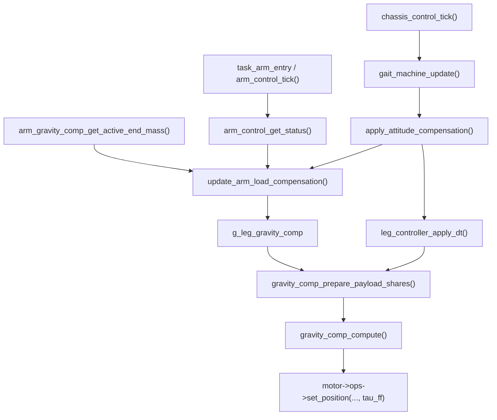

# 机械臂姿态到底盘腿部补偿代码图

本文档描述当前第一版“机械臂载荷 -> 底盘腿部前馈力矩”的实现。它是准静态补偿：根据机械臂末端位置估算等效质心，把机械臂/末端载荷按质心投影分配到支撑腿，再沿用腿控制器现有的 `tau_ff` 下发路径。

默认不开启。并且 MCU 构建中 `APP_CHASSIS_COMP_FORCE_DISABLE=(!APP_TARGET_HOST)` 默认会把机械臂载荷补偿、姿态补偿和腿部 `tau_ff` 补偿全部编译期关掉；上板调试前需要确认编译期开关允许补偿路径，再逐步打开 `g_chassis_arm_load_comp.enable`。

关闭该开关、编译期强制关闭或失去有效机械臂姿态时，下位机会清掉写入腿控制器的 payload 载荷，避免继续使用旧姿态补偿。

## 1. 控制链路



## 2. 关键函数和作用

| 文件 | 函数/变量 | 作用 |
|---|---|---|
| `App/common/include/config.h` | `APP_CHASSIS_COMP_FORCE_DISABLE` | MCU 默认强制关闭补偿路径；host 单测默认允许。 |
| `App/control/src/chassis/chassis_control.c` | `update_arm_load_compensation()` | 每个底盘 tick 读取机械臂末端位置和末端质量，估算等效载荷质心，写入腿部补偿入口。 |
| `App/control/src/chassis/chassis_control.c` | `arm_load_select_end_pose()` | 优先选择实测 FK 末端坐标；没有实测时回退到规划末端坐标。 |
| `App/control/src/chassis/chassis_control.c` | `arm_load_filter_update()` | 对载荷总质量和质心做一阶滤波，避免机械臂目标突变导致腿部前馈跳变。 |
| `App/control/src/chassis/chassis_control.c` | `arm_load_release_leg_comp()` | 关闭补偿或姿态无效时释放 payload 载荷，防止旧补偿滞留。 |
| `App/control/include/chassis/chassis_control.h` | `g_chassis_arm_load_comp` | 机械臂到底盘补偿的现场调参/观测入口。 |
| `App/control/src/leg/leg_controller.c` | `gravity_comp_prepare_payload_shares()` | 根据 `g_leg_gravity_comp` 把总载荷分到本周期支撑腿。 |
| `App/control/src/leg/leg_controller.c` | `gravity_comp_prepare_com_payload()` | 按质心投影分配：前伸增加前腿，左偏增加左腿。 |
| `App/control/src/leg/leg_controller.c` | `gravity_comp_compute()` | 将每条腿分到的等效质量转换成 hip/knee `tau_ff`。 |
| `App/control/include/leg/leg_controller.h` | `g_leg_gravity_comp` | 腿控制器通用重力/载荷补偿入口，新增了质心分配字段。 |

## 3. 当前补偿模型

机械臂侧输入：

- 末端坐标：`measured_end_x/y/z` 优先；没有新鲜电机反馈时使用 `planned_end_x/y/z`。
- 末端质量：`arm_gravity_comp_get_active_end_mass()`，会随吸泵空载/带载状态平滑变化。
- 连杆质量：默认包含 `g_arm_gc_mass_l2_kg + g_arm_gc_mass_l3_kg`。

等效质心估计：

```c
total_mass = end_mass + link2_mass + link3_mass;
com_x = arm_mount_x_m + end_x * end_to_com_ratio;
com_y = arm_mount_y_m + end_y * end_to_com_ratio;
```

`end_to_com_ratio` 默认 `0.55`，表示先用末端点估算整条机械臂的等效质心。后续如果把 J2/J3 实测角暴露到状态里，可以升级为基于各连杆 COM 的精确质心。

本机底盘支撑几何按左右轮距 `0.30 m`、前后轮距 `0.50 m` 配置，因此支撑点坐标近似为 `x=±0.25 m`、`y=±0.15 m`。机械臂基座位于底盘几何中心，`arm_mount_x_m = 0`、`arm_mount_y_m = 0`。

支撑腿分配：

```c
share_i = mass / stance_count
        + mass * com_x * leg_x_i / sum(leg_x_j^2)
        + mass * com_y * leg_y_i / sum(leg_y_j^2);
```

然后对负载荷截断到 0，并归一化回总质量；如设置 `max_leg_payload_kg`，最后再做单腿限幅。这样机械臂前伸时前腿分到更多，向左偏时左腿分到更多。

## 4. 调参入口

### `g_chassis_arm_load_comp`

| 字段 | 默认值 | 说明 |
|---|---:|---|
| `enable` | `0` | 总开关；为安全默认关闭。 |
| `enable_leg_tau_ff` | `1` | 打开后同步置位 `g_leg_gravity_comp.enable`。若只想看 debug 而不下发力矩，可设为 `0`。 |
| `prefer_measured` | `1` | 优先使用机械臂电机反馈 FK 结果。 |
| `include_link_mass` | `1` | 载荷包含 L2/L3 连杆质量。 |
| `scale` | `1.0` | 载荷质量比例，上板可从 `0.2`、`0.5` 逐步放大。 |
| `end_to_com_ratio` | `0.55` | 末端点到等效质心的比例。 |
| `arm_mount_x_m/y_m` | `0` | 机械臂基座相对机体中心的安装偏置。 |
| `support_half_length_m` | `0.25` | 足端支撑矩形半长。 |
| `support_half_track_m` | `0.15` | 足端支撑矩形半宽。 |
| `smooth_tau_s` | `0.08` | 质量/质心滤波时间常数。 |
| `max_leg_payload_kg` | `2.5` | 单腿等效载荷限幅。 |
| `max_tau_nm` | `3.0` | 写入腿关节前馈的限幅。 |

### `g_leg_gravity_comp`

| 字段 | 说明 |
|---|---|
| `use_payload_com` | `1` 时按 `payload_com_x/y` 分配；`0` 时退回均分。 |
| `payload_mass_kg` | 当前写入腿部的总等效载荷。 |
| `payload_com_x_m/y_m` | 当前写入腿部的等效质心。 |
| `payload_leg_mass_kg[4]` | 本周期 FL/FR/RL/RR 实际分配到的等效质量。 |
| `payload_applied_mass_kg` | 单腿限幅后的总应用质量。 |
| `hip_tau_ff_nm[4] / knee_tau_ff_nm[4]` | 本周期计算出的前馈力矩。 |

## 5. 和上位机状态机的关系

这个补偿不改变通信协议，也不改变“导航阶段发底盘、抓取阶段发机械臂”的上位机状态机。区别是：底盘控制 tick 会一直读取本机机械臂状态并调整腿部前馈，因此：

- ARM 模式下机械臂移动时，站立腿可以根据末端运动做平衡补偿。
- NAV 模式下如果机械臂保持某个姿态或带货，底盘行走时也会按当前姿态补偿。
- 它不会允许上位机同时发送底盘速度和机械臂目标；模式 gate 仍然由 `task_chassis`/`task_arm` 执行。
- 当前 MCU 默认构建里该路径被编译期开关关闭，所以上述效果需要显式开启补偿构建后才会出现在实机输出中。

## 6. 已覆盖测试

| 测试 | 覆盖点 |
|---|---|
| `test_gravity_comp_payload_com_biases_support_loads()` | 直接验证前左质心会让 FL 分到更多载荷，并产生非零 `tau_ff`。 |
| `test_chassis_arm_load_comp_updates_leg_payload_from_measured_arm()` | 验证机械臂实测末端 -> 底盘补偿 -> 腿部载荷分配的端到端链路。 |

## 7. 后续升级点

1. 在 `arm_control_status_t` 中暴露 J2/J3/J4 实测/规划角，用连杆 COM 精确计算整臂质心。
2. 增加机械臂末端速度/加速度，形成动态惯性补偿；当前版本只做准静态重力载荷分配。
3. 根据步态相位更精细处理两腿/三腿支撑时的可实现力矩，避免高速步态下过度归一化。
4. 把调参结果固化到配置文件或参数区，减少上板后依赖 GDB 手动写变量。
