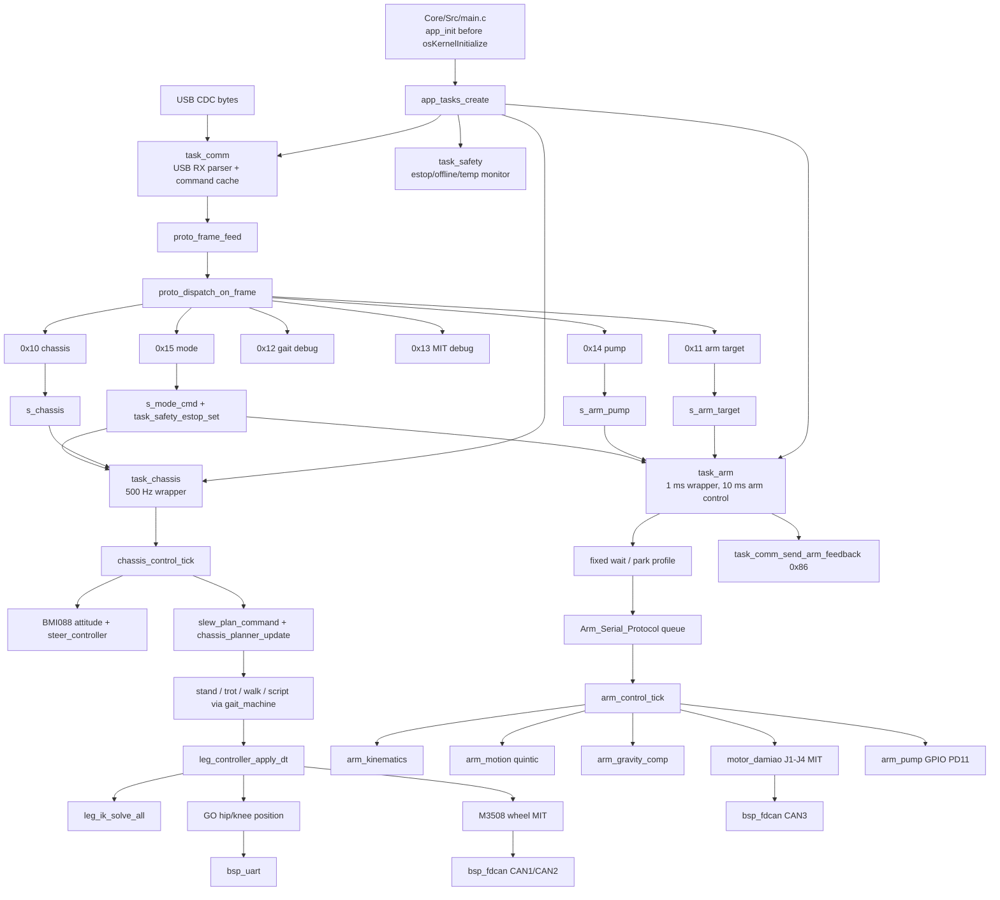

# 固件控制链路

本文档说明当前“USB 命令到电机/气泵输出”的实际路径。这里描述的是已实现行为，不是未来目标。

## 总图



## 启动阶段

1. `Core/Src/main.c` 默认 `USE_LEGACY_MAIN=0`，只保留 HAL/时钟/外设启动。
2. `app_init()` 在 `osKernelInitialize()` 前运行，初始化 time、FDCAN、UART、USB CDC、SPI、GPIO、气泵、motor registry、GO/M3508/达妙、BMI088。
3. `MX_FREERTOS_Init()` 创建 CubeMX `defaultTask`，再调用 `app_tasks_create()`。
4. `defaultTask` 初始化 USB device；`app_tasks_create()` 初始化 `task_comm`、`task_chassis`、`task_arm` 并创建 app 任务。

## 通信输入

`task_comm` 是整机 USB CDC 唯一下行入口。

| FuncID | 当前处理 |
|---:|---|
| `0x10 CHASSIS_CMD` | 接受 12B `vx/vy/wz` 或 17B `target_yaw/steer_mode` 扩展帧，写 `s_chassis`。 |
| `0x11 ARM_TARGET` | 校验 `target_type`、有限值和 0.045-0.655 m 可达距离，写 `s_arm_target`。 |
| `0x12 GAIT_CMD` | stand/trot/walk/set-param 调试命令，走 `task_chassis_*` 包装。 |
| `0x13 MIT_CMD` | 单电机 MIT 调试；拒绝 ARM_J1-J6 旁路，防止抢机械臂 task。 |
| `0x14 ARM_PUMP` | 校验 `pump_on` 后写 `s_arm_pump`。 |
| `0x15 MODE_CMD` | 写 `s_mode_cmd`；`ESTOP/ERROR` 同步置位 `task_safety` 急停。 |

上行：

- `0x80 STATE`：`task_comm_entry()` 10 Hz 发送。
- `0x81 MOTOR_STATE`：`task_comm_entry()` 5 Hz 轮询发送单电机状态。
- `0x86 ARM_FEEDBACK`：`task_arm` 50 Hz 发送机械臂末端反馈。

## 底盘控制周期

`task_chassis_entry()` 在 MCU 上以 500 Hz 调用：

```text
task_comm_get_chassis/mode
  -> mode gate: no mode frame allows legacy debug; NAV allows motion; others zero command
  -> chassis_control_tick()
```

`chassis_control_tick()` 的当前顺序：

1. MCU 构建先跑 GO 预标定窗口，采集反馈后 `motor_go_calibrate_all()`。
2. 上电 stand height ramp 从 `0.12 m` 平滑到目标站高。
3. 读取 BMI088，更新 yaw/roll/pitch；`steer_mode=1` 时用目标 yaw 生成实际 `wz`。
4. 对 `vx/vy/wz` 做斜率限制：`0.80 m/s^2`、`0.60 m/s^2`、`1.50 rad/s^2`。
5. `chassis_planner_update()` 生成 moving、walk/trot 参数、每腿步长、每轮局部滚动速度。
6. 根据心跳和 mode 判断 online/offline。
7. online 且普通移动选择 `trot`；低速/原地 yaw 转向选择 `walk`；停止选择 `stand`。
8. `gait_machine_update()` 输出足端目标，过渡时混合输出。
9. 支撑相腿应用 planner 轮速；摆动相轮速清零。
10. 姿态补偿和机械臂载荷补偿按编译期开关和 debug 开关写入 `g_leg_gravity_comp`。
11. `leg_controller_apply_dt()` 做 IK、支撑腿载荷分配、髋/膝位置命令和轮毂 MIT 命令。
12. MCU 构建 `motor_go_send_all()`、`motor_m3508_send_all()` 刷新总线输出。

当前 planner 约束：

- `vx/wz` 进入每腿局部前后速度：`v_leg_x = vx - wz * y_leg`，默认 `|y_leg| = 0.15 m`。
- `vy` 只参与 moving 判断，不进入 2DOF 足端横向轨迹。
- `g_chassis_stride_cfg` 默认把周期从 `0.60 s` 小范围调到 `0.50 s`；速度主要进入轮速和每腿步长。
- `g_chassis_turn_cfg` 控制低速转向的 walk 周期、抬脚高度、duty 和轮速/步长限幅。

## 腿和轮输出

`leg_controller_apply_dt()`：

```text
gait_output
  -> leg_ik_solve_all()
  -> gravity_comp_prepare_payload_shares()
  -> gravity_comp_prepare_balance_forces()
  -> hip/knee motor->ops->set_position(... tau_ff)
  -> wheel MIT reference
```

轮毂 M3508 默认使用 MIT 路径：

- 支撑相：`theta_ref += wheel_rads * dt`，发送位置/速度/kp/kd/tau_ff。
- 摆动相：参考角锁到当前轮角，速度和力矩前馈为 0。
- `g_leg_wheel_mit` 提供增益、力矩限幅、位置误差限幅和 debug reset。

## 机械臂控制周期

`task_arm_entry()` 每 1 ms 调用 `task_arm_step_for_test()`；`arm_control_tick()` 内部按 `APP_ARM_CONTROL_PERIOD_MS=10` 控制达妙输出。

当前机械臂 task 不是由 mode 启停，而是常驻：

1. `ESTOP/ERROR` 急停时禁用达妙输出和控制器，不进入 `Arm_Control_Process()`，但保留气泵处理和反馈发送。
2. `APP_ARM_FORCE_GRAVITY_ONLY` 或 Live Expressions `debug_arm_force_gravity_only` 非零时，清空旧协议队列，关全部泵，只跑纯重力保持。
3. 非 ARM 模式默认进入 `PARK` 固定姿态；ARM 模式进入第一箱等待姿态。
4. 等待姿态到位后，只有新的合法 `GRASP` 目标会释放给 host 抓放流程。
5. `task_comm` 中缓存的 `0x11/0x14` 只有在 `ROBOT_MODE_ARM` 且固定姿态已释放后才排进 `Arm_Serial_Protocol_QueueTarget/QueuePump()`。
6. `Arm_Serial_Protocol_Process()` 保留旧 target/pump/place-cycle 语义：PLACE 到位后延迟关泵、切重力模式、等待下一次 GRASP。
7. `Arm_Control_Process()` 包装到 `arm_control_tick()`，执行 IK、三段式安全运动、fine tracking、五次轨迹、重力补偿、达妙 MIT 输出。
8. PLACE cycle 完成后，`task_arm` 等待 `APP_ARM_PLACE_HOLD_AFTER_PUMP_OFF_MS=3000 ms`，再进入第二箱等待姿态序列。

机械臂 target 校验：

- `task_comm` 先拦截错类型、非有限值和明显错单位/错字节序。
- `arm_control_validate_host_target()` 再运行 IK；`GRASP` 额外应用 J1 周期性禁区，`PLACE` 不应用该禁区。

## 安全链路

- `task_safety_estop_set(true)` 会遍历 registry 并调用每个电机的 `disable()`。
- `task_safety_entry()` 200 Hz 扫描电机反馈超时和温度；达妙超时默认跟机械臂运动反馈 abort 阈值 `250 ms`。
- M3508 温度警告和降额主要在 M3508 驱动内执行，超过 stop 阈值由 safety 禁用电机。
- `task_chassis_entry()` 急停时跳过底盘控制 tick。
- `task_arm_step_for_test()` 急停时跳过达妙自动 enable，避免急停中重新使能。

## 验证命令

```sh
cmake --build build_arm
cmake --build build_host_tests
ctest --test-dir build_host_tests --output-on-failure
git diff --check
```
