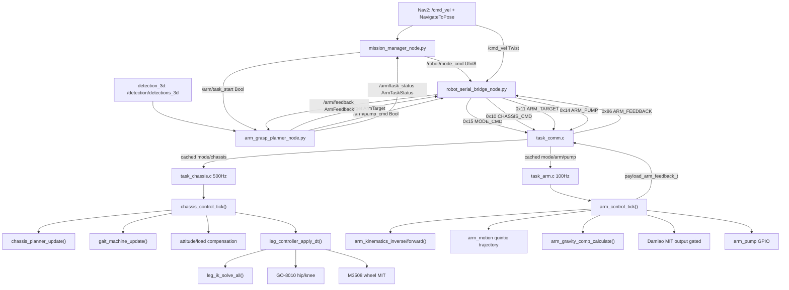

# 上下位机整合控制链路深度导读

这份文档按“上机测试时怎么从现象追到函数和变量”的粒度写。它不是迁移方案，也不是概览，而是当前代码的实际控制路径、算法、反馈、运动学、补偿和调试入口。

关键安全默认值先放在最前面：

- 机械臂达妙电机输出在 MCU 固件默认打开：[config.h:63](/Users/code/FengMH/App/common/include/config.h:63) `APP_ARM_MOTOR_OUTPUT_DEFAULT_ENABLE = (!APP_TARGET_HOST)`。上板固件会上电常驻运行机械臂 task，自动 enable 达妙；host 单测仍默认关闭输出。
- 底盘姿态力矩补偿默认关闭：[chassis_control.c:893](/Users/code/FengMH/App/control/src/chassis/chassis_control.c:893) 初始化 `g_chassis_attitude_comp`，但 `enable` 清零。
- 机械臂载荷到底盘腿部补偿默认关闭：[chassis_control.c:908](/Users/code/FengMH/App/control/src/chassis/chassis_control.c:908) `g_chassis_arm_load_comp.enable = 0`。
- 上位机串口只有一个所有者：[robot_serial_bridge_node.py:32](/Users/leon/Desktop/merge/gsing_dog-main/src/robot_system/robot_system/robot_serial_bridge_node.py:32) `RobotSerialBridgeNode` 独占 STM32 CDC。机械臂识别节点和导航节点都不直接碰串口。

## 1. 总链路



一句话理解当前系统：底盘 task 和机械臂 task 在下位机并行常驻；上位机高层状态机只决定 USB 命令当前归谁消费。`NAV` 时底盘接收速度、机械臂保持原状态；`ARM` 时机械臂接收目标/泵命令、底盘收到零速度。

## 2. 初始化和任务

### 2.1 板级初始化

入口是 [app_init.c:27](/Users/code/FengMH/App/app/src/app_init.c:27) `app_init()`。

实际顺序：

1. [app_init.c:28](/Users/code/FengMH/App/app/src/app_init.c:28) 初始化日志。
2. [app_init.c:32](/Users/code/FengMH/App/app/src/app_init.c:32) 初始化时间基准。
3. [app_init.c:35](/Users/code/FengMH/App/app/src/app_init.c:35) 初始化 FDCAN。
4. [app_init.c:36](/Users/code/FengMH/App/app/src/app_init.c:36) 初始化 GO 用的 UART2/UART3/UART4/UART7。
5. [app_init.c:40](/Users/code/FengMH/App/app/src/app_init.c:40) 初始化 USB CDC，也就是和 ROS 上位机通讯的通道。
6. [app_init.c:43](/Users/code/FengMH/App/app/src/app_init.c:43) 初始化 BMI088 用 SPI。
7. [app_init.c:44](/Users/code/FengMH/App/app/src/app_init.c:44) 初始化机械臂气泵 GPIO。
8. [app_init.c:48](/Users/code/FengMH/App/app/src/app_init.c:48) 初始化 `motor_registry`。
9. [app_init.c:49](/Users/code/FengMH/App/app/src/app_init.c:49) 创建 GO-8010 电机实例并绑定 registry。
10. [app_init.c:50](/Users/code/FengMH/App/app/src/app_init.c:50) 创建 M3508 电机实例并绑定 registry。
11. [app_init.c:51](/Users/code/FengMH/App/app/src/app_init.c:51) 创建达妙机械臂电机实例并绑定 registry。
12. [app_init.c:53](/Users/code/FengMH/App/app/src/app_init.c:53) 初始化 BMI088；失败时不是硬停机，而是降级运行，姿态/航向相关功能不可用。

### 2.2 RTOS 任务

入口是 [app_tasks.c:25](/Users/code/FengMH/App/app/src/app_tasks.c:25) `app_tasks_create()`。

初始化阶段：

- [app_tasks.c:28](/Users/code/FengMH/App/app/src/app_tasks.c:28) `task_comm_init()`：注册协议解析器和 USB RX 回调。
- [app_tasks.c:31](/Users/code/FengMH/App/app/src/app_tasks.c:31) `task_chassis_init()`：创建 gait、leg controller、planner、姿态估计等底盘控制状态。
- [app_tasks.c:32](/Users/code/FengMH/App/app/src/app_tasks.c:32) `task_arm_init()`：初始化机械臂控制、轨迹、重力补偿、气泵。

板上创建 5 个任务：

| 任务 | 入口 | 周期/职责 |
|---|---|---|
| log | [task_log_entry](/Users/code/FengMH/App/app/src/app_tasks.c:35) | 低优先级日志 |
| safety | [task_safety_entry](/Users/code/FengMH/App/app/src/app_tasks.c:36) | 实时安全任务 |
| comm | [task_comm_entry](/Users/code/FengMH/App/app/src/task_comm.c:359) | 上行状态帧 10 Hz、电机状态 5 Hz；下行解析在 USB 回调里同步完成 |
| chassis | [task_chassis_entry](/Users/code/FengMH/App/app/src/task_chassis.c:132) | 500 Hz 底盘控制 |
| arm | [task_arm_entry](/Users/code/FengMH/App/app/src/task_arm.c:83) | 约 100 Hz 机械臂控制，反馈 50 Hz |

## 3. 通信协议

### 3.1 帧格式

定义在 [proto_defs.h:3](/Users/code/FengMH/App/service/include/protocol/proto_defs.h:3)。

```text
55 AA | func_id(1) | len(1) | payload(len) | checksum(1)
checksum = (55 + AA + func_id + len + sum(payload)) & 0xFF
```

上位机构帧在 [protocol.py:47](/Users/leon/Desktop/merge/gsing_dog-main/src/robot_system/robot_system/protocol.py:47) `build_frame()`；下位机构帧在 [proto_frame.c:98](/Users/code/FengMH/App/service/src/protocol/proto_frame.c:98) `proto_frame_build()`。二者 checksum 算法一致。

### 3.2 FuncID 对照

| 方向 | FuncID | Payload | 上位机打包 | 下位机处理 |
|---|---:|---|---|---|
| Host -> MCU | `0x10` | `<fff>` `vx,vy,wz`；下位机也兼容 17B 扩展帧 | [protocol.py:57](/Users/leon/Desktop/merge/gsing_dog-main/src/robot_system/robot_system/protocol.py:57) `pack_chassis_cmd()` | [task_comm.c:74](/Users/code/FengMH/App/app/src/task_comm.c:74) `handle_chassis()` |
| Host -> MCU | `0x11` | `<Bfff>` `target_type,x,y,z` | [protocol.py:68](/Users/leon/Desktop/merge/gsing_dog-main/src/robot_system/robot_system/protocol.py:68) `pack_arm_target()` | [task_comm.c:161](/Users/code/FengMH/App/app/src/task_comm.c:161) `handle_arm_target()` |
| Host -> MCU | `0x12` | gait debug/standalone command | 暂非统一上位机主路径 | [task_comm.c:101](/Users/code/FengMH/App/app/src/task_comm.c:101) `handle_gait()` |
| Host -> MCU | `0x13` | MIT 单电机调试命令 | 暂非统一上位机主路径 | [task_comm.c:142](/Users/code/FengMH/App/app/src/task_comm.c:142) `handle_mit_cmd()` |
| Host -> MCU | `0x14` | `<B>` pump_on | [protocol.py:75](/Users/leon/Desktop/merge/gsing_dog-main/src/robot_system/robot_system/protocol.py:75) `pack_arm_pump()` | [task_comm.c:180](/Users/code/FengMH/App/app/src/task_comm.c:180) `handle_arm_pump()` |
| Host -> MCU | `0x15` | `<B>` robot mode | [protocol.py:61](/Users/leon/Desktop/merge/gsing_dog-main/src/robot_system/robot_system/protocol.py:61) `pack_mode_cmd()` | [task_comm.c:195](/Users/code/FengMH/App/app/src/task_comm.c:195) `handle_mode_cmd()` |
| MCU -> Host | `0x80` | 整机状态 | [task_comm.c:321](/Users/code/FengMH/App/app/src/task_comm.c:321) `send_state_frame()` | 串口桥目前只打印非 arm feedback 帧 |
| MCU -> Host | `0x81` | 单电机状态轮询 | [task_comm.c:351](/Users/code/FengMH/App/app/src/task_comm.c:351) `send_motor_frame()` | 串口桥目前只打印非 arm feedback 帧 |
| MCU -> Host | `0x86` | `<Bffff>` arm_state,end_x,end_y,end_z,theta1 | [task_comm.c:313](/Users/code/FengMH/App/app/src/task_comm.c:313) `task_comm_send_arm_feedback()` | [protocol.py:80](/Users/leon/Desktop/merge/gsing_dog-main/src/robot_system/robot_system/protocol.py:80) `parse_arm_feedback()` |

### 3.3 MCU 下行解析

USB 收到字节后进入 [task_comm.c:219](/Users/code/FengMH/App/app/src/task_comm.c:219) `on_usb_rx()`，调用 [proto_frame.c:35](/Users/code/FengMH/App/service/src/protocol/proto_frame.c:35) `proto_frame_feed()`。

`proto_frame_feed()` 是一个字节状态机：

1. [proto_frame.c:40](/Users/code/FengMH/App/service/src/protocol/proto_frame.c:40) 等 `0x55`。
2. [proto_frame.c:46](/Users/code/FengMH/App/service/src/protocol/proto_frame.c:46) 等 `0xAA`；如果错位但新字节又是 `0x55`，继续当下一帧头。
3. [proto_frame.c:56](/Users/code/FengMH/App/service/src/protocol/proto_frame.c:56) 读 func_id。
4. [proto_frame.c:61](/Users/code/FengMH/App/service/src/protocol/proto_frame.c:61) 读 len，并检查 `PROTO_MAX_PAYLOAD`。
5. [proto_frame.c:73](/Users/code/FengMH/App/service/src/protocol/proto_frame.c:73) 收 payload。
6. [proto_frame.c:80](/Users/code/FengMH/App/service/src/protocol/proto_frame.c:80) 校验 checksum，正确则 `good_cnt++` 并回调 dispatcher，错误则 `bad_cnt++`。

dispatcher 在 [proto_dispatch.c:17](/Users/code/FengMH/App/service/src/protocol/proto_dispatch.c:17) `proto_dispatch_on_frame()`，按 [task_comm.c:210](/Users/code/FengMH/App/app/src/task_comm.c:210) `s_tbl[]` 查表调用 handler。`expect_len=0` 的底盘命令由 `handle_chassis()` 自己兼容 12B/17B。

### 3.4 `task_comm` 缓存

`task_comm` 不直接控制底盘或机械臂，只更新缓存：

- [task_comm.c:30](/Users/code/FengMH/App/app/src/task_comm.c:30) `s_chassis`
- [task_comm.c:31](/Users/code/FengMH/App/app/src/task_comm.c:31) `s_arm_target`
- [task_comm.c:32](/Users/code/FengMH/App/app/src/task_comm.c:32) `s_arm_pump`
- [task_comm.c:33](/Users/code/FengMH/App/app/src/task_comm.c:33) `s_mode_cmd`
- [task_comm.c:34](/Users/code/FengMH/App/app/src/task_comm.c:34) `s_last_rx_ms`

每类缓存都有 `seq`，例如 [task_comm.c:175](/Users/code/FengMH/App/app/src/task_comm.c:175) 新机械臂目标会 `s_arm_target.seq++`。机械臂任务靠这个判断是否有新命令。

## 4. 上位机 ROS 系统

### 4.1 Launch

统一 launch 在 [integrated_system.launch.py:20](/Users/leon/Desktop/merge/gsing_dog-main/src/robot_system/launch/integrated_system.launch.py:20) `generate_launch_description()`。

启动节点：

- [integrated_system.launch.py:61](/Users/leon/Desktop/merge/gsing_dog-main/src/robot_system/launch/integrated_system.launch.py:61) `robot_serial_bridge`
- [integrated_system.launch.py:69](/Users/leon/Desktop/merge/gsing_dog-main/src/robot_system/launch/integrated_system.launch.py:69) `arm_grasp_planner`
- [integrated_system.launch.py:77](/Users/leon/Desktop/merge/gsing_dog-main/src/robot_system/launch/integrated_system.launch.py:77) `mission_manager`
- [integrated_system.launch.py:98](/Users/leon/Desktop/merge/gsing_dog-main/src/robot_system/launch/integrated_system.launch.py:98) 可选 `detection_3d bringup.launch.py`

注意 [integrated_system.launch.py:103](/Users/leon/Desktop/merge/gsing_dog-main/src/robot_system/launch/integrated_system.launch.py:103) `use_arm_bridge=false`，旧机械臂串口桥不会再抢串口。

参数默认值在 [system_params.yaml:1](/Users/leon/Desktop/merge/gsing_dog-main/src/robot_system/config/system_params.yaml:1)。

### 4.2 `robot_serial_bridge`

文件：[robot_serial_bridge_node.py](/Users/leon/Desktop/merge/gsing_dog-main/src/robot_system/robot_system/robot_serial_bridge_node.py:32)。

它是串口唯一出口和入口。

主循环在 [robot_serial_bridge_node.py:213](/Users/leon/Desktop/merge/gsing_dog-main/src/robot_system/robot_system/robot_serial_bridge_node.py:213) `_tick()`：

1. [robot_serial_bridge_node.py:215](/Users/leon/Desktop/merge/gsing_dog-main/src/robot_system/robot_system/robot_serial_bridge_node.py:215) `_read_serial()`：读 MCU 上行帧。
2. [robot_serial_bridge_node.py:216](/Users/leon/Desktop/merge/gsing_dog-main/src/robot_system/robot_system/robot_serial_bridge_node.py:216) `_send_mode_if_due()`：周期重复 `0x15`，默认 5 Hz。
3. [robot_serial_bridge_node.py:217](/Users/leon/Desktop/merge/gsing_dog-main/src/robot_system/robot_system/robot_serial_bridge_node.py:217) `_send_chassis_tick()`：默认 50 Hz 发底盘命令。
4. [robot_serial_bridge_node.py:218](/Users/leon/Desktop/merge/gsing_dog-main/src/robot_system/robot_system/robot_serial_bridge_node.py:218) `_send_arm_tick()`：ARM 模式下发机械臂目标/气泵。

底盘 gate：

- `/cmd_vel` 缓存在 [robot_serial_bridge_node.py:184](/Users/leon/Desktop/merge/gsing_dog-main/src/robot_system/robot_system/robot_serial_bridge_node.py:184) `_cmd_vel_cb()`。
- [robot_serial_bridge_node.py:281](/Users/leon/Desktop/merge/gsing_dog-main/src/robot_system/robot_system/robot_serial_bridge_node.py:281) 判断 `/cmd_vel` 是否 stale，默认超时 0.15 s。
- [gate.py:22](/Users/leon/Desktop/merge/gsing_dog-main/src/robot_system/robot_system/gate.py:22) `gated_chassis_command()`：只有 `mode == NAV` 且不 stale 才允许速度通过，否则返回 0。
- [robot_serial_bridge_node.py:292](/Users/leon/Desktop/merge/gsing_dog-main/src/robot_system/robot_system/robot_serial_bridge_node.py:292) 发送 `pack_chassis_cmd()`。默认即使非 NAV 也发送零速度帧，这是为了让下位机持续收到安全零命令。

机械臂 gate：

- `/arm/target` 缓存在 [robot_serial_bridge_node.py:205](/Users/leon/Desktop/merge/gsing_dog-main/src/robot_system/robot_system/robot_serial_bridge_node.py:205) `_arm_target_cb()`。
- `/arm/pump_cmd` 缓存在 [robot_serial_bridge_node.py:209](/Users/leon/Desktop/merge/gsing_dog-main/src/robot_system/robot_system/robot_serial_bridge_node.py:209) `_pump_cb()`。
- [gate.py:40](/Users/leon/Desktop/merge/gsing_dog-main/src/robot_system/robot_system/gate.py:40) `arm_commands_allowed()`：只有 `mode == ARM` 才允许机械臂命令。
- [robot_serial_bridge_node.py:307](/Users/leon/Desktop/merge/gsing_dog-main/src/robot_system/robot_system/robot_serial_bridge_node.py:307) 非 ARM 直接 return；切到 NAV 不会偷偷发机械臂目标或关泵命令，放气必须由 ARM 任务明确发出。
- [robot_serial_bridge_node.py:319](/Users/leon/Desktop/merge/gsing_dog-main/src/robot_system/robot_system/robot_serial_bridge_node.py:319) 机械臂目标重复发送限频，默认 8 Hz。

MCU 上行反馈：

- [robot_serial_bridge_node.py:220](/Users/leon/Desktop/merge/gsing_dog-main/src/robot_system/robot_system/robot_serial_bridge_node.py:220) `_read_serial()` 读 CDC，调用 `FrameParser.feed()`。
- [robot_serial_bridge_node.py:233](/Users/leon/Desktop/merge/gsing_dog-main/src/robot_system/robot_system/robot_serial_bridge_node.py:233) 只有 `FUNC_ARM_FEEDBACK=0x86` 会被解析成 ROS 消息。
- [robot_serial_bridge_node.py:241](/Users/leon/Desktop/merge/gsing_dog-main/src/robot_system/robot_system/robot_serial_bridge_node.py:241) `_publish_arm_feedback()` 发布 `/arm/feedback`。

### 4.3 `mission_manager`

文件：[mission_manager_node.py](/Users/leon/Desktop/merge/gsing_dog-main/src/robot_system/robot_system/mission_manager_node.py:46)。

它是高层任务状态机，不碰串口、不直接发底盘速度。

状态定义在 [mission_manager_node.py:27](/Users/leon/Desktop/merge/gsing_dog-main/src/robot_system/robot_system/mission_manager_node.py:27)：

```text
IDLE
NAV_TO_TARGET
WAIT_NAV_RESULT
SWITCH_TO_ARM
ARM_GRASP
ARM_DONE
SWITCH_TO_NAV
FINISH
ERROR
```

主循环在 [mission_manager_node.py:210](/Users/leon/Desktop/merge/gsing_dog-main/src/robot_system/robot_system/mission_manager_node.py:210) `_tick()`：

- [mission_manager_node.py:212](/Users/leon/Desktop/merge/gsing_dog-main/src/robot_system/robot_system/mission_manager_node.py:212) 周期重复当前期望模式，默认 2 Hz。
- [mission_manager_node.py:216](/Users/leon/Desktop/merge/gsing_dog-main/src/robot_system/robot_system/mission_manager_node.py:216) `NAV_TO_TARGET` 时发 Nav2 goal。
- [mission_manager_node.py:219](/Users/leon/Desktop/merge/gsing_dog-main/src/robot_system/robot_system/mission_manager_node.py:219) `WAIT_NAV_RESULT` 超时则 ERROR，默认 120 s。
- [mission_manager_node.py:222](/Users/leon/Desktop/merge/gsing_dog-main/src/robot_system/robot_system/mission_manager_node.py:222) `SWITCH_TO_ARM` 等 `mode_settle_sec`，默认 0.5 s，再发 `/arm/task_start=true`。
- [mission_manager_node.py:226](/Users/leon/Desktop/merge/gsing_dog-main/src/robot_system/robot_system/mission_manager_node.py:226) `ARM_GRASP` 超时则 ERROR，默认 30 s。
- [mission_manager_node.py:230](/Users/leon/Desktop/merge/gsing_dog-main/src/robot_system/robot_system/mission_manager_node.py:230) `ARM_DONE` 发 `/arm/task_start=false`，切回 NAV。

导航成功后的关键跳转在 [mission_manager_node.py:276](/Users/leon/Desktop/merge/gsing_dog-main/src/robot_system/robot_system/mission_manager_node.py:276) `_nav_result_cb()`：

```text
Nav2 success -> _publish_mode(ARM) -> SWITCH_TO_ARM
```

机械臂成功后的关键跳转在 [mission_manager_node.py:202](/Users/leon/Desktop/merge/gsing_dog-main/src/robot_system/robot_system/mission_manager_node.py:202) `_arm_status_cb()`：

```text
ArmTaskStatus.STATUS_SUCCEEDED -> ARM_DONE
```

### 4.4 `arm_grasp_planner`

文件：[arm_grasp_planner_node.py](/Users/leon/Desktop/merge/gsing_dog-main/src/robot_system/robot_system/arm_grasp_planner_node.py:39)。

它是机械臂上位机抓放状态机，不碰串口，只发 ROS topic。

状态定义在 [arm_grasp_planner_node.py:28](/Users/leon/Desktop/merge/gsing_dog-main/src/robot_system/robot_system/arm_grasp_planner_node.py:28)：

```text
IDLE
WAIT_DETECTION
SEND_GRASP
GRASP_DELAY
SEND_PLACE
PLACE_DELAY
SUCCEEDED
FAILED
```

视觉目标处理：

- [arm_grasp_planner_node.py:262](/Users/leon/Desktop/merge/gsing_dog-main/src/robot_system/robot_system/arm_grasp_planner_node.py:262) `_detection_cb()` 只在任务运行且状态为 `WAIT_DETECTION/SEND_GRASP` 时处理检测。
- [arm_grasp_planner_node.py:271](/Users/leon/Desktop/merge/gsing_dog-main/src/robot_system/robot_system/arm_grasp_planner_node.py:271) 选择最高分检测；如果 `target_class` 非空，则过滤类别。
- [arm_grasp_planner_node.py:287](/Users/leon/Desktop/merge/gsing_dog-main/src/robot_system/robot_system/arm_grasp_planner_node.py:287) 先 EMA，再稳定滤波；满足稳定帧数才进入可发目标状态。
- 默认参数见 [system_params.yaml:27](/Users/leon/Desktop/merge/gsing_dog-main/src/robot_system/config/system_params.yaml:27)：`ema_alpha=0.25`，`stable_radius_m=0.02`，`stable_frames=3`。

相机坐标转机械臂坐标：

- [arm_grasp_planner_node.py:325](/Users/leon/Desktop/merge/gsing_dog-main/src/robot_system/robot_system/arm_grasp_planner_node.py:325) `_current_grasp_target()`。
- [arm_grasp_planner_node.py:334](/Users/leon/Desktop/merge/gsing_dog-main/src/robot_system/robot_system/arm_grasp_planner_node.py:334) 调用 `transform_camera_to_arm_base()`，使用 MCU 反馈的 `theta1_rad` 和当前末端 `end_xyz`。
- [arm_grasp_planner_node.py:514](/Users/leon/Desktop/merge/gsing_dog-main/src/robot_system/robot_system/arm_grasp_planner_node.py:514) `_apply_command_offset()` 添加命令偏置。默认 z 偏置 [system_params.yaml:53](/Users/leon/Desktop/merge/gsing_dog-main/src/robot_system/config/system_params.yaml:53) 是 `0.11 m`，y 绝对偏置 [system_params.yaml:54](/Users/leon/Desktop/merge/gsing_dog-main/src/robot_system/config/system_params.yaml:54) 是 `0.03 m`。

抓放流程：

1. [arm_grasp_planner_node.py:315](/Users/leon/Desktop/merge/gsing_dog-main/src/robot_system/robot_system/arm_grasp_planner_node.py:315) `_send_grasp()`：发布抓取目标，并更新到位判定。
2. [arm_grasp_planner_node.py:356](/Users/leon/Desktop/merge/gsing_dog-main/src/robot_system/robot_system/arm_grasp_planner_node.py:356) `_delay_after_grasp()`：抓取到位后开泵，等待 `arrival_delay_sec`，默认 1 s。
3. [arm_grasp_planner_node.py:370](/Users/leon/Desktop/merge/gsing_dog-main/src/robot_system/robot_system/arm_grasp_planner_node.py:370) `_send_place()`：发布放置目标。
4. [arm_grasp_planner_node.py:377](/Users/leon/Desktop/merge/gsing_dog-main/src/robot_system/robot_system/arm_grasp_planner_node.py:377) `_delay_after_place()`：放置到位后保持，延时，再关泵并 SUCCEEDED。

到位判定在 [arm_grasp_planner_node.py:431](/Users/leon/Desktop/merge/gsing_dog-main/src/robot_system/robot_system/arm_grasp_planner_node.py:431) `_update_arrival()`，三条路任意满足就推进：

- 距离到位：[arm_grasp_planner_node.py:442](/Users/leon/Desktop/merge/gsing_dog-main/src/robot_system/robot_system/arm_grasp_planner_node.py:442)，`dist_m <= reach_tolerance_m` 连续 `reach_stable_frames`。默认 2 cm、2 帧。
- MCU 到位：[arm_grasp_planner_node.py:465](/Users/leon/Desktop/merge/gsing_dog-main/src/robot_system/robot_system/arm_grasp_planner_node.py:465)，下位机 `arm_state == REACHED`，同时距离不大于 10 cm，并且末端确实运动过或已经很近。
- 停滞到位：[arm_grasp_planner_node.py:488](/Users/leon/Desktop/merge/gsing_dog-main/src/robot_system/robot_system/arm_grasp_planner_node.py:488)，距离目标 8 cm 内，连续 5 帧末端移动小于 1.5 cm。

视觉遮挡保持在 [arm_grasp_planner_node.py:342](/Users/leon/Desktop/merge/gsing_dog-main/src/robot_system/robot_system/arm_grasp_planner_node.py:342) `_occluded_grasp_target()`：如果抓取过程中目标被机械臂挡住，会用最近目标历史的中值继续保持，默认最长 8 s。

## 5. 下位机任务层互锁

### 5.1 底盘任务

文件：[task_chassis.c](/Users/code/FengMH/App/app/src/task_chassis.c:1)。

模式 gate 在 [task_chassis.c:24](/Users/code/FengMH/App/app/src/task_chassis.c:24) `chassis_mode_allows_motion()`：

- 如果还没收到任何 `mode` 帧：返回允许，兼容旧上位机。
- 如果收到过 `mode` 帧：只有 `mode == PROTO_ROBOT_MODE_NAV` 才允许底盘速度进入控制器。

输入复制在 [task_chassis.c:33](/Users/code/FengMH/App/app/src/task_chassis.c:33) `read_chassis_input()`：

```text
allow_motion ? command.vx : 0
allow_motion ? command.vy : 0
allow_motion ? command.wz : 0
allow_motion ? command.target_yaw : 0
allow_motion ? command.steer_mode : 0
```

因此即使上位机错误地在 ARM 模式发了 `/cmd_vel`，下位机底盘也会把速度清零。

500 Hz 控制入口在 [task_chassis.c:132](/Users/code/FengMH/App/app/src/task_chassis.c:132) `task_chassis_entry()`，每 2 ms 调 [task_chassis.c:126](/Users/code/FengMH/App/app/src/task_chassis.c:126) `task_chassis_step_for_test()`，再进入 [chassis_control.c:960](/Users/code/FengMH/App/control/src/chassis/chassis_control.c:960) `chassis_control_tick()`。

### 5.2 机械臂任务

文件：[task_arm.c](/Users/code/FengMH/App/app/src/task_arm.c:1)。

机械臂 task 不再由 mode 启停；它像原工程一样常驻运行。`mode=ARM` 只控制是否消费 USB 目标/气泵命令。

USB 命令 gate 在 [task_arm.c:36](/Users/code/FengMH/App/app/src/task_arm.c:36) `arm_usb_commands_allowed()`：

```text
mode.seq > 0 && mode.mode == PROTO_ROBOT_MODE_ARM
```

非 ARM 模式下如果缓存里来了新的 `0x11/0x14`，`consume_new_commands()` 会更新本地 seq 并丢弃，不会等以后切到 ARM 再执行旧目标。

周期入口在 [task_arm.c](/Users/code/FengMH/App/app/src/task_arm.c) `task_arm_step_for_test()`：

1. 读 `command_allowed = arm_usb_commands_allowed()`。
2. `consume_new_commands(command_allowed)`：非 ARM 模式同步 seq 并丢弃，ARM 模式把 target/pump 排进 `Arm_Serial_Protocol_QueueTarget()` / `Arm_Serial_Protocol_QueuePump()`。
3. 每周期调用旧工程形状的 `Arm_Control_Process()`。
4. 每周期调用旧工程形状的 `Pump_Control_Process()`。
5. 每周期调用旧工程形状的 `Arm_Serial_Protocol_Process()`，执行 target/pump、延迟关泵、等待下一次抓取等逻辑。
6. `send_feedback_if_due()` 以 50 Hz 发送新整机协议 `0x86 ARM_FEEDBACK`；旧 `0x21` 反馈默认关闭，避免和 `USB_CDC_PING` 冲突。

消费新命令在 [task_arm.c:34](/Users/code/FengMH/App/app/src/task_arm.c:34) `consume_new_commands()`：

- [task_arm.c:46](/Users/code/FengMH/App/app/src/task_arm.c:46) 读取目标缓存。
- [task_arm.c:47](/Users/code/FengMH/App/app/src/task_arm.c:47) 读取气泵缓存。
- [task_arm.c:49](/Users/code/FengMH/App/app/src/task_arm.c:49) 如果当前不允许机械臂 USB 命令，只同步 seq 并返回。
- [task_arm.c:51](/Users/code/FengMH/App/app/src/task_arm.c:51) ARM 模式下如果 `target.seq` 变了，调用 [arm_serial_protocol.c:122](/Users/code/FengMH/App/service/src/protocol/arm_serial_protocol.c:122) `Arm_Serial_Protocol_QueueTarget()`。
- [task_arm.c:59](/Users/code/FengMH/App/app/src/task_arm.c:59) ARM 模式下如果 `pump.seq` 变了，调用 [arm_serial_protocol.c:148](/Users/code/FengMH/App/service/src/protocol/arm_serial_protocol.c:148) `Arm_Serial_Protocol_QueuePump()`。

## 6. 底盘 500 Hz 控制周期

主入口：[chassis_control.c:960](/Users/code/FengMH/App/control/src/chassis/chassis_control.c:960) `chassis_control_tick()`。

一帧真实顺序：

1. [chassis_control.c:966](/Users/code/FengMH/App/control/src/chassis/chassis_control.c:966) `go_pre_calibration_ready()`：板上先发 GO 零力矩帧收反馈，约 500 周期后执行 GO 零位标定。Host 测试直接 ready。
2. [chassis_control.c:970](/Users/code/FengMH/App/control/src/chassis/chassis_control.c:970) `update_boot_stand(dt_s)`：上电先从 0.12 m 慢慢起到目标站高，再进入正常控制。
3. [chassis_control.c:974](/Users/code/FengMH/App/control/src/chassis/chassis_control.c:974) `safe_input_or_zero()`：空输入变零命令，避免 NULL。
4. [chassis_control.c:976](/Users/code/FengMH/App/control/src/chassis/chassis_control.c:976) `update_steering()`：读 IMU、更新姿态估计、可选 yaw 闭环，把最终角速度写到 `effective_wz`。
5. [chassis_control.c:979](/Users/code/FengMH/App/control/src/chassis/chassis_control.c:979) `update_plan_from_input()`：调用 planner，把速度命令变成 gait 参数和轮速。
6. [chassis_control.c:980](/Users/code/FengMH/App/control/src/chassis/chassis_control.c:980) `update_online_state()`：根据是否有协议帧和超时判断 online/offline。
7. [chassis_control.c:989](/Users/code/FengMH/App/control/src/chassis/chassis_control.c:989) `decide_gait_for_link_state()`：在线按 plan 选择 walk/stand，离线按保守站立。
8. [chassis_control.c:990](/Users/code/FengMH/App/control/src/chassis/chassis_control.c:990) `update_stand_height_ramp()`：站立高度限速更新，默认 0.025 m/s。
9. [chassis_control.c:991](/Users/code/FengMH/App/control/src/chassis/chassis_control.c:991) `apply_gait_output_to_motors()`：步态、轮速、补偿、IK、电机 setpoint。
10. [chassis_control.c:992](/Users/code/FengMH/App/control/src/chassis/chassis_control.c:992) `flush_motor_outputs()`：板上实际发 GO/M3508 总线帧。

### 6.1 在线/离线

[chassis_control.c:224](/Users/code/FengMH/App/control/src/chassis/chassis_control.c:224) `is_offline()`：

- `CHASSIS_MODE_STANDALONE`：强制 offline，通常用于 gait debug 帧手动控制。
- `CHASSIS_MODE_ONLINE`：强制 online。
- `CHASSIS_MODE_AUTO`：没有收到过有效帧或者超过 [chassis_control.c:70](/Users/code/FengMH/App/control/src/chassis/chassis_control.c:70) `s_online_timeout_ms=500` 则 offline。

在线策略在 [chassis_control.c:232](/Users/code/FengMH/App/control/src/chassis/chassis_control.c:232) `online_decide()`：

- `plan->moving == 1`：切到 walk，或更新当前 walk 参数。
- `plan->moving == 0`：切到 stand。

离线策略在 [chassis_control.c:688](/Users/code/FengMH/App/control/src/chassis/chassis_control.c:688) `offline_decide()`：默认 `APP_OFFLINE_AUTO_MARCH=0`，所以离线保持 conservative stand；如果处于手动 gait hold，则保持手动步态。

### 6.2 转向和姿态估计

[chassis_control.c:663](/Users/code/FengMH/App/control/src/chassis/chassis_control.c:663) `update_steering()`：

1. 默认 `*wz_out = command->wz_rad_s`。
2. [chassis_control.c:670](/Users/code/FengMH/App/control/src/chassis/chassis_control.c:670) 调 `imu_bmi088_read()`。
3. [chassis_control.c:672](/Users/code/FengMH/App/control/src/chassis/chassis_control.c:672) 调 [attitude_estimator.c:104](/Users/code/FengMH/App/control/src/attitude/attitude_estimator.c:104) `attitude_estimator_update(gyro, accel, dt_s)`。
4. 如果 `command->steer_mode == 1`，进入 yaw 闭环：[chassis_control.c:681](/Users/code/FengMH/App/control/src/chassis/chassis_control.c:681)，用 [steer_controller.c:70](/Users/code/FengMH/App/control/src/attitude/steer_controller.c:70) `steer_controller_update()` 输出实际 `wz`。

姿态估计算法：

- [attitude_estimator.c:108](/Users/code/FengMH/App/control/src/attitude/attitude_estimator.c:108) 保存 `roll_rate = gyro[0]`、`pitch_rate = gyro[1]`、`yaw_rate = gyro[2]`。
- [attitude_estimator.c:112](/Users/code/FengMH/App/control/src/attitude/attitude_estimator.c:112) `roll += gyro[0] * dt`。
- [attitude_estimator.c:113](/Users/code/FengMH/App/control/src/attitude/attitude_estimator.c:113) `pitch += gyro[1] * dt`。
- [attitude_estimator.c:118](/Users/code/FengMH/App/control/src/attitude/attitude_estimator.c:118) 只有三轴角速度模长大于 0.01 rad/s 才积分 yaw，抑制静止漂移。
- [attitude_estimator.c:49](/Users/code/FengMH/App/control/src/attitude/attitude_estimator.c:49) 用加速度归一化估计 roll/pitch：
  - `roll_acc = atan2(ay, az)`
  - `pitch_acc = atan2(-ax, sqrt(ay^2 + az^2))`
- [attitude_estimator.c:89](/Users/code/FengMH/App/control/src/attitude/attitude_estimator.c:89) roll/pitch 做低通融合，默认 `accel_blend = 0.04`。

yaw 闭环算法：

- [steer_controller.c:80](/Users/code/FengMH/App/control/src/attitude/steer_controller.c:80) `err = wrap_pi(target_yaw - current_yaw)`。
- [steer_controller.c:83](/Users/code/FengMH/App/control/src/attitude/steer_controller.c:83) `p = kp * err`，默认 `kp=2.0`。
- [steer_controller.c:85](/Users/code/FengMH/App/control/src/attitude/steer_controller.c:85) 积分项 `ki * err * dt`，默认 `ki=0.1`，限幅 `i_max=0.5`。
- [steer_controller.c:92](/Users/code/FengMH/App/control/src/attitude/steer_controller.c:92) 微分项 `kd * (err - prev_err) / dt`，默认 `kd=0.05`。
- [steer_controller.c:99](/Users/code/FengMH/App/control/src/attitude/steer_controller.c:99) 输出限幅默认 `wz_max=3.0 rad/s`。

## 7. 底盘速度规划

入口：[chassis_planner.c:205](/Users/code/FengMH/App/control/src/chassis/chassis_planner.c:205) `chassis_planner_update()`。

输入结构在 [chassis_planner.h:18](/Users/code/FengMH/App/control/include/chassis/chassis_planner.h:18)：

```text
vx_m_s, vy_m_s, wz_rad_s
```

输出结构在 [chassis_planner.h:24](/Users/code/FengMH/App/control/include/chassis/chassis_planner.h:24)：

```text
gait_params
wheel_rads[4]
moving
```

### 7.1 运动判定

[chassis_planner.c:213](/Users/code/FengMH/App/control/src/chassis/chassis_planner.c:213)：

```text
forward_speed = abs(vx)
lateral_speed = abs(vy)
turn_edge_speed = abs(wz) * half_track
motion_speed = max(forward_speed, turn_edge_speed)
moving = abs(vx)>0.01 || abs(vy)>0.01 || abs(wz)>0.05
```

注意：`vy` 会让系统进入 moving，但当前 2DOF 腿没有横向足端轨迹，所以 `vy` 暂不进入 IK 运动学，只作为状态保留。

### 7.2 每腿局部速度

[chassis_planner.c:87](/Users/code/FengMH/App/control/src/chassis/chassis_planner.c:87) `planner_leg_y_m()`：

```text
左腿 FL/RL: y = +half_track
右腿 FR/RR: y = -half_track
```

默认 [chassis_planner.c:17](/Users/code/FengMH/App/control/src/chassis/chassis_planner.c:17) `half_track = 0.15 m`，对应左右轮距 `0.30 m`。

[chassis_planner.c:92](/Users/code/FengMH/App/control/src/chassis/chassis_planner.c:92) `planner_leg_local_vx()`：

```text
v_leg_x = vx - wz * y_leg
```

所以原地左转/右转时，左右腿得到相反方向的前后局部速度；直行时四腿相同。

### 7.3 步频/步长调度

默认步态参数在 [gait_params.c:15](/Users/code/FengMH/App/control/src/gait/gait_params.c:15) `GAIT_PARAMS_WALK_DEFAULT`：

```text
body_height = 0.20 m
step_height = 0.055 m
period = 0.60 s
duty = 0.75
phase_offset = FL 0.75, FR 0.25, RL 0.00, RR 0.50
```

速度调度参数在 [chassis_planner.c:38](/Users/code/FengMH/App/control/src/chassis/chassis_planner.c:38) `g_chassis_stride_cfg`：

```text
enable = 1
slow_period = 0.60 s
fast_period = 0.50 s
fast_speed = 0.35 m/s
```

[chassis_planner.c:149](/Users/code/FengMH/App/control/src/chassis/chassis_planner.c:149) `planner_period_from_speed()`：

```text
t = clamp(speed_abs / fast_speed, 0, 1)
period = slow_period + (fast_period - slow_period) * t
```

因此现在速度变快时，步频只小范围变快：周期从 0.60 s 变到 0.50 s。速度主要由轮速和步长承担。

[chassis_planner.c:169](/Users/code/FengMH/App/control/src/chassis/chassis_planner.c:169) `planner_step_from_vx()`：

```text
leg_step_length = v_leg_x * period_s * duty
leg_step_length = clamp(leg_step_length, -max_leg_step, +max_leg_step)
```

默认 [chassis_planner.c:18](/Users/code/FengMH/App/control/src/chassis/chassis_planner.c:18) `max_leg_step = 0.20 m`。

[chassis_planner.c:237](/Users/code/FengMH/App/control/src/chassis/chassis_planner.c:237) 轮速：

```text
wheel_radius = LEG_DIM_DEFAULT.wheel_diameter * 0.5
wheel_rads[i] = v_leg_x[i] / wheel_radius
```

`LEG_DIM_DEFAULT.wheel_diameter` 在 [leg_params.c:14](/Users/code/FengMH/App/control/src/kinematics/leg_params.c:14) 是 `0.095 m`，所以半径约 `0.0475 m`。

### 7.4 低速转向

[chassis_planner.c:61](/Users/code/FengMH/App/control/src/chassis/chassis_planner.c:61) `planner_is_low_speed_turn()`：

```text
enable_gait_turn == 1
abs(vx) <= 0.05 m/s
abs(wz) > 0.05 rad/s
```

满足时 [chassis_planner.c:97](/Users/code/FengMH/App/control/src/chassis/chassis_planner.c:97) `planner_apply_turn_gait()` 会用转向专用参数：

- 默认转向抬腿高度 [chassis_planner.c:19](/Users/code/FengMH/App/control/src/chassis/chassis_planner.c:19) `0.055 m`
- 默认转向周期 [chassis_planner.c:20](/Users/code/FengMH/App/control/src/chassis/chassis_planner.c:20) `0.60 s`
- 默认转向 duty [chassis_planner.c:21](/Users/code/FengMH/App/control/src/chassis/chassis_planner.c:21) `0.75`

## 8. 步态生成

### 8.1 gait machine

入口：[gait_machine.c:66](/Users/code/FengMH/App/control/src/gait/gait_machine.c:66) `gait_machine_update()`。

它只做步态调度和过渡，不做 IK、不碰电机。

- [gait_machine.c:33](/Users/code/FengMH/App/control/src/gait/gait_machine.c:33) `gait_machine_set()`：直接切到某步态。
- [gait_machine.c:45](/Users/code/FengMH/App/control/src/gait/gait_machine.c:45) `gait_machine_request()`：从当前步态平滑过渡到目标步态。
- [gait_machine.c:12](/Users/code/FengMH/App/control/src/gait/gait_machine.c:12) `blend_outputs()`：线性混合足端目标、关节兼容字段和轮速；`in_stance` 使用目标步态的值。

### 8.2 stand

[gait_stand.c:30](/Users/code/FengMH/App/control/src/gait/gait_stand.c:30) `stand_update()`：

```text
foot_x_m = 0
foot_z_m = 0
in_stance = 1
wheel_rads = 0
```

站立高度不在 gait 里加，而是 [leg_controller.c:23](/Users/code/FengMH/App/control/src/leg/leg_controller.c:23) `s_stand_height` 传给 IK。

### 8.3 walk

[gait_walk.c:56](/Users/code/FengMH/App/control/src/gait/gait_walk.c:56) `walk_update()`：

1. [gait_walk.c:64](/Users/code/FengMH/App/control/src/gait/gait_walk.c:64) 主相位推进：

```text
phase = wrap01(phase + dt / period)
```

2. [gait_walk.c:71](/Users/code/FengMH/App/control/src/gait/gait_walk.c:71) 每腿相位：

```text
leg_phase = wrap01(phase + phase_offset[i])
```

3. [gait_walk.c:72](/Users/code/FengMH/App/control/src/gait/gait_walk.c:72) 取每腿步长：

```text
leg_step = gait_resolve_leg_step_length(params, i)
```

4. [gait_walk.c:75](/Users/code/FengMH/App/control/src/gait/gait_walk.c:75) 调通用摆线足端轨迹。

默认 walk 相位是四拍三支撑：[gait_params.c:23](/Users/code/FengMH/App/control/src/gait/gait_params.c:23) `FL 0.75, FR 0.25, RL 0.00, RR 0.50`，配合 `duty=0.75`，正常情况下同一时刻只有一条腿摆动。

### 8.4 trot

[gait_trot.c:55](/Users/code/FengMH/App/control/src/gait/gait_trot.c:55) `trot_update()` 和 walk 类似，但默认相位 [gait_params.c:11](/Users/code/FengMH/App/control/src/gait/gait_params.c:11) 是对角小跑：

```text
FL/RR: phase 0.0
FR/RL: phase 0.5
duty = 0.5
```

在线移动现在默认走 walk，不是 trot。trot 保留给 gait 调试和 standalone。

### 8.5 足端轨迹公式

通用函数：[gait_trajectory.c:28](/Users/code/FengMH/App/control/src/gait/gait_trajectory.c:28) `gait_cycloid_foot_traj()`。

支撑相 `lp < duty`：

```text
t = lp / duty
dx = step_len * (0.5 - t)
dz = 0
in_stance = 1
```

摆动相 `lp >= duty`：

```text
t = (lp - duty) / (1 - duty)
theta = 2*pi*t
dx = step_len * (t - sin(theta)/(2*pi) - 0.5)
dz = 0.5 * step_height * (1 - cos(theta))
in_stance = 0
```

`step_height` 现在 walk/trot 默认都是 `0.055 m`：[gait_params.c:8](/Users/code/FengMH/App/control/src/gait/gait_params.c:8)、[gait_params.c:20](/Users/code/FengMH/App/control/src/gait/gait_params.c:20)。

## 9. 腿部 IK

入口：[leg_controller.c:587](/Users/code/FengMH/App/control/src/leg/leg_controller.c:587) `leg_controller_apply_dt()` 先调用 [leg_ik.c:288](/Users/code/FengMH/App/control/src/kinematics/leg_ik.c:288) `leg_ik_solve_all()`。

### 9.1 坐标约定

[leg_ik.c:7](/Users/code/FengMH/App/control/src/kinematics/leg_ik.c:7) 注释约定：

```text
x: 水平方向，向前为正
z: 竖直方向，向下为正
原点: 髋关节
```

但当前控制器里的站高 [leg_controller.c:23](/Users/code/FengMH/App/control/src/leg/leg_controller.c:23) `s_stand_height=-0.18f`，所以函数里 [leg_ik.c:218](/Users/code/FengMH/App/control/src/kinematics/leg_ik.c:218)：

```text
z_total = foot_z + hight
```

站立时 `foot_z=0`，`z_total=-0.18`，相当于把足端放到髋下方的约定姿态。

### 9.2 腿型和符号

[leg_ik.c:274](/Users/code/FengMH/App/control/src/kinematics/leg_ik.c:274) `s_leg_type`：

```text
FL: MIRROR
FR: ORIGINAL
RL: ORIGINAL
RR: MIRROR
```

[leg_ik.c:281](/Users/code/FengMH/App/control/src/kinematics/leg_ik.c:281) `s_leg_x_dir`：

```text
FL: -1
FR: +1
RL: -1
RR: +1
```

所以 gait 输出的机体系 `foot_x_m` 进入 IK 前会在 [leg_ik.c:314](/Users/code/FengMH/App/control/src/kinematics/leg_ik.c:314) 乘 `s_leg_x_dir[i]`。

如果上机时某条腿前后动作反了，优先查这个表和 [motor_registry.c:24](/Users/code/FengMH/App/device/src/motor_registry.c:24) 对应电机方向 `dir`。

### 9.3 单腿 IK 公式

入口：[leg_ik.c:213](/Users/code/FengMH/App/control/src/kinematics/leg_ik.c:213) `leg_ik_solve()`。

参数：

- 大腿长度 [leg_params.c:11](/Users/code/FengMH/App/control/src/kinematics/leg_params.c:11) `L1=0.100 m`
- 小腿长度 [leg_params.c:12](/Users/code/FengMH/App/control/src/kinematics/leg_params.c:12) `L2=0.150 m`

计算：

```text
z_total = z + hight
D = sqrt(x^2 + z_total^2)
```

[leg_ik.c:224](/Users/code/FengMH/App/control/src/kinematics/leg_ik.c:224) 工作空间判断：

```text
abs(L1-L2) <= D <= L1+L2
```

无解时 [leg_ik.c:227](/Users/code/FengMH/App/control/src/kinematics/leg_ik.c:227) 给一个伸直近似姿态，并返回 `-1`；批量 IK 里 [leg_ik.c:320](/Users/code/FengMH/App/control/src/kinematics/leg_ik.c:320) 收到无解会把该腿目标关节置 0，这是安全降级但上机应避免触发。

有解时：

```text
cos_theta = (L1^2 + D^2 - L2^2) / (2*L1*D)
theta = acos(clamp(cos_theta, -1, 1))
```

腿型分支：

```text
MIRROR:   a = atan2(z_total, x) + theta
ORIGINAL: a = atan2(z_total, x) - theta
```

输出：

```text
theta1 = a
theta2 = atan2(z_total - L1*sin(a), x - L1*cos(a))
```

随后 [leg_ik.c:247](/Users/code/FengMH/App/control/src/kinematics/leg_ik.c:247) 调 `leg_ik_constrain_joint_target()`，按腿型夹关节范围，并限制髋膝夹角差在约 `0.25*pi ~ 0.87*pi`。

## 10. 腿控制和电机输出

入口：[leg_controller.c:587](/Users/code/FengMH/App/control/src/leg/leg_controller.c:587) `leg_controller_apply_dt()`。

流程：

1. [leg_controller.c:592](/Users/code/FengMH/App/control/src/leg/leg_controller.c:592) `leg_ik_solve_all()`：足端位移 -> 髋/膝角。
2. [leg_controller.c:593](/Users/code/FengMH/App/control/src/leg/leg_controller.c:593) `count_stance_legs()`：统计当前支撑腿数。
3. [leg_controller.c:594](/Users/code/FengMH/App/control/src/leg/leg_controller.c:594) `gravity_comp_prepare_payload_shares()`：机械臂载荷分配。
4. [leg_controller.c:595](/Users/code/FengMH/App/control/src/leg/leg_controller.c:595) `gravity_comp_prepare_balance_forces()`：姿态力矩分配。
5. [leg_controller.c:597](/Users/code/FengMH/App/control/src/leg/leg_controller.c:597) 遍历四条腿，按 mask 和电机绑定情况发送 setpoint。

### 10.1 GO-8010 髋/膝

[leg_controller.c:558](/Users/code/FengMH/App/control/src/leg/leg_controller.c:558) `send_joint_targets()`：

1. [leg_controller.c:565](/Users/code/FengMH/App/control/src/leg/leg_controller.c:565) `gravity_comp_compute()` 计算 hip/knee `tau_ff`。
2. [leg_controller.c:567](/Users/code/FengMH/App/control/src/leg/leg_controller.c:567) `try_set_pos(hip, target->hip_rad, hip_tau)`。
3. [leg_controller.c:568](/Users/code/FengMH/App/control/src/leg/leg_controller.c:568) `try_set_pos(knee, target->knee_rad, knee_tau)`。

`try_set_pos()` 在 [leg_controller.c:105](/Users/code/FengMH/App/control/src/leg/leg_controller.c:105)：

```text
motor->ops->set_position(dev, rad, 0, s_joint_kp, s_joint_kd, tau_ff)
```

默认关节增益在 [leg_controller.c:27](/Users/code/FengMH/App/control/src/leg/leg_controller.c:27)：

```text
s_joint_kp = 1.5
s_joint_kd = 0.1
```

GO 驱动的 `set_position` 在 [motor_go.c:252](/Users/code/FengMH/App/device/src/motor_go.c:252) `go_set_position()`：

- 如果未标定但已有反馈，先 [motor_go.c:259](/Users/code/FengMH/App/device/src/motor_go.c:259) `go_calibrate()`。
- 如果仍未标定，[motor_go.c:265](/Users/code/FengMH/App/device/src/motor_go.c:265) 保持零力矩，禁止位置指令，防止 zero_offset 错导致顶限位。
- 标定后 [motor_go.c:273](/Users/code/FengMH/App/device/src/motor_go.c:273) 把输出轴关节角转换成电机侧位置：

```text
cmd_pos = dir * joint_pos * gear_ratio + zero_offset
cmd_vel = dir * joint_vel * gear_ratio
cmd_tau = dir * joint_tau / gear_ratio
```

GO RIS 帧编码在 [motor_go.c:161](/Users/code/FengMH/App/device/src/motor_go.c:161) `go_encode_cmd()`，发送在 [motor_go.c:507](/Users/code/FengMH/App/device/src/motor_go.c:507) `motor_go_send_all()`。它按 UART 总线分组逐帧发送。

### 10.2 M3508 轮子

轮子现在走 M3508 类 MIT，而不是单纯速度模式。控制入口 [leg_controller.c:202](/Users/code/FengMH/App/control/src/leg/leg_controller.c:202) `try_set_wheel()`。

逻辑：

- [leg_controller.c:214](/Users/code/FengMH/App/control/src/leg/leg_controller.c:214) `g_leg_wheel_mit.enable = 1`。
- [leg_controller.c:218](/Users/code/FengMH/App/control/src/leg/leg_controller.c:218) 如果本腿参考未锁存，则用当前轮角作为 `theta_ref`。
- 支撑相：[leg_controller.c:181](/Users/code/FengMH/App/control/src/leg/leg_controller.c:181) `wheel_mit_apply_stance()`：

```text
theta_ref[i] += wheel_rads * dt
vel_des = wheel_rads
active_mask bit = 1
```

- 摆动相：[leg_controller.c:192](/Users/code/FengMH/App/control/src/leg/leg_controller.c:192) `wheel_mit_apply_swing()`：

```text
theta_ref[i] = current_wheel_angle
vel_des = 0
active_mask bit = 0
```

因此摆动相轮子不会继续按地面速度空转，而是 MIT 保持当前角。

M3508 `set_position` 在 [motor_m3508.c:141](/Users/code/FengMH/App/device/src/motor_m3508.c:141)：

- 如果 `vel/kp/kd/tau_ff` 任一非零，就进入 MIT 模式。
- [motor_m3508.c:150](/Users/code/FengMH/App/device/src/motor_m3508.c:150) 保存 `mit_pos_des_rad`。
- [motor_m3508.c:151](/Users/code/FengMH/App/device/src/motor_m3508.c:151) 保存 `mit_vel_des_rads`。
- [motor_m3508.c:152](/Users/code/FengMH/App/device/src/motor_m3508.c:152) 限制 `kp <= 40`。
- [motor_m3508.c:153](/Users/code/FengMH/App/device/src/motor_m3508.c:153) 限制 `kd <= 8`。
- [motor_m3508.c:154](/Users/code/FengMH/App/device/src/motor_m3508.c:154) 限制 `tau_ff <= 2 Nm`。

M3508 MIT 实际计算在 [motor_m3508.c:801](/Users/code/FengMH/App/device/src/motor_m3508.c:801) `m3508_run_mit_control()`：

```text
pos_err = pos_des - actual_pos
vel_err = vel_des - actual_vel
pos_err = clamp(pos_err, -pos_err_limit, +pos_err_limit)
tau_out = kp * pos_err + kd * vel_err + tau_ff
tau_out = clamp(tau_out, -tau_limit, +tau_limit)
cmd_current_raw = torque_to_raw(tau_out)
cmd_current_raw = temperature_derate + power_limit
```

然后 [motor_m3508.c:1023](/Users/code/FengMH/App/device/src/motor_m3508.c:1023) `motor_m3508_send_all()` 每条 FDCAN 总线发一个 `0x200` 电流帧；[motor_m3508.c:931](/Users/code/FengMH/App/device/src/motor_m3508.c:931) 每个电机占 2 字节。

## 11. 姿态力矩补偿

这部分回答“补偿到底加在哪里”：不加到步态足端 `foot_z_m`，而是把姿态误差转成机身虚拟力矩，再分配到支撑腿垂向力，最后换成 GO 髋/膝 `tau_ff`。

### 11.1 入口和开关

入口：[chassis_control.c:391](/Users/code/FengMH/App/control/src/chassis/chassis_control.c:391) `apply_attitude_compensation()`，在 [chassis_control.c:852](/Users/code/FengMH/App/control/src/chassis/chassis_control.c:852) 每个底盘 tick 调用。

开关变量在 [chassis_control.h:47](/Users/code/FengMH/App/control/include/chassis/chassis_control.h:47) `g_chassis_attitude_comp`。

默认参数在 [chassis_control.c:38](/Users/code/FengMH/App/control/src/chassis/chassis_control.c:38) 到 [chassis_control.c:48](/Users/code/FengMH/App/control/src/chassis/chassis_control.c:48)：

```text
half_length = 0.25 m
half_track = 0.15 m
roll_kp = 8.0 Nm/rad
pitch_kp = 8.0 Nm/rad
roll_kd = 0.4 Nm/(rad/s)
pitch_kd = 0.4 Nm/(rad/s)
deadband = 0.010 rad
max_moment = 3.0 Nm
max_leg_force = 20 N
smooth_tau = 0.08 s
```

你的底盘参数是左右轮距 0.30 m、前后轮距 0.50 m，所以 half_track=0.15、half_length=0.25 正好匹配。

### 11.2 姿态误差到机身力矩

[chassis_control.c:400](/Users/code/FengMH/App/control/src/chassis/chassis_control.c:400) 读取姿态估计：

```text
roll, pitch, roll_rate, pitch_rate
```

[chassis_control.c:421](/Users/code/FengMH/App/control/src/chassis/chassis_control.c:421) 对 roll/pitch 做死区：

```text
if abs(value) <= deadband: value = 0
else value -= sign(value) * deadband
```

[chassis_control.c:433](/Users/code/FengMH/App/control/src/chassis/chassis_control.c:433) 生成目标力矩：

```text
target_mx = -scale * (roll_kp * roll + roll_kd * roll_rate)
target_my = -scale * (pitch_kp * pitch + pitch_kd * pitch_rate)
```

[chassis_control.c:435](/Users/code/FengMH/App/control/src/chassis/chassis_control.c:435) 对 `Mx/My` 限幅到 `max_moment_nm`。

[chassis_control.c:438](/Users/code/FengMH/App/control/src/chassis/chassis_control.c:438) 一阶低通：

```text
alpha = dt / (tau + dt)
filtered += alpha * (target - filtered)
```

[chassis_control.c:444](/Users/code/FengMH/App/control/src/chassis/chassis_control.c:444) 把滤波后的 `Mx/My` 写入腿控制器通用补偿入口：

```text
g_leg_gravity_comp.enable = 1
g_leg_gravity_comp.compensate_balance = 1
g_leg_gravity_comp.balance_mx_nm = filtered_mx
g_leg_gravity_comp.balance_my_nm = filtered_my
```

### 11.3 机身力矩到支撑腿垂向力

计算在 [leg_controller.c:440](/Users/code/FengMH/App/control/src/leg/leg_controller.c:440) `gravity_comp_prepare_balance_forces()`。

每条支撑腿坐标：

- [leg_controller.c:267](/Users/code/FengMH/App/control/src/leg/leg_controller.c:267) 前腿 `x=+half_length`，后腿 `x=-half_length`
- [leg_controller.c:274](/Users/code/FengMH/App/control/src/leg/leg_controller.c:274) 左腿 `y=+half_track`，右腿 `y=-half_track`

目标关系：

```text
Mx = sum(y_i * Fz_i)
My = sum(-x_i * Fz_i)
Fz_total = balance_fz_n
```

[leg_controller.c:473](/Users/code/FengMH/App/control/src/leg/leg_controller.c:473) 分配公式：

```text
force_i = fz / stance_count
force_i += mx * y_i / sum(y_j^2)
force_i += -my * x_i / sum(x_j^2)
```

只对 `in_stance == 1` 的腿分配。

### 11.4 垂向力到关节前馈

计算在 [leg_controller.c:507](/Users/code/FengMH/App/control/src/leg/leg_controller.c:507) `gravity_comp_compute()`。

如果本腿在支撑相且有 balance force：

```text
vertical_force_n += balance_leg_force_n[i]
```

[leg_controller.c:538](/Users/code/FengMH/App/control/src/leg/leg_controller.c:538) 转换到髋/膝：

```text
hip_tau  += Fz_i * thigh_length * cos(hip_rad)
knee_tau += Fz_i * shin_length  * cos(knee_rad)
```

随后 [leg_controller.c:543](/Users/code/FengMH/App/control/src/leg/leg_controller.c:543) 乘 `g_leg_gravity_comp.scale` 并限幅到 `max_tau_nm`，默认 3 Nm。

如果 [leg_controller.c:549](/Users/code/FengMH/App/control/src/leg/leg_controller.c:549) `g_leg_gravity_comp.enable == 0`，即使 debug 数组里算出了 `hip_tau_ff_nm/knee_tau_ff_nm`，真正输出也会清零。

## 12. 机械臂载荷到底盘补偿

入口：[chassis_control.c:568](/Users/code/FengMH/App/control/src/chassis/chassis_control.c:568) `update_arm_load_compensation()`。

它和姿态补偿共用 `g_leg_gravity_comp`，区别是它写 payload 质量/质心，不写姿态力矩。

### 12.1 姿态来源

[chassis_control.c:577](/Users/code/FengMH/App/control/src/chassis/chassis_control.c:577) 读取 [arm_control.c:933](/Users/code/FengMH/App/control/src/arm/arm_control.c:933) `arm_control_get_status()`。

[chassis_control.c:458](/Users/code/FengMH/App/control/src/chassis/chassis_control.c:458) `arm_load_select_end_pose()`：

- 如果 `prefer_measured=1` 且机械臂电机反馈新鲜，优先用 `measured_end_x/y/z`。
- 否则用规划轨迹的 `planned_end_x/y/z`。
- 如果两者都不合法，释放补偿。

末端位置合法性：[chassis_control.c:452](/Users/code/FengMH/App/control/src/chassis/chassis_control.c:452) 坐标必须 finite 且绝对值不超过 1.5 m。

### 12.2 等效质量和质心

末端质量来自 [chassis_control.c:596](/Users/code/FengMH/App/control/src/chassis/chassis_control.c:596) `arm_gravity_comp_get_active_end_mass()`。

机械臂质量参数在 [arm_gravity_comp.h:15](/Users/code/FengMH/App/control/include/arm/arm_gravity_comp.h:15)：

```text
L2 = 1.083 kg
L3 = 0.134 kg
empty end = 0.613 kg
cargo box = 0.500 kg
```

如果 [chassis_control.c:600](/Users/code/FengMH/App/control/src/chassis/chassis_control.c:600) `include_link_mass=1`，总质量：

```text
total_mass = active_end_mass + mass_l2 + mass_l3
```

再乘 [chassis_control.c:607](/Users/code/FengMH/App/control/src/chassis/chassis_control.c:607) `g_chassis_arm_load_comp.scale`。如果 scale 非法或不大于 0，质量会变成 0。

等效质心：

```text
ratio = clamp(end_to_com_ratio, 0, 1)   默认 0.55
target_com_x = arm_mount_x + end_x * ratio
target_com_y = arm_mount_y + end_y * ratio
```

代码在 [chassis_control.c:610](/Users/code/FengMH/App/control/src/chassis/chassis_control.c:610) 到 [chassis_control.c:615](/Users/code/FengMH/App/control/src/chassis/chassis_control.c:615)。机械臂基座在底盘几何中心，所以当前初始化 [chassis_control.c:914](/Users/code/FengMH/App/control/src/chassis/chassis_control.c:914) `arm_mount_x_m=0`、[chassis_control.c:915](/Users/code/FengMH/App/control/src/chassis/chassis_control.c:915) `arm_mount_y_m=0`。

[chassis_control.c:619](/Users/code/FengMH/App/control/src/chassis/chassis_control.c:619) 对总质量和 COM 做同样的一阶低通。

### 12.3 质心到腿部载荷分配

[chassis_control.c:632](/Users/code/FengMH/App/control/src/chassis/chassis_control.c:632) 写入：

```text
g_leg_gravity_comp.compensate_payload = 1
g_leg_gravity_comp.use_payload_com = 1
g_leg_gravity_comp.payload_mass_kg = filtered_mass
g_leg_gravity_comp.payload_com_x_m = filtered_com_x
g_leg_gravity_comp.payload_com_y_m = filtered_com_y
```

分配在 [leg_controller.c:334](/Users/code/FengMH/App/control/src/leg/leg_controller.c:334) `gravity_comp_prepare_com_payload()`：

```text
share_i = payload_mass / stance_count
share_i += payload_mass * com_x * x_i / sum(x_j^2)
share_i += payload_mass * com_y * y_i / sum(y_j^2)
```

之后：

- [leg_controller.c:371](/Users/code/FengMH/App/control/src/leg/leg_controller.c:371) 负 share 截断为 0。
- [leg_controller.c:380](/Users/code/FengMH/App/control/src/leg/leg_controller.c:380) 归一化，让总和回到 payload_mass。
- [leg_controller.c:299](/Users/code/FengMH/App/control/src/leg/leg_controller.c:299) `gravity_comp_store_payload_shares()` 可按 `max_leg_payload_kg` 做单腿限幅。

载荷转关节 `tau_ff` 仍在 [leg_controller.c:507](/Users/code/FengMH/App/control/src/leg/leg_controller.c:507) `gravity_comp_compute()`：

```text
vertical_force_n += payload_share_kg * g
hip_tau  += Fz_i * thigh_length * cos(hip_rad)
knee_tau += Fz_i * shin_length  * cos(knee_rad)
```

## 13. 机械臂下位机控制

### 13.1 状态结构

外部可读状态是 [arm_control.h:20](/Users/code/FengMH/App/control/include/arm/arm_control.h:20) `arm_control_status_t`。重要字段：

| 字段 | 含义 |
|---|---|
| `enabled` | 机械臂控制器硬运行开关；正常 `IDLE/NAV/ARM` 不由 mode 改它 |
| `target_valid` | 当前是否有合法目标 |
| `target_pending` | 是否有待启动轨迹 |
| `trajectory_state` | `ARM_TRAJECTORY_IDLE/MOVING/FINISHED` |
| `planned_end_x/y/z` | 规划轨迹 FK 末端位置 |
| `measured_end_x/y/z` | 电机反馈 FK 末端位置 |
| `gravity_tau2/3/4_nm` | 机械臂关节重力前馈 |
| `motor_output_enabled` | 是否真的给达妙电机发 setpoint |
| `motor_bound_mask` | 四个达妙电机是否绑定到 registry |
| `motor_online_mask` | 四个达妙电机是否在线 |
| `motor_feedback_fresh` | 四个达妙反馈是否都在超时内 |
| `safe_move_stage` | `IDLE/RETRACT/ROTATE_BASE/EXTEND` |
| `reached` | 下位机到位判定 |
| `settle_error_rad` | 当前最大关节误差 |
| `settle_speed_rads` | 当前最大关节速度 |

### 13.2 初始化

[arm_control.c:719](/Users/code/FengMH/App/control/src/arm/arm_control.c:719) `arm_control_init()`：

1. 清零 `s_arm`。
2. [arm_control.c:721](/Users/code/FengMH/App/control/src/arm/arm_control.c:721) `init_planned_home_sample()`：规划样本归零，并强制 J4 和 J3 耦合。
3. [arm_control.c:722](/Users/code/FengMH/App/control/src/arm/arm_control.c:722) `arm_gravity_comp_init()`。
4. [arm_control.c:723](/Users/code/FengMH/App/control/src/arm/arm_control.c:723) `arm_pump_init()`，上电气泵关闭。
5. [arm_control.c:724](/Users/code/FengMH/App/control/src/arm/arm_control.c:724) `arm_motion_init(NULL)`，使用默认轨迹限速。
6. [arm_control.c:727](/Users/code/FengMH/App/control/src/arm/arm_control.c:727) 按 `APP_ARM_MOTOR_OUTPUT_DEFAULT_ENABLE` 设置达妙输出开关；MCU 固件默认 1，host 单测默认 0。
7. [arm_control.c:729](/Users/code/FengMH/App/control/src/arm/arm_control.c:729) `enabled = 1`，对齐原工程上电常驻运行。
8. [arm_control.c:730](/Users/code/FengMH/App/control/src/arm/arm_control.c:730) `bind_arm_motors_from_registry()`。
9. [arm_control.c:731](/Users/code/FengMH/App/control/src/arm/arm_control.c:731) 反馈状态置 `IDLE`。

### 13.3 目标点到 IK

入口：[arm_control.c:698](/Users/code/FengMH/App/control/src/arm/arm_control.c:698) `arm_control_set_target()`。

检查：

- [arm_control.c:699](/Users/code/FengMH/App/control/src/arm/arm_control.c:699) `target_type` 必须是 `GRASP` 或 `PLACE`。
- [arm_control.c:706](/Users/code/FengMH/App/control/src/arm/arm_control.c:706) `x/y/z` 必须 finite。

构造目标位姿：[arm_control.c:714](/Users/code/FengMH/App/control/src/arm/arm_control.c:714)：

```text
target_pose = {x, y, z, pitch=0}
```

调用 IK：[arm_control.c:721](/Users/code/FengMH/App/control/src/arm/arm_control.c:721) `arm_kinematics_inverse()`。

IK 参数在 [arm_kinematics.c:10](/Users/code/FengMH/App/control/src/arm/arm_kinematics.c:10)：

```text
l2 = 0.35 m
l3 = 0.30 m
theta2_offset = 90 deg
theta4_offset = 180 deg
theta3_theta4_sum = -85 deg
```

IK 算法在 [arm_kinematics.c:61](/Users/code/FengMH/App/control/src/arm/arm_kinematics.c:61)：

```text
r = sqrt(x^2 + y^2)
distance = sqrt(r^2 + z^2)
theta1_geo = atan2(y, x)
phi = atan2(z, r)
cos_delta = (distance^2 + l2^2 - l3^2) / (2 * distance * l2)
delta = acos(clamp(cos_delta, -1, 1))
theta2_candidate = {phi + delta, phi - delta}
```

对每个 `theta2_candidate`：

```text
remaining_r = r - l2*cos(theta2_geo)
remaining_z = z - l2*sin(theta2_geo)
theta3_geo = atan2(remaining_z, remaining_r)
theta2_motor = theta2_geo - theta2_offset
theta3_motor = theta3_geo - theta3_offset
```

然后 [arm_kinematics.c:103](/Users/code/FengMH/App/control/src/arm/arm_kinematics.c:103) 把 J2/J3 转物理方向检查限位：

- J2 物理范围 [arm_kinematics.h:28](/Users/code/FengMH/App/control/include/arm/arm_kinematics.h:28)：`-88 deg ~ +90 deg`
- J3 物理范围 [arm_kinematics.h:30](/Users/code/FengMH/App/control/include/arm/arm_kinematics.h:30)：`-40 deg ~ +110 deg`
- J3 物理方向是反的：[arm_kinematics.h:21](/Users/code/FengMH/App/control/include/arm/arm_kinematics.h:21) `ARM_KINEMATICS_MOTOR3_DIR = -1`

J4 耦合：

- [arm_kinematics.c:39](/Users/code/FengMH/App/control/src/arm/arm_kinematics.c:39) `arm_kinematics_compute_t4_from_t3()`：

```text
theta4_motor = theta3_theta4_sum - theta3_motor
```

如果 IK 成功，[arm_control.c:736](/Users/code/FengMH/App/control/src/arm/arm_control.c:736) 用当前参考角把 `theta1` 归一化到离当前最近的一圈，避免底座绕远路。

### 13.4 安全分段运动

机械臂不是每次都直接从当前姿态插到目标姿态。安全阶段定义在 [arm_control.c:54](/Users/code/FengMH/App/control/src/arm/arm_control.c:54)：

```text
IDLE
RETRACT
ROTATE_BASE
EXTEND
```

安全中间姿态在 [arm_control.c:49](/Users/code/FengMH/App/control/src/arm/arm_control.c:49)：

```text
J2 motor = 3.256634 deg
J3 logical = 21.856606 deg
J4 = theta3_theta4_sum - J3
```

如果目标和当前参考差距很小，直接精细跟踪。窗口在 [arm_control.c:51](/Users/code/FengMH/App/control/src/arm/arm_control.c:51)：

```text
base delta <= 8 deg
J2/J3 delta <= 12 deg
```

判断函数：[arm_control.c:155](/Users/code/FengMH/App/control/src/arm/arm_control.c:155) `target_delta_inside_fine_window()`。

大范围目标走：

1. [arm_control.c:401](/Users/code/FengMH/App/control/src/arm/arm_control.c:401) `start_safe_retract_stage()`：保持当前底座角，J2/J3 收到安全姿态。
2. [arm_control.c:409](/Users/code/FengMH/App/control/src/arm/arm_control.c:409) `start_safe_rotate_stage()`：在安全姿态下旋转底座到目标 `theta1`。
3. [arm_control.c:415](/Users/code/FengMH/App/control/src/arm/arm_control.c:415) `start_safe_extend_stage()`：伸到最终目标。

推进在 [arm_control.c:431](/Users/code/FengMH/App/control/src/arm/arm_control.c:431) `advance_safe_stage()`。

到位判定在 [arm_control.c:492](/Users/code/FengMH/App/control/src/arm/arm_control.c:492) `update_settle_state()`：

- 轨迹没结束：MOVING。
- 没有电机新鲜反馈：MOVING。
- 轨迹结束后比较实测角和目标角。
- [arm_control.c:513](/Users/code/FengMH/App/control/src/arm/arm_control.c:513) 误差小于当前阶段容差且速度小于 0.05 rad/s。
- [arm_control.c:517](/Users/code/FengMH/App/control/src/arm/arm_control.c:517) 稳定 200 ms 后推进阶段或 REACHED。
- [arm_control.c:525](/Users/code/FengMH/App/control/src/arm/arm_control.c:525) 超过 4 s 会按阶段恢复；精细跟踪时误差不超过 3 deg 可接受为 REACHED，否则 ERROR。

### 13.5 五次轨迹

入口：[arm_control.c:549](/Users/code/FengMH/App/control/src/arm/arm_control.c:549) `start_pending_target()`，它把 `s_arm.target_angles` 转成 4 关节目标数组，然后调用 [arm_motion.c:170](/Users/code/FengMH/App/control/src/arm/arm_motion.c:170) `arm_motion_start()`。

默认限速在 [arm_motion.c:121](/Users/code/FengMH/App/control/src/arm/arm_motion.c:121)：

```text
max_velocity = {0.60, 0.50, 0.50, 0.80} rad/s
max_acceleration = {1.20, 1.00, 1.00, 1.60} rad/s^2
min_duration = 0.30 s
max_duration = 15.0 s
```

五次多项式系数在 [arm_motion.c:34](/Users/code/FengMH/App/control/src/arm/arm_motion.c:34) `calculate_coefficients()`：

```text
q(t) = c0 + c1*t + c2*t^2 + c3*t^3 + c4*t^4 + c5*t^5
c0 = q0
c1 = v0
c2 = 0.5*a0
c3 = (20*dq - 12*v0*T - 3*a0*T^2) / (2*T^3)
c4 = (-30*dq + 16*v0*T + 3*a0*T^2) / (2*T^4)
c5 = (12*dq - 6*v0*T - a0*T^2) / (2*T^5)
```

采样在 [arm_motion.c:61](/Users/code/FengMH/App/control/src/arm/arm_motion.c:61) `evaluate()`：

```text
position = q(t)
velocity = q'(t)
acceleration = q''(t)
```

持续时间先由 [arm_motion.c:79](/Users/code/FengMH/App/control/src/arm/arm_motion.c:79) `initial_duration()` 估计：

```text
velocity_time = 1.875 * distance / vmax
acceleration_time = sqrt(5.773503 * distance / amax)
continuity_time = 2 * abs(start_velocity) / amax
duration = max(min_duration, all above) * 1.05
```

随后 [arm_motion.c:202](/Users/code/FengMH/App/control/src/arm/arm_motion.c:202) 如果采样检查超出速度/加速度限制，就把 duration 乘 1.25，最多尝试 10 次。

每周期更新在 [arm_motion.c:225](/Users/code/FengMH/App/control/src/arm/arm_motion.c:225) `arm_motion_update()`。

### 13.6 机械臂重力补偿

入口：[arm_gravity_comp.c:64](/Users/code/FengMH/App/control/src/arm/arm_gravity_comp.c:64) `arm_gravity_comp_calculate()`。

payload 状态由气泵控制：

- [arm_control.c:846](/Users/code/FengMH/App/control/src/arm/arm_control.c:846) 开泵 -> `ARM_GRAVITY_PAYLOAD_LOADED`
- [arm_control.c:846](/Users/code/FengMH/App/control/src/arm/arm_control.c:846) 关泵 -> `ARM_GRAVITY_PAYLOAD_EMPTY`

末端质量平滑在 [arm_gravity_comp.c:22](/Users/code/FengMH/App/control/src/arm/arm_gravity_comp.c:22) `update_mass_transition()`，每次调用最多变化 [arm_gravity_comp.h:20](/Users/code/FengMH/App/control/include/arm/arm_gravity_comp.h:20) `0.002 kg`，避免吸取瞬间重力前馈跳变。

核心公式：

```text
theta_ee_abs = theta3 - theta4
ee_common = active_ee_mass * g

ee_tau2 = ee_common * L2 * cos(theta2)
ee_tau3 = ee_common * (L3*cos(theta3) + com_ee_x*cos(theta_ee_abs))
ee_tau4 = -ee_common * com_ee_x * cos(theta_ee_abs)

link3_tau3 = mass_l3*g*(com_r3_x*cos(theta3) - com_r3_y*sin(theta3))
link3_tau2 = mass_l3*g*L2*cos(theta2)
link2_tau2 = mass_l2*g*(com_r2_x*cos(theta2) - com_r2_y*sin(theta2))

tau2 = sign2 * (link2_tau2 + link3_tau2 + ee_tau2)
tau3 = sign3 * (link3_tau3 + ee_tau3)
tau4 = sign4 * ee_tau4
```

调用位置在 [arm_control.c:374](/Users/code/FengMH/App/control/src/arm/arm_control.c:374)，当更新规划反馈时计算并写入 `s_arm.status.gravity_tau2/3/4_nm`。

### 13.7 达妙输出

目标运动/保持输出由 [arm_control.c:617](/Users/code/FengMH/App/control/src/arm/arm_control.c:617) `command_arm_motors()` 控制。

它有三重 gate：

```text
motor_output_enabled == 1
enabled == 1
target_valid == 1
motor_feedback_fresh == 1
```

无目标时不是不管机械臂，而是走原工程的重力/当前位置保持路径：[arm_control.c:670](/Users/code/FengMH/App/control/src/arm/arm_control.c:670) `command_idle_gravity_hold_motors()`。

这个路径要求：

```text
motor_output_enabled == 1
enabled == 1
motor_feedback_fresh == 1
```

它使用当前反馈角作为目标，J4 按 J3 耦合重算，并发送原工程风格的 gravity 模式增益：J1/J2/J3 `kp=0, kd=0.05`，J4 `kp=30, kd=0.8`。

如果启用输出：

- 运动中用 [arm_control.c:21](/Users/code/FengMH/App/control/src/arm/arm_control.c:21) `MOVE_KP/KD`，保持时用 [arm_control.c:30](/Users/code/FengMH/App/control/src/arm/arm_control.c:30) `HOLD_KP/KD`。
- J2/J3 在 [arm_control.c:627](/Users/code/FengMH/App/control/src/arm/arm_control.c:627) 转物理方向，J3 是反向。
- [arm_control.c:635](/Users/code/FengMH/App/control/src/arm/arm_control.c:635) 先发 J3，再 J2，再 J1，再 J4。
- 失败会置 [arm_control.c:634](/Users/code/FengMH/App/control/src/arm/arm_control.c:634) `motor_tx_fail_mask`。

达妙帧打包在 [motor_damiao.c:81](/Users/code/FengMH/App/device/src/motor_damiao.c:81) `motor_damiao_pack_mit()`：

```text
position: 16 bits, range [-12.5, 12.5]
velocity: 12 bits, model range
kp: 12 bits, [0, 500]
kd: 12 bits, [0, 5]
tau: 12 bits, model range
```

发送在 [motor_damiao.c:155](/Users/code/FengMH/App/device/src/motor_damiao.c:155) `damiao_send()`，CAN ID 为 `ctx->can_id + DAMIAO_MIT_MODE_ID`。

自动 enable 在 [motor_damiao.c:236](/Users/code/FengMH/App/device/src/motor_damiao.c:236) `motor_damiao_process()`，每 200 ms 检查一次；如果没反馈、未 enable 或反馈超时，按 500 ms retry 发送 enable 帧。

### 13.8 机械臂反馈

MCU 机械臂反馈结构在 [proto_defs.h:109](/Users/code/FengMH/App/service/include/protocol/proto_defs.h:109)：

```text
arm_state
end_x_m
end_y_m
end_z_m
theta1_rad
```

生成位置：

- [arm_control.c:349](/Users/code/FengMH/App/control/src/arm/arm_control.c:349) `update_pose_feedback_from_sample()` 把 motion sample 或 measured sample 做 FK。
- [arm_control.c:384](/Users/code/FengMH/App/control/src/arm/arm_control.c:384) `update_feedback()` 先写规划反馈，如果电机反馈新鲜，再用实测反馈覆盖。
- [task_arm.c:56](/Users/code/FengMH/App/app/src/task_arm.c:56) `send_feedback_if_due()` 50 Hz 发 `0x86`。

机械臂 FK 在 [arm_kinematics.c:45](/Users/code/FengMH/App/control/src/arm/arm_kinematics.c:45)：

```text
r = l2*cos(theta2_geo) + l3*cos(theta3_geo)
z = l2*sin(theta2_geo) + l3*sin(theta3_geo)
x = r*cos(theta1_geo)
y = r*sin(theta1_geo)
```

## 14. 电机映射

硬件映射集中在 [motor_registry.c:22](/Users/code/FengMH/App/device/src/motor_registry.c:22) `s_cfg[]`，控制算法不应该散落硬件 ID。

腿部：

| 逻辑电机 | 驱动 | 总线/ID | 方向 |
|---|---|---|---|
| FL_HIP | GO | UART2, id 0 | +1 |
| FL_KNEE | GO | UART2, id 1 | -1 |
| FL_WHEEL | M3508 | FDCAN1, 0x201 | -1 |
| RL_HIP | GO | UART3, id 3 | +1 |
| RL_KNEE | GO | UART3, id 4 | -1 |
| RL_WHEEL | M3508 | FDCAN1, 0x202 | -1 |
| RR_HIP | GO | UART7, id 6 | +1 |
| RR_KNEE | GO | UART7, id 7 | -1 |
| RR_WHEEL | M3508 | FDCAN2, 0x203 | +1 |
| FR_HIP | GO | UART4, id 9 | +1 |
| FR_KNEE | GO | UART4, id 10 | -1 |
| FR_WHEEL | M3508 | FDCAN2, 0x204 | +1 |

机械臂：

| 逻辑电机 | 驱动 | 总线/ID |
|---|---|---|
| ARM_J1 | Damiao | FDCAN3, 0x001 |
| ARM_J2 | Damiao | FDCAN3, 0x002 |
| ARM_J3 | Damiao | FDCAN3, 0x003 |
| ARM_J4 | Damiao | FDCAN3, 0x004 |

## 15. 调试变量和现象定位

### 15.1 通信没通

先看：

- 下位机 [task_comm.c:238](/Users/code/FengMH/App/app/src/task_comm.c:238) `task_comm_good_cnt()`
- 下位机 [task_comm.c:239](/Users/code/FengMH/App/app/src/task_comm.c:239) `task_comm_bad_cnt()`
- 下位机 [task_comm.c:240](/Users/code/FengMH/App/app/src/task_comm.c:240) `task_comm_dispatch_hit()`
- 下位机 [task_comm.c:241](/Users/code/FengMH/App/app/src/task_comm.c:241) `task_comm_dispatch_miss()`
- 上位机 [protocol.py:97](/Users/leon/Desktop/merge/gsing_dog-main/src/robot_system/robot_system/protocol.py:97) `FrameParser.good_count/bad_count`

现象和定位：

| 现象 | 优先检查 |
|---|---|
| `good_cnt` 不涨 | USB CDC、帧头、checksum、串口设备 |
| `good_cnt` 涨但 `dispatch_hit` 不涨 | func_id 不在 [task_comm.c:210](/Users/code/FengMH/App/app/src/task_comm.c:210) `s_tbl[]` |
| `bad_cnt` 涨 | len/checksum/字节序问题 |
| 上位机能发但 MCU 不动 | mode gate、下位机 task 是否运行、offline 判定 |

### 15.2 底盘完全不走

检查顺序：

1. 上位机当前 mode 是否是 `NAV`：[robot_serial_bridge_node.py:70](/Users/leon/Desktop/merge/gsing_dog-main/src/robot_system/robot_system/robot_serial_bridge_node.py:70) `_mode`。
2. `/cmd_vel` 是否 stale：[robot_serial_bridge_node.py:281](/Users/leon/Desktop/merge/gsing_dog-main/src/robot_system/robot_system/robot_serial_bridge_node.py:281)。
3. 下位机是否收到 mode：[task_chassis.c:24](/Users/code/FengMH/App/app/src/task_chassis.c:24) `chassis_mode_allows_motion()`。
4. `chassis_control_status_t.online`、`moving`：[chassis_control.c:1123](/Users/code/FengMH/App/control/src/chassis/chassis_control.c:1123) `chassis_control_get_status()`。
5. planner 是否产生 `wheel_rads[]`：[chassis_planner.c:237](/Users/code/FengMH/App/control/src/chassis/chassis_planner.c:237)。
6. 是否还在上电起立阶段：[chassis_control.c:857](/Users/code/FengMH/App/control/src/chassis/chassis_control.c:857) `update_boot_stand()`。
7. GO 是否完成标定：[chassis_control.c:771](/Users/code/FengMH/App/control/src/chassis/chassis_control.c:771) `go_pre_calibration_ready()`。

### 15.3 有腿步态但轮子不滚

检查：

- `g_leg_wheel_mit.active_mask`：[leg_controller.h:33](/Users/code/FengMH/App/control/include/leg/leg_controller.h:33)，支撑相腿 bit 应该为 1。
- `g_leg_wheel_mit.theta_ref_rad[]` 是否在支撑相积分：[leg_controller.c:187](/Users/code/FengMH/App/control/src/leg/leg_controller.c:187)。
- planner 的 `wheel_rads[]` 是否非零：[chassis_planner.c:240](/Users/code/FengMH/App/control/src/chassis/chassis_planner.c:240)。
- M3508 是否在线：[motor_m3508.c:241](/Users/code/FengMH/App/device/src/motor_m3508.c:241) `dev->state.online`。
- M3508 MIT 输出 `mit_tau_cmd_nm` 是否非零：[motor_m3508.c:815](/Users/code/FengMH/App/device/src/motor_m3508.c:815)。

如果摆动相轮子不转是正常行为；当前设计就是摆动相 hold 当前轮角。

### 15.4 轮子转但像纯轮，腿不明显

检查：

- 当前 gait 是否 `walk`：[chassis_control.c:1005](/Users/code/FengMH/App/control/src/chassis/chassis_control.c:1005) `chassis_control_get_gait_active()`。
- `GAIT_PARAMS_WALK_DEFAULT.step_height_m` 是否还是 `0.055`：[gait_params.c:20](/Users/code/FengMH/App/control/src/gait/gait_params.c:20)。
- `leg_step_length_m[]` 是否被 planner 写入：[chassis_planner.c:199](/Users/code/FengMH/App/control/src/chassis/chassis_planner.c:199)。
- `foot_z_m` 摆动相是否走到了 `step_height`：[gait_trajectory.c:54](/Users/code/FengMH/App/control/src/gait/gait_trajectory.c:54)。

### 15.5 腿方向反

优先看三处：

- IK 每腿 x 符号：[leg_ik.c:281](/Users/code/FengMH/App/control/src/kinematics/leg_ik.c:281) `s_leg_x_dir`
- 腿型：[leg_ik.c:274](/Users/code/FengMH/App/control/src/kinematics/leg_ik.c:274) `s_leg_type`
- 电机方向：[motor_registry.c:24](/Users/code/FengMH/App/device/src/motor_registry.c:24) `s_cfg[].dir`

现象判断：

- 单条腿 hip/knee 方向反，多半是 registry `dir` 或 boot angle。
- 左右/前后整组反，多半是 `s_leg_x_dir` 或步态相位/腿序映射。
- IK 经常无解并回零，看 [leg_ik.c:320](/Users/code/FengMH/App/control/src/kinematics/leg_ik.c:320) 是否触发。

### 15.6 机械臂不动

先区分“算法没动”还是“算法动了但电机没输出”：

1. 当前是否允许 USB 机械臂命令：下位机 [task_arm.c:36](/Users/code/FengMH/App/app/src/task_arm.c:36) `arm_usb_commands_allowed()`，只有 `mode=ARM` 才消费新目标。
2. 上位机 `/arm/target` 是否进入串口桥：[robot_serial_bridge_node.py:205](/Users/leon/Desktop/merge/gsing_dog-main/src/robot_system/robot_system/robot_serial_bridge_node.py:205)。
3. 下位机 `s_arm.status.target_seq` 是否增长：[arm_control.h:28](/Users/code/FengMH/App/control/include/arm/arm_control.h:28)。
4. `last_result` 是否为 IK 错误：[arm_control.h:33](/Users/code/FengMH/App/control/include/arm/arm_control.h:33)。
5. `trajectory_state` 是否 MOVING/FINISHED：[arm_control.h:32](/Users/code/FengMH/App/control/include/arm/arm_control.h:32)。
6. `motor_output_enabled` 是否为 1：[arm_control.h:43](/Users/code/FengMH/App/control/include/arm/arm_control.h:43)。MCU 固件默认是 1，host 单测默认是 0。
7. 如果打开了输出，`motor_feedback_fresh` 是否为 1：[arm_control.h:46](/Users/code/FengMH/App/control/include/arm/arm_control.h:46)。
8. `motor_tx_fail_mask` 是否非零：[arm_control.h:48](/Users/code/FengMH/App/control/include/arm/arm_control.h:48)。

如果是 host 单测或手动关闭输出，`planned_end_x/y/z` 会变化，`/arm/feedback` 也会发布规划位置，但达妙不会动。

### 15.7 姿态补偿没效果

检查：

- `g_chassis_attitude_comp.enable` 是否为 1。
- `imu_bmi088_is_ready()` 是否为真：[chassis_control.c:395](/Users/code/FengMH/App/control/src/chassis/chassis_control.c:395)。
- `g_chassis_attitude_comp.filtered_mx_nm/my_nm` 是否非零：[chassis_control.c:441](/Users/code/FengMH/App/control/src/chassis/chassis_control.c:441)。
- `g_leg_gravity_comp.compensate_balance` 是否为 1：[chassis_control.c:362](/Users/code/FengMH/App/control/src/chassis/chassis_control.c:362)。
- `g_leg_gravity_comp.balance_leg_force_n[]` 是否非零：[leg_controller.c:425](/Users/code/FengMH/App/control/src/leg/leg_controller.c:425)。
- `g_leg_gravity_comp.hip_tau_ff_nm/knee_tau_ff_nm` 是否非零：[leg_controller.c:546](/Users/code/FengMH/App/control/src/leg/leg_controller.c:546)。
- `g_leg_gravity_comp.enable` 是否为 1，否则计算值不会输出：[leg_controller.c:549](/Users/code/FengMH/App/control/src/leg/leg_controller.c:549)。

### 15.8 机械臂载荷补偿没效果

检查：

- `g_chassis_arm_load_comp.enable` 是否为 1。
- `source_valid` 是否为 1：[chassis_control.c:589](/Users/code/FengMH/App/control/src/chassis/chassis_control.c:589)。
- `source_measured` 是 1 还是 0，判断用的是实测 FK 还是规划 FK。
- `filtered_total_mass_kg` 是否大于 0：[chassis_control.c:626](/Users/code/FengMH/App/control/src/chassis/chassis_control.c:626)。
- `filtered_com_x/y_m` 是否随机械臂姿态变化：[chassis_control.c:629](/Users/code/FengMH/App/control/src/chassis/chassis_control.c:629)。
- `g_leg_gravity_comp.payload_leg_mass_kg[]` 是否按支撑腿分配：[leg_controller.c:313](/Users/code/FengMH/App/control/src/leg/leg_controller.c:313)。
- `enable_leg_tau_ff` 是否为 1：[chassis_control.c:526](/Users/code/FengMH/App/control/src/chassis/chassis_control.c:526)，否则只看 debug 不输出。

## 16. 现在这套实现的边界

- 底盘没有 MPC/QP 动力学模型，当前是经验可调的准静态/低速前馈补偿。
- 姿态补偿是 roll/pitch PD -> 机身力矩 -> 支撑腿垂向力 -> 关节 tau_ff，不改步态足端 z。
- 机械臂载荷补偿是末端点估算整臂等效 COM，默认 `end_to_com_ratio=0.55`，不是完整多刚体动力学。
- `vy` 在协议和 planner 中保留，但当前 2DOF 腿不生成横向足端轨迹。
- 在线移动默认用 walk gait，轮子只在支撑相按局部速度滚动，摆动相 hold；不是纯轮模式。
- 机械臂和底盘上位机命令仍按模式互斥：行走过程中不会由上位机发机械臂新目标。但底盘 tick 会读取当前机械臂姿态用于补偿，所以“带着已成形姿态移动”可被补偿。
