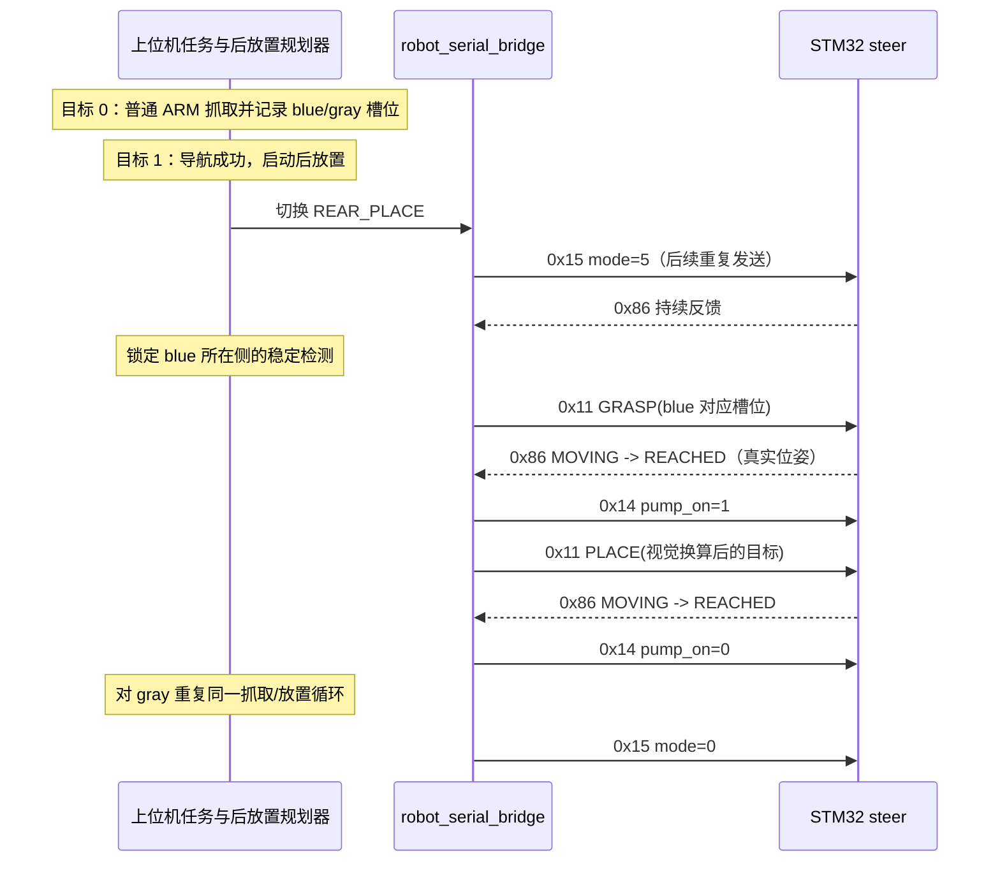

# 后放置上下位机联调规范（steer）

## 1. 目的与适用范围

本文档是后放置功能的唯一正式上下位机接口规范，适用于：

- 上位机 `D:\GSing_dipan` 中的 `robot_serial_bridge`、任务管理器和后放置规划器；
- 下位机 `D:\FengMH` 的 `steer` 分支；
- STM32 USB CDC 上使用整机集成协议的联调。

本文档只冻结现有接口和联调要求，不修改 STM32 固件、ROS 节点、协议编号或硬件引脚。协议常量以
`App/service/include/protocol/proto_defs.h` 为准；接收、模式门控和反馈实现分别位于
`task_comm.c` 与 `task_arm.c`。

## 2. 职责边界

| 上位机负责 | STM32 负责 |
| --- | --- |
| 识别 `Cube_ins`（blue）和 `Cube_tool`（gray） | 解析集成 USB CDC 帧、校验、缓存合法命令 |
| 在抓取成功后记录蓝、灰方块所在的后槽位 | 在 `ARM=2` 或 `REAR_PLACE=5` 下执行机械臂目标和主真空泵命令 |
| 启动时显式选择 `blue_left_gray_right` 或 `gray_left_blue_right` | 执行运动学、轨迹、限位、碰撞规避和后放置避障路径 |
| 在第 0 个导航点完成抓取，在第 1 个导航点启动后放置 | 持续回传真实末端位置、J1 角度及机械臂状态 |
| 把相机/库存信息换算为 arm-base 米制坐标并发出命令 | 在模式切换、故障和任务退出时清理机械臂任务并关闭泵 |

蓝、灰颜色、A/B 后槽、左右布局、库存文件、相机坐标和 ROS 任务主题都不会通过 CDC 下发给 STM32。
STM32 只接收 `target_type` 和已经换算到机械臂基座坐标系的目标坐标。

上位机约定：正 Y 为左侧，负 Y 为右侧。该约定用于上位机选择检测和放置目标；STM32 不应根据颜色、槽位名或
左右布局推断任务含义。

## 3. USB CDC 集成协议

### 3.1 链路与帧格式

链路为 STM32 USB CDC 原始字节流。`robot_serial_bridge` 是唯一允许打开该 CDC 设备的上位机节点；不得同时启动
旧版直连机械臂串口工具或第二个 CDC 读写者。

```text
+--------+--------+---------+-------------+---------+----------+
| 0x55   | 0xAA   | func_id | payload_len | payload | checksum |
+--------+--------+---------+-------------+---------+----------+
```

- `payload_len` 为 `uint8`。
- `checksum` 是从 `0x55` 到 payload 最后一个字节的无符号累加和低 8 位。
- 所有多字节浮点数为 IEEE-754 `float32`、Little-Endian；不得依赖跨平台 C 结构体对齐。
- 解析器必须支持任意分包、粘包、帧头错位和校验失败后的重新同步。

示例：模式切换到后放置的完整帧为 `55 AA 15 01 05 1A`；主泵关闭帧为
`55 AA 14 01 00 14`。

本文档使用整机集成协议的 `0x11`、`0x14`、`0x15`、`0x86`。`arm_serial_protocol.h` 中旧的
独立机械臂功能号 `0x12`、`0x13`、`0x21` 不属于本接口，且默认不接管 USB CDC。

### 3.2 正式功能号

| 方向 | FuncID | 载荷 | 载荷/整帧长度 | 约定 |
| --- | ---: | --- | --- | --- |
| 上位机 -> STM32 | `0x15` | `uint8 mode` | 1 / 6 字节 | 模式命令，后放置使用 `REAR_PLACE=5` |
| 上位机 -> STM32 | `0x11` | `uint8 target_type` + `float32_le x_m,y_m,z_m` | 13 / 18 字节 | 机械臂目标，`0=GRASP`，`1=PLACE` |
| 上位机 -> STM32 | `0x14` | `uint8 pump_on` | 1 / 6 字节 | 主真空泵，`0=关闭`，`1=开启` |
| STM32 -> 上位机 | `0x86` | `uint8 arm_state` + `float32_le end_x_m,end_y_m,end_z_m,theta1_rad` | 17 / 22 字节 | 真实机械臂反馈 |

模式取值：`0=IDLE`、`1=NAV`、`2=ARM`、`3=ESTOP`、`4=ERROR`、`5=REAR_PLACE`。
`REAR_PLACE=5` 是独立模式，不能复用普通抓取的 `ARM=2` 状态。

### 3.3 目标、泵和反馈字段

`0x11` 目标载荷：

| 偏移 | 类型 | 字段 | 说明 |
| ---: | --- | --- | --- |
| 0 | `uint8` | `target_type` | `0=GRASP`，`1=PLACE` |
| 1 | `float32_le` | `x_m` | arm-base X，单位 m |
| 5 | `float32_le` | `y_m` | arm-base Y，单位 m |
| 9 | `float32_le` | `z_m` | arm-base Z，单位 m |

下位机通信入口拒绝非有限数、非法 `target_type` 以及超出粗略可达范围的目标；机械臂控制层还会继续执行
逆解和关节约束校验。当前通信入口的径向范围是 `0.045 m..0.655 m`。坐标不得当作毫米，也不得再次做相机到机械臂的
坐标变换。

`0x86` 反馈载荷：

| 偏移 | 类型 | 字段 | 说明 |
| ---: | --- | --- | --- |
| 0 | `uint8` | `arm_state` | `0=IDLE`、`1=MOVING`、`2=REACHED`、`3=ERROR` |
| 1 | `float32_le` | `end_x_m` | 当前真实末端 X，arm-base，m |
| 5 | `float32_le` | `end_y_m` | 当前真实末端 Y，arm-base，m |
| 9 | `float32_le` | `end_z_m` | 当前真实末端 Z，arm-base，m |
| 13 | `float32_le` | `theta1_rad` | 当前 J1 几何角，rad |

当前 `steer` 实现以 50 Hz（20 ms 周期）发送 `0x86`。`REACHED` 必须由测量关节角前向运动学得到的实际末端位置支持，
不能直接回显目标；上位机只接受落在其配置容差内的 `REACHED`。机械臂无法继续执行时应发送 `ERROR=3`，停止当前轨迹并
关闭主泵。

## 4. 模式门控、重复帧与安全语义

通信层会缓存合法的 `0x11` 和 `0x14`；是否执行由机械臂任务按当前模式决定。因此“收到帧”不等于“已开始运动”。

- 只有 `ARM=2` 和 `REAR_PLACE=5` 可以消费新的机械臂目标和泵命令。
- `ARM <-> REAR_PLACE` 切换以及离开这两个模式时，机械臂任务必须清空内部协议状态并关闭主、辅助泵输出。
  上位机在离开机械臂模式前也会先发送 `0x14 pump_on=0`。
- 相同模式帧会被上位机以约 5 Hz 重发；重复的 `0x15 mode=5` 必须保持幂等，不能重置正在执行的后放置任务。
- `REAR_PLACE=5` 会启用下位机的后放置避障逻辑；普通 `ARM=2` 不应借用其任务状态。
- `ESTOP=3` 和 `ERROR=4` 不启动新的后放置任务。硬件级急停仍以 STM32 本地安全链路为准；当前通信处理对这两个模式的
  安全行为应在实机上单独验收，不把本协议文档当作硬急停认证。

上位机在未看到新目标后的 `MOVING` 或有效 `REACHED` 反馈时可能重发同一个 `0x11`。接口合同要求 STM32 将相同的
活动目标视为幂等操作，不得重新开始轨迹、清空插补或造成抖动；新的不同目标才可以覆盖旧目标。

当前 `steer` 的每个接收目标都会增加内部序号，且后放置 `PLACE` 可能重新规划分段避障路径。因此“反馈丢失期间的重复
`0x11` 不重启运动”尚未完成认证，详见第 7 节，不能在实机联调中视为已通过。

`0x14` 只定义主真空泵，不定义辅助 GPIO 的上位机接口。相同泵命令必须幂等。下位机可将 `PLACE` 过程中的关泵延迟到
实际到达后完成，但模式退出和故障路径必须保证泵关闭。

## 5. 两个方块的后放置时序

上位机在第 0 个导航点进入普通 `ARM=2`，完成两次抓取并保存蓝色和灰色方块的后槽位。导航到第 1 个点成功后，
任务管理器切换到 `REAR_PLACE=5` 并启动后放置规划器。规划器固定先处理 blue，再处理 gray；左右位置由启动时选择的
布局和检测结果决定，不下发颜色或布局字段。



每个方块的最小顺序为：

1. 上位机等待当前物块预期一侧的稳定检测和新鲜 MCU 反馈。
2. 发送 `0x11 GRASP`，等待真实 `REACHED`。
3. 发送 `0x14 pump_on=1`，保持抓取。
4. 发送 `0x11 PLACE`，等待真实 `REACHED`。
5. 发送 `0x14 pump_on=0`，再开始下一个物块。

放置目标的 X/Y 由上位机视觉换算产生；当前上位机参数将后放置 Z 设为 `0.02 m`。STM32 应执行收到的 arm-base 目标，
不得硬编码 A/B 槽坐标、颜色或左右布局。

## 6. 失败、超时与日志

以下情况由上位机结束后放置：蓝/灰库存缺失、布局非法、预期侧检测超时、MCU 反馈丢失、收到 `0x86 ERROR`，或目标到达
反馈不可信。结束时上位机关闭泵并退出机械臂模式；STM32 同样必须停止当前任务并关闭泵。

联调日志至少应记录：时间戳、FuncID、模式、目标类型、XYZ、泵状态、`arm_state`、反馈 XYZ、`theta1_rad` 和拒绝原因。
排查时按相同时间轴对照上位机 `robot_serial_bridge` 日志与 STM32 CDC 收发日志。

## 7. 当前实现状态与联调阻塞项

| 项目 | 当前状态 | 联调结论 |
| --- | --- | --- |
| `REAR_PLACE=5` 枚举和接收 | 已实现 | 可作为后放置模式使用 |
| `ARM=2` / `REAR_PLACE=5` 机械臂命令门控 | 已实现 | 两种模式均可消费目标和泵命令，切换会清理内部状态 |
| 后放置避障 | 已实现 | 仅在 `REAR_PLACE` 下启用 |
| `0x86` 实际反馈 | 已实现 | 载荷 17 字节，名义 50 Hz |
| 相同 `0x15` 重发 | 已实现 | 不应触发模式边沿重置 |
| 反馈丢失时相同 `0x11` 的幂等性 | 已实现并新增主机回归用例 | 相同活动目标不重新规划；仍需实机确认反馈丢失场景 |
| `ESTOP/ERROR` 的硬件级急停语义 | 未认证 | 仅能作为模式/软安全流程，不替代本地安全链路验证 |
| C 主机测试构建 | 已恢复链接 | 车轮诊断测试桩已补齐；全量套件仍有既有断言漂移，需单独处理 |

## 8. CDC 台架验收清单

| 场景 | 操作 | 通过条件 |
| --- | --- | --- |
| 分包、粘包与坏校验 | 拆分帧、合并帧、插入错误 checksum 后续接合法帧 | 解析器恢复同步，只有合法帧生效 |
| 重复模式 | 连续发送 `0x15 mode=5`（约 5 Hz） | 不清任务、不重启轨迹、不出现泵抖动 |
| blue/gray 两轮 | 依次执行两套 GRASP -> 泵开 -> PLACE -> 泵关 | 两次均有真实 `MOVING/REACHED`，blue 先于 gray，完成后 IDLE |
| 真实反馈 | 在空闲、运动、到达和故障状态抓取 `0x86` | 帧长 22、字段有限、实际 XYZ/J1 与机械臂一致、名义 50 Hz |
| 重复目标 | 人为屏蔽反馈后重发相同 `0x11` | 不得重启轨迹；未通过则记录为第 7 节阻塞项 |
| 非法目标和故障 | 非法类型、非有限值、不可达目标或 MCU `ERROR` | 目标不执行，任务停止，泵关闭，上位机退出后放置 |
| 模式退出 | 在抓取和放置过程中切换至 IDLE/NAV/ERROR | STM32 清任务、关泵，后续旧命令不继续执行 |

文档修改后的静态检查应至少执行 `git diff --check` 以及所有 Markdown 链接人工核对。主机测试现可构建；全量套件的
既有参数断言失败不作为本次后放置修复“已验证”的依据。
