# 上下位机统一控制链路代码图

本文档不是架构愿景，而是当前代码的“控制链路索引”。目标是让你不用通读所有代码，也能知道一条命令从 ROS 到 STM32，再到电机/气泵，中间经过哪些函数、每个函数负责什么、相互之间怎么跳转。

## 0. 一句话模型

集成后的系统只有一个原则：

> 上位机 `robot_serial_bridge` 独占 STM32 CDC 串口；`mission_manager` 决定当前模式；串口桥按模式 gate USB 命令；下位机 `task_comm` 只解析并缓存命令。底盘 task 和机械臂 task 并行常驻，模式只决定哪一类 USB 命令被消费。

## 1. 总控制链路图

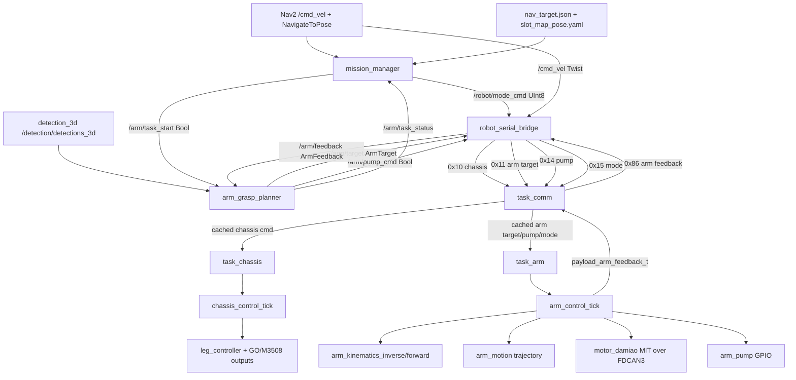

## 2. 模式和互锁

| 模式 | 上位机发送方 | 下位机允许执行 | 被强制屏蔽 |
|---|---|---|---|
| `IDLE=0` | `mission_manager` / 手动 | 底盘速度为 0；机械臂保持当前状态 | 底盘运动、机械臂 USB 新目标/泵命令 |
| `NAV=1` | `mission_manager` 导航阶段 | `0x10 CHASSIS_CMD`；机械臂保持当前状态 | 机械臂 `0x11/0x14` |
| `ARM=2` | `mission_manager` 抓取阶段 | `0x11 ARM_TARGET`、`0x14 ARM_PUMP`；底盘收到零速度 | 底盘运动 |
| `ESTOP=3` | 预留安全态 | 串口桥仍发模式，底盘速度为 0 | 底盘运动、机械臂新命令 |
| `ERROR=4` | 任务失败态 | 串口桥仍发模式，底盘速度为 0 | 底盘运动、机械臂新命令 |

对应代码：

| 位置 | 函数 | 作用 |
|---|---|---|
| [/Users/leon/Desktop/merge/gsing_dog-main/src/robot_system/robot_system/gate.py](/Users/leon/Desktop/merge/gsing_dog-main/src/robot_system/robot_system/gate.py) | `gated_chassis_command()` | 上位机侧：只有 `NAV` 且 `/cmd_vel` 未过期才允许底盘速度通过，否则输出 0。 |
| [/Users/leon/Desktop/merge/gsing_dog-main/src/robot_system/robot_system/gate.py](/Users/leon/Desktop/merge/gsing_dog-main/src/robot_system/robot_system/gate.py) | `arm_commands_allowed()` | 上位机侧：只有 `ARM` 才允许机械臂目标和气泵帧发出。 |
| [/Users/code/FengMH/App/app/src/task_chassis.c](/Users/code/FengMH/App/app/src/task_chassis.c) | `chassis_mode_allows_motion()` | 下位机侧：只在收到 `mode=NAV` 后允许底盘命令进入控制器；没有新模式帧时兼容旧路径。 |
| [/Users/code/FengMH/App/app/src/task_arm.c](/Users/code/FengMH/App/app/src/task_arm.c) | `arm_usb_commands_allowed()` | 下位机侧：只有 `mode=ARM` 才把新的 `0x11/0x14` 排进旧机械臂协议队列；其他模式下同步 seq 并丢弃。 |

## 3. 上位机代码图

### 3.1 `integrated_system.launch.py`

文件：[/Users/leon/Desktop/merge/gsing_dog-main/src/robot_system/launch/integrated_system.launch.py](/Users/leon/Desktop/merge/gsing_dog-main/src/robot_system/launch/integrated_system.launch.py)

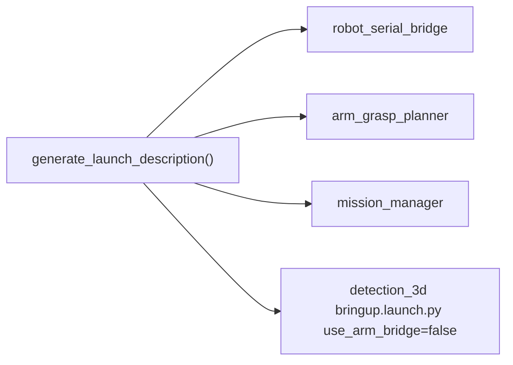

关键点：

| 函数/节点 | 作用 |
|---|---|
| `generate_launch_description()` | 启动 `robot_serial_bridge`、`arm_grasp_planner`、可选 `mission_manager`、可选 `detection_3d`。 |
| `use_arm_bridge:=false` | 禁止旧 `detection_3d/arm_serial_bridge_node.py` 抢串口。 |
| `use_nav_target_file` | 让 `mission_manager` 直接替代旧 `slot_nav_dispatcher.py`，轮询 `nav_target.json`。 |

### 3.2 `mission_manager_node.py`

文件：[/Users/leon/Desktop/merge/gsing_dog-main/src/robot_system/robot_system/mission_manager_node.py](/Users/leon/Desktop/merge/gsing_dog-main/src/robot_system/robot_system/mission_manager_node.py)

职责：高层任务状态机。它不碰串口，不直接发底盘速度，只决定“现在该导航还是该抓取”。

状态机：

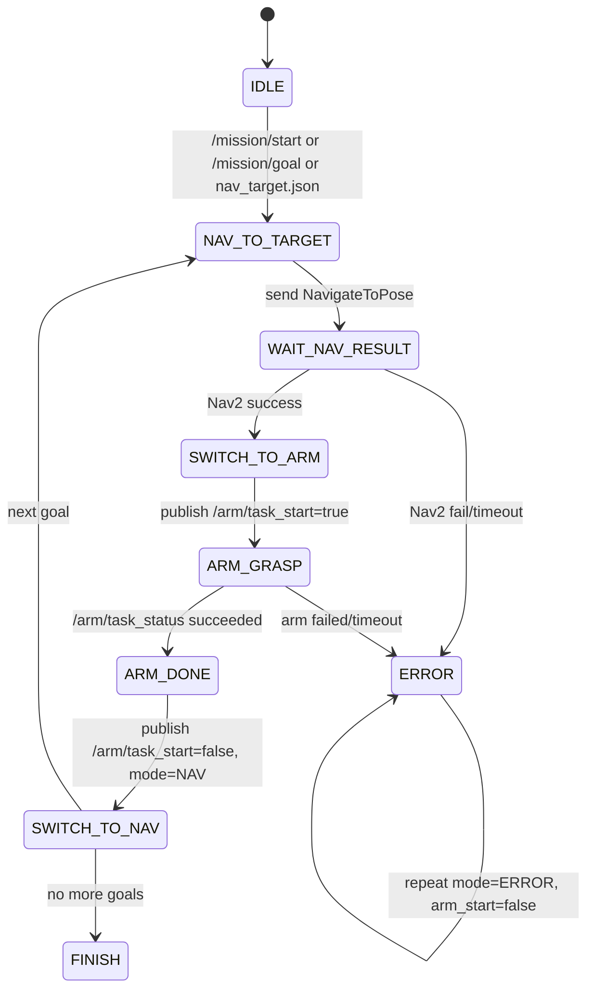

函数链路：

| 入口 | 调用/输出 | 作用 |
|---|---|---|
| `__init__()` | 创建 publisher/subscriber/action client/timer | 参数加载、Nav2 ActionClient、`/robot/mode_cmd`、`/arm/task_start`、`/mission/status`。 |
| `_start_cb()` | `_start_mission()` 或 `_cancel_mission()` | 手动 `/mission/start` 开/停任务。 |
| `_goal_cb()` | `_start_mission()` | 手动 `/mission/goal` 作为单目标任务。 |
| `_poll_nav_target_file()` | `_read_nav_target()` -> `_make_slot_pose()` -> `_start_mission()` | 读取底盘视觉链路输出的 `nav_target.json`，用 `slot_map_pose.yaml` 转成 Nav2 目标。 |
| `_load_slot_map()` | 填充 `_slot_poses` | 加载 `slots: {id: {x,y,yaw}}`。 |
| `_start_mission()` | `_publish_mode(NAV)` -> state `NAV_TO_TARGET` | 进入导航阶段。 |
| `_tick()` | 按 `MissionState` 分发 | 10Hz 主循环，负责超时、模式重复、状态推进。 |
| `_send_nav_goal()` | `NavigateToPose.send_goal_async()` | 发 Nav2 目标。 |
| `_nav_goal_response_cb()` | 保存 goal handle 或 ERROR | 处理目标是否被 Nav2 接受。 |
| `_nav_result_cb()` | `_publish_mode(ARM)` -> state `SWITCH_TO_ARM` | Nav2 成功后切 ARM。 |
| `_arm_status_cb()` | state `ARM_DONE` 或 `ERROR` | 接收机械臂抓放结果。 |
| `_advance_goal_or_finish()` | `NAV_TO_TARGET` 或 `FINISH` | 多目标任务推进。 |
| `_publish_mode()` / `_repeat_mode_if_due()` | `/robot/mode_cmd` | 周期性重复模式，避免单帧丢失。 |
| `_publish_arm_start()` | `/arm/task_start` | 通知 `arm_grasp_planner` 开始或取消抓放。 |
| `_publish_status()` | `/mission/status` | 对外发布任务状态。 |

### 3.3 `arm_grasp_planner_node.py`

文件：[/Users/leon/Desktop/merge/gsing_dog-main/src/robot_system/robot_system/arm_grasp_planner_node.py](/Users/leon/Desktop/merge/gsing_dog-main/src/robot_system/robot_system/arm_grasp_planner_node.py)

职责：机械臂上位机状态机。它不碰串口，只把视觉目标和 MCU 反馈转换成 `/arm/target`、`/arm/pump_cmd`、`/arm/task_status`。

状态机：

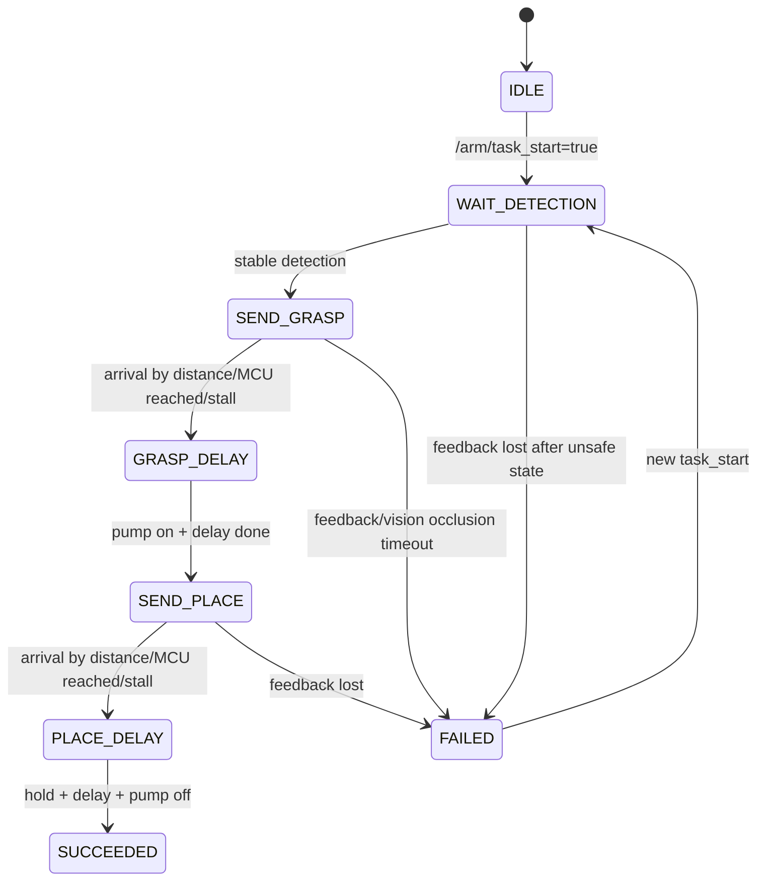

函数链路：

| 入口 | 调用/输出 | 作用 |
|---|---|---|
| `__init__()` | 创建话题和参数 | 订阅 `/detection/detections_3d`、`/arm/feedback`、`/arm/task_start`、`/robot/mode_state`；发布 `/arm/target`、`/arm/pump_cmd`、`/arm/task_status`。 |
| `_task_start_cb()` | `_start_task()` / `_cancel_task()` | 接收 mission 的开始/取消。 |
| `_mode_state_cb()` | 可选自动开始/取消 | 如果开启 `auto_start_on_arm_mode`，模式进 ARM 自动启动。默认关闭，由 mission 显式启动。 |
| `_detection_cb()` | EMA + StabilityFilter -> state `SEND_GRASP` | 选择最高分检测，按类别过滤，得到稳定相机坐标。 |
| `_feedback_cb()` | 缓存 `ArmFeedback` | 保留末端 `end_xyz` 和 `theta1`，供坐标转换和到位判定。 |
| `_tick()` | `_send_grasp()` / `_delay_after_grasp()` / `_send_place()` / `_delay_after_place()` | 20Hz 主状态机。 |
| `_current_grasp_target()` | `transform_camera_to_arm_base()` -> `_apply_command_offset()` | 用最新 MCU 反馈把相机坐标转成 `arm_base` 目标，再加机械补偿。 |
| `_occluded_grasp_target()` | 中值保持 | 抓取末端相机被机械臂遮挡后，继续发最近成功目标的中值。 |
| `_publish_target()` | `/arm/target ArmTarget` | 限频发布目标，`target_type=GRASP/PLACE`。 |
| `_activate_target()` | 记录 active target | 只有实际发布过的目标才进入到位判定，避免“未发送目标”推进状态。 |
| `_update_arrival()` | `_update_mcu_reached_count()` + `_update_stall_count()` | 三路到位：距离到位、MCU reached、近目标停滞。 |
| `_lock_place_target()` | 锁定本次放置点 | 抓取到达时按末端 `end_y` 选择左/右放置点。 |
| `_publish_pump()` | `/arm/pump_cmd Bool` | 抓取到达后开泵；放置保持延时后关泵。 |
| `_publish_status()` | `/arm/task_status` | 给 `mission_manager` 反馈 RUNNING/SUCCEEDED/FAILED。 |

### 3.4 `robot_serial_bridge_node.py`

文件：[/Users/leon/Desktop/merge/gsing_dog-main/src/robot_system/robot_system/robot_serial_bridge_node.py](/Users/leon/Desktop/merge/gsing_dog-main/src/robot_system/robot_system/robot_serial_bridge_node.py)

职责：唯一拥有 STM32 CDC 串口。所有 Host -> MCU 帧都从这里走。

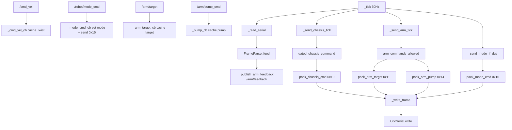

函数链路：

| 函数 | 作用 |
|---|---|
| `__init__()` | 加载参数、创建串口对象、创建 topic、启动 50Hz timer。 |
| `_open_serial()` / `_try_reopen_serial()` | 打开或重连 STM32 CDC。 |
| `_write_frame()` | 串口写的唯一出口；失败时关闭 fd 等待重连。 |
| `_cmd_vel_cb()` | 缓存最后一帧 `/cmd_vel` 和时间戳。 |
| `_mode_cmd_cb()` | 更新 `_mode`，立即发送 `0x15 MODE_CMD`；切出 ARM 时请求关泵。 |
| `_arm_target_cb()` | 缓存最新机械臂目标。 |
| `_pump_cb()` | 缓存最新气泵请求。 |
| `_tick()` | 每周期读串口、重复模式、发底盘 tick、发机械臂 tick。 |
| `_read_serial()` | 读取 CDC 字节，交给 `FrameParser.feed()`。 |
| `_publish_arm_feedback()` | 解析 `0x86` 并发布 `/arm/feedback`。 |
| `_send_mode_if_due()` | 周期性重复 `0x15`，增强模式可靠性。 |
| `_send_chassis_tick()` | 只有 `NAV` 且 `/cmd_vel` 未超时才发真实速度，否则发零。 |
| `_send_arm_tick()` | 只有 `ARM` 才发 `0x11` 和 `0x14`；非 ARM 只允许必要的关泵。 |
| `destroy_node()` | 退出时发底盘零速、关泵、切 IDLE。 |

### 3.5 上位机协议层

文件：[/Users/leon/Desktop/merge/gsing_dog-main/src/robot_system/robot_system/protocol.py](/Users/leon/Desktop/merge/gsing_dog-main/src/robot_system/robot_system/protocol.py)

| 函数/类 | 作用 |
|---|---|
| `RobotMode` | `IDLE/NAV/ARM/ESTOP/ERROR` 枚举，和下位机 `PROTO_ROBOT_MODE_*` 对齐。 |
| `ArmTargetType` | `GRASP=0`、`PLACE=1`，和下位机 `PROTO_ARM_TARGET_*` 对齐。 |
| `ArmState` | `IDLE/MOVING/REACHED/ERROR`，和下位机 `PROTO_ARM_STATE_*` 对齐。 |
| `build_frame()` | 构造 `0x55 0xAA | func | len | payload | checksum`。 |
| `pack_chassis_cmd()` | 打包 `0x10`，payload 为 `<fff>`。 |
| `pack_mode_cmd()` | 打包 `0x15`，payload 为 `<B>`。 |
| `pack_arm_target()` | 打包 `0x11`，payload 为 `<Bfff>`。 |
| `pack_arm_pump()` | 打包 `0x14`，payload 为 `<B>`。 |
| `parse_arm_feedback()` | 解析 `0x86`，payload 为 `<Bffff>`。 |
| `FrameParser.feed()` | 增量解析 MCU 上行帧。 |

## 4. 下位机代码图

### 4.1 初始化和任务创建

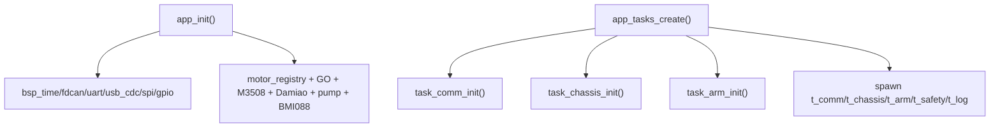

| 文件 | 函数 | 作用 |
|---|---|---|
| [/Users/code/FengMH/App/app/src/app_init.c](/Users/code/FengMH/App/app/src/app_init.c) | `app_init()` | 初始化 BSP、USB CDC、FDCAN/UART、GPIO、气泵、GO/M3508/Damiao 电机、BMI088。 |
| [/Users/code/FengMH/App/app/src/app_tasks.c](/Users/code/FengMH/App/app/src/app_tasks.c) | `app_tasks_create()` | 初始化通信/底盘/机械臂模块，并创建 FreeRTOS 任务。 |

### 4.2 USB CDC 协议入口

文件：[/Users/code/FengMH/App/app/src/task_comm.c](/Users/code/FengMH/App/app/src/task_comm.c)

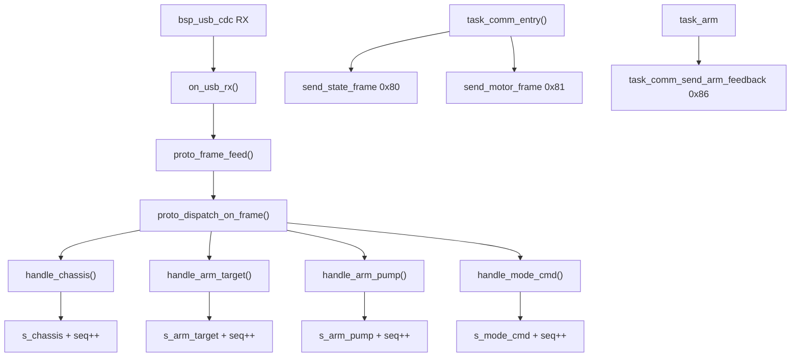

通信函数索引：

| 函数 | 作用 | 下游 |
|---|---|---|
| `task_comm_init()` | 清空命令缓存；注册协议分发表；把 `on_usb_rx()` 挂到 USB CDC RX。 | `bsp_usb_cdc_attach_rx()` |
| `on_usb_rx()` | USB 收到任意字节后喂给帧解析器。 | `proto_frame_feed()` |
| `proto_frame_feed()` | 字节级状态机，校验帧头/长度/checksum。 | `proto_dispatch_on_frame()` |
| `proto_dispatch_on_frame()` | 根据 func id 查表分发。 | `handle_*()` |
| `handle_chassis()` | 接收 `0x10`，兼容 12 字节速度帧和 17 字节扩展帧。 | `s_chassis` |
| `handle_arm_target()` | 接收 `0x11`，校验 target type，缓存目标 xyz。 | `s_arm_target` |
| `handle_arm_pump()` | 接收 `0x14`，校验 0/1，缓存气泵状态。 | `s_arm_pump` |
| `handle_mode_cmd()` | 接收 `0x15`，缓存机器人模式。 | `s_mode_cmd` |
| `task_comm_get_chassis()` | 给 `task_chassis` 读取缓存。 | `task_chassis` |
| `task_comm_get_arm_target()` | 给 `task_arm` 读取缓存。 | `task_arm` |
| `task_comm_get_arm_pump()` | 给 `task_arm` 读取缓存。 | `task_arm` |
| `task_comm_get_mode_cmd()` | 给 `task_chassis/task_arm` 判断模式。 | `task_chassis/task_arm` |
| `task_comm_send_arm_feedback()` | 把 `payload_arm_feedback_t` 打包成 `0x86` 上行。 | Host `/arm/feedback` |

### 4.3 下位机协议定义

文件：[/Users/code/FengMH/App/service/include/protocol/proto_defs.h](/Users/code/FengMH/App/service/include/protocol/proto_defs.h)

| FuncID | 方向 | Payload | 消费函数 |
|---|---|---|---|
| `0x10 PROTO_FUNC_CHASSIS_CMD` | Host -> MCU | `float vx, vy, wz` | `handle_chassis()` -> `task_chassis_step_for_test()` |
| `0x11 PROTO_FUNC_ARM_TARGET` | Host -> MCU | `uint8 target_type + float x,y,z` | `handle_arm_target()` -> `consume_new_commands()` |
| `0x14 PROTO_FUNC_ARM_PUMP` | Host -> MCU | `uint8 pump_on` | `handle_arm_pump()` -> `consume_new_commands()` |
| `0x15 PROTO_FUNC_MODE_CMD` | Host -> MCU | `uint8 mode` | `handle_mode_cmd()` -> `chassis_mode_allows_motion()` / `arm_usb_commands_allowed()` |
| `0x86 PROTO_FUNC_ARM_FEEDBACK` | MCU -> Host | `uint8 arm_state + float end_x,end_y,end_z,theta1` | `Arm_Control_GetCurrentAngles()` + `Arm_Control_GetMoveStatus()` -> `task_comm_send_arm_feedback()` |

### 4.4 底盘执行链路

文件：[/Users/code/FengMH/App/app/src/task_chassis.c](/Users/code/FengMH/App/app/src/task_chassis.c)  
核心控制：[/Users/code/FengMH/App/control/src/chassis/chassis_control.c](/Users/code/FengMH/App/control/src/chassis/chassis_control.c)

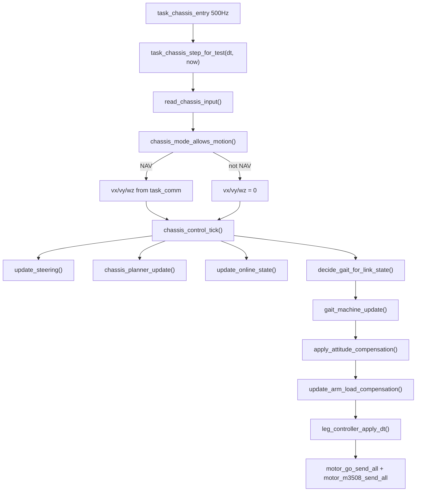

底盘函数索引：

| 函数 | 作用 |
|---|---|
| `task_chassis_entry()` | FreeRTOS 任务，500Hz 调 `task_chassis_step_for_test()`。 |
| `read_chassis_input()` | 从 `task_comm` 读速度和模式；非 NAV 时速度清零。 |
| `task_chassis_step_for_test()` | 把 app 输入传给 `chassis_control_tick()`。 |
| `chassis_control_init()` | 创建 stand/trot/walk/script gait，绑定腿控制器和电机。 |
| `chassis_control_tick()` | 底盘单周期总入口：输入 -> steering -> planner -> gait -> leg IK -> motor output。 |
| `update_steering()` | 可选 yaw 闭环，将 target_yaw 转成有效 `wz`。 |
| `chassis_planner_update()` | 把 `vx/vy/wz` 转成步态参数和轮速计划。 |
| `decide_gait_for_link_state()` | 在线时按 motion plan 切 walk/stand；离线时保守 stand。 |
| `apply_gait_output_to_motors()` | 更新 gait 输出，写入姿态力矩补偿和机械臂载荷补偿，然后交给腿控制器。 |
| `update_arm_load_compensation()` | 读取机械臂末端位置/末端质量，估算等效质心并写入 `g_leg_gravity_comp`。 |
| `flush_motor_outputs()` | 板上发送 GO/M3508 总线输出。 |

机械臂到底盘补偿详图见：[/Users/code/FengMH/docs/arm_chassis_load_compensation.md](/Users/code/FengMH/docs/arm_chassis_load_compensation.md)。

### 4.5 机械臂执行链路

任务入口：[/Users/code/FengMH/App/app/src/task_arm.c](/Users/code/FengMH/App/app/src/task_arm.c)  
核心控制：[/Users/code/FengMH/App/control/src/arm/arm_control.c](/Users/code/FengMH/App/control/src/arm/arm_control.c)

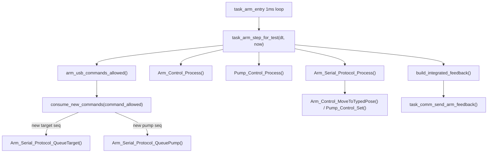

`task_arm.c` 函数索引：

| 函数 | 作用 |
|---|---|
| `arm_usb_commands_allowed()` | 只有 `mode=ARM` 才允许新的机械臂 USB 命令。 |
| `consume_new_commands()` | 用 seq 判断是否有新 `0x11` 或 `0x14`；非 ARM 模式同步 seq 并丢弃，ARM 模式才排进 `Arm_Serial_Protocol_QueueTarget()` / `Arm_Serial_Protocol_QueuePump()`。 |
| `build_integrated_feedback()` | 用旧 API 读取当前关节和运动状态，打包新整机协议 `0x86 ARM_FEEDBACK`。 |
| `send_feedback_if_due()` | 50Hz 发送 `0x86 ARM_FEEDBACK`。 |
| `task_arm_init()` | 按原工程顺序调用 `Pump_Control_Init()`、`Arm_Control_Init()`、`Arm_Control_SetGravityOnlyMode(0)`、`Arm_Serial_Protocol_Init()`。 |
| `task_arm_step_for_test()` | 机械臂单周期入口：USB 命令 gate -> 原工程 `Arm_Control_Process()` / `Pump_Control_Process()` / `Arm_Serial_Protocol_Process()` -> 新协议反馈。 |
| `task_arm_entry()` | FreeRTOS 任务，1ms 循环，贴近原工程 `while(1)+HAL_Delay(1)`。 |

### 4.6 `arm_control.c` 内部状态机

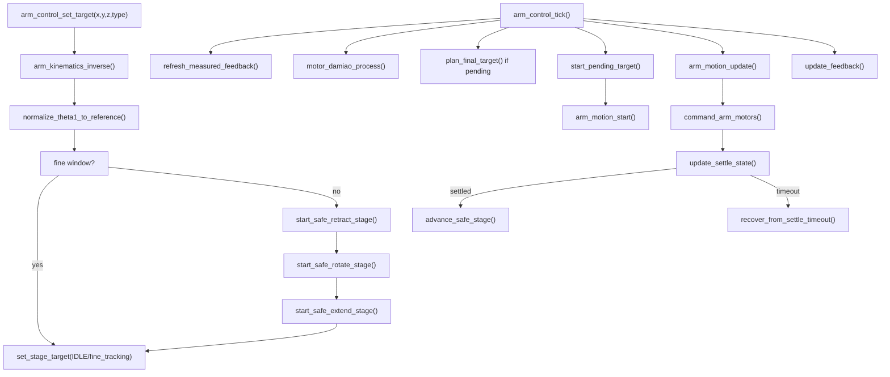

`arm_control.c` 函数索引：

| 函数 | 作用 |
|---|---|
| `arm_control_init()` | 初始化上下文、重力补偿、气泵、轨迹模块、绑定 Damiao 电机。 |
| `arm_control_set_enabled()` | 硬停/故障级运行开关；正常 `IDLE/NAV/ARM` 不由 mode 调用它。 |
| `arm_control_set_gravity_mode()` | 停止当前轨迹并回到重力补偿保持，不关泵，对齐旧 `Arm_Control_SetGravityMode()` 语义。 |
| `arm_control_set_target()` | Host 目标入口；校验 target type/finite，IK，决定 fine tracking 还是安全三段运动。 |
| `arm_control_set_pump()` | 控制气泵 GPIO，并同步重力补偿 payload 状态。 |
| `arm_control_tick()` | 机械臂控制单周期总入口。 |
| `refresh_measured_feedback()` | 从电机反馈读当前关节，FK 得到实际末端坐标。 |
| `plan_final_target()` | 新目标第一次执行时决定 fine tracking 或 safe move。 |
| `start_safe_retract_stage()` | 安全三段第 1 段：收臂到安全姿态。 |
| `start_safe_rotate_stage()` | 安全三段第 2 段：只转底座到目标方向。 |
| `start_safe_extend_stage()` | 安全三段第 3 段：伸到最终目标关节。 |
| `set_stage_target()` | 设置当前阶段目标，并重置到位检测。 |
| `start_pending_target()` | 以当前实测/规划点为起点启动 `arm_motion_start()`。 |
| `arm_motion_update()` | 轨迹插值，更新 `s_arm.motion_sample`。 |
| `command_arm_motors()` | 将规划点、速度、KP/KD、重力补偿扭矩发给 4 个 Damiao。 |
| `update_settle_state()` | 轨迹结束后用实测误差和速度确认到位。 |
| `advance_safe_stage()` | RETRACT -> ROTATE_BASE -> EXTEND -> REACHED。 |
| `recover_from_settle_timeout()` | 阶段超时时重试/接受 fine 小误差/进入 ERROR。 |
| `update_feedback()` | 生成 `payload_arm_feedback_t`，优先使用实测反馈。 |
| `arm_control_get_feedback()` | 给 `task_arm` 读取 `0x86` payload。 |

### 4.7 机械臂底层模块

| 文件 | 函数 | 作用 |
|---|---|---|
| [/Users/code/FengMH/App/control/src/arm/arm_kinematics.c](/Users/code/FengMH/App/control/src/arm/arm_kinematics.c) | `arm_kinematics_inverse()` | `arm_base xyz` -> 关节目标。 |
| [/Users/code/FengMH/App/control/src/arm/arm_kinematics.c](/Users/code/FengMH/App/control/src/arm/arm_kinematics.c) | `arm_kinematics_forward()` | 关节角 -> 当前末端坐标，生成反馈。 |
| [/Users/code/FengMH/App/control/src/arm/arm_kinematics.c](/Users/code/FengMH/App/control/src/arm/arm_kinematics.c) | `arm_kinematics_compute_t4_from_t3()` | 保持 J4 和 J3 耦合。 |
| [/Users/code/FengMH/App/control/src/arm/arm_motion.c](/Users/code/FengMH/App/control/src/arm/arm_motion.c) | `arm_motion_start()` | 启动关节轨迹。 |
| [/Users/code/FengMH/App/control/src/arm/arm_motion.c](/Users/code/FengMH/App/control/src/arm/arm_motion.c) | `arm_motion_update()` | 按时间更新关节位置/速度/加速度。 |
| [/Users/code/FengMH/App/control/src/arm/arm_gravity_comp.c](/Users/code/FengMH/App/control/src/arm/arm_gravity_comp.c) | `arm_gravity_comp_calculate()` | 根据姿态和 payload 状态算 J2/J3/J4 重力补偿。 |
| [/Users/code/FengMH/App/device/src/motor_damiao.c](/Users/code/FengMH/App/device/src/motor_damiao.c) | `motor_damiao_process()` | 自动 enable/重试 Damiao，保证电机能恢复。 |
| [/Users/code/FengMH/App/device/src/motor_damiao.c](/Users/code/FengMH/App/device/src/motor_damiao.c) | `motor_damiao_pack_mit()` | 把 pos/vel/kp/kd/tau 打包成 Damiao MIT 8 字节。 |
| [/Users/code/FengMH/App/device/src/motor_damiao.c](/Users/code/FengMH/App/device/src/motor_damiao.c) | `motor_damiao_parse_feedback()` | 解析 Damiao 反馈，更新 `motor_state_t`。 |
| [/Users/code/FengMH/App/device/src/arm_pump.c](/Users/code/FengMH/App/device/src/arm_pump.c) | `arm_pump_set()` | 主气泵 GPIO 开关。 |

## 5. 三条典型运行路径

### 5.1 导航阶段

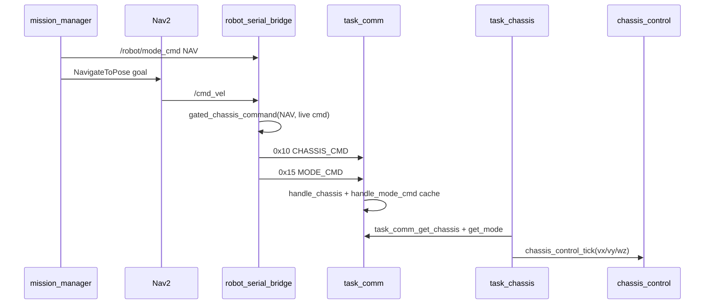

### 5.2 到点后抓取阶段

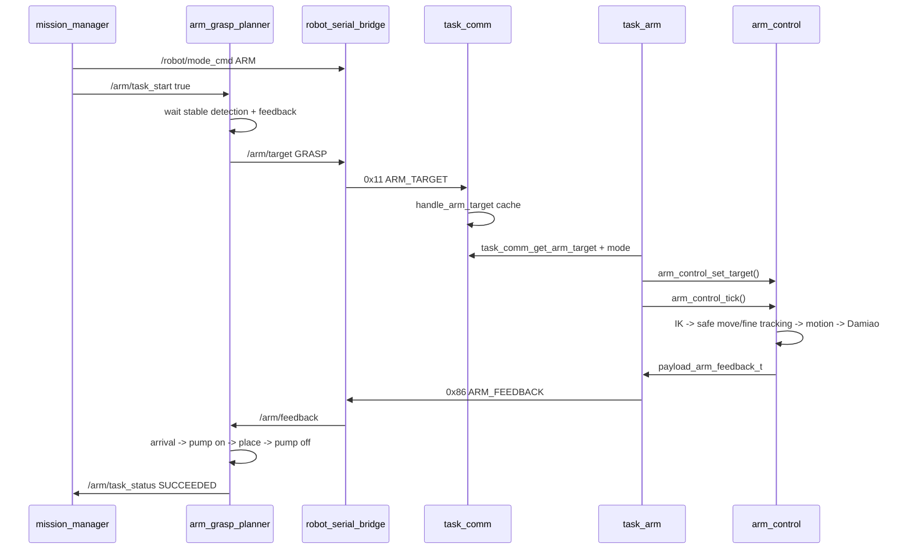

### 5.3 反馈闭环

## 6. 当前最重要的修改点速查

| 你想改什么 | 改哪里 |
|---|---|
| 串口协议 func id / payload | Host: `robot_system/protocol.py`；MCU: `proto_defs.h`、`task_comm.c` |
| 允许行走或机械臂同时工作 | Host: `gate.py`、`robot_serial_bridge_node.py`；MCU: `task_chassis.c`、`task_arm.c` |
| Nav2 到点后如何触发抓取 | `mission_manager_node.py` 的 `_nav_result_cb()`、`_tick()` |
| `nav_target.json` 槽位决策接入 | `mission_manager_node.py` 的 `_poll_nav_target_file()`、`_load_slot_map()`、`_make_slot_pose()` |
| 视觉坐标到机械臂坐标转换 | `arm_grasp_planner_node.py` 的 `_current_grasp_target()`，实际公式在 `detection_3d/vision_transform.py` |
| 抓取补偿参数 | `system_params.yaml` 的 `command_offset_*`、`command_abs_y_offset_m` |
| 放置点 | `system_params.yaml` 的 `place_targets_m`，以及 `arm_grasp_planner_node.py` 默认值 |
| 抓取/放置状态机 | Host: `arm_grasp_planner_node.py`；MCU: `arm_control.c` |
| 机械臂安全移动策略 | `arm_control.c` 的 `start_safe_retract_stage()`、`start_safe_rotate_stage()`、`start_safe_extend_stage()` |
| Damiao 电机输出 | `arm_control.c` 的 `command_arm_motors()`；`motor_damiao.c` 的 `motor_damiao_pack_mit()` |
| 气泵 GPIO | `arm_control_set_pump()` -> `arm_pump_set()` |

## 7. 哪些旧节点不能同跑

集成模式下不要同时启动：

| 旧节点 | 原因 | 替代者 |
|---|---|---|
| `detection_3d/arm_serial_bridge_node.py` | 它也会打开 STM32 CDC 串口。 | `robot_system/robot_serial_bridge` + `arm_grasp_planner` |
| `dog_nav2_bringup/scripts/cmd_vel_chassis_serial.py` | 它也会打开 STM32 CDC 串口并发送底盘帧。 | `robot_system/robot_serial_bridge` |
| `dog_nav2_bringup/scripts/slot_nav_dispatcher.py` | 如果 `mission_manager use_nav_target_file=true`，两者会同时给 Nav2 发目标。 | `robot_system/mission_manager` |

## 8. 最小联调观察点

| 阶段 | 应该看到什么 |
|---|---|
| 启动集成上位机 | 只有 `robot_serial_bridge` 打开 STM32 CDC。 |
| 发布 `mode=NAV` | Host 发 `0x15`；MCU `task_chassis` 允许 `/cmd_vel` 进入。 |
| Nav2 发布 `/cmd_vel` | Host 发 `0x10`；MCU `handle_chassis()` seq 增加；`chassis_control_tick()` 收到非零速度。 |
| 发布 `mode=ARM` | Host 底盘发零；机械臂目标/气泵允许发送；MCU `task_arm` 已常驻运行并开始消费新 ARM 命令。 |
| 视觉稳定目标 | `arm_grasp_planner` 从 `WAIT_DETECTION` 到 `SEND_GRASP`，发布 `/arm/target`。 |
| MCU 收到 `0x11` | `handle_arm_target()` seq 增加；`consume_new_commands()` 调 `Arm_Serial_Protocol_QueueTarget()`。 |
| 机械臂运动 | `Arm_Serial_Protocol_Process()` 调 `Arm_Control_MoveToTypedPose()`，随后 `Arm_Control_Process()` / `arm_control_tick()` 执行 IK/轨迹/Damiao 输出；`0x86` 反馈持续上行。 |
| 抓取成功 | `arm_grasp_planner` 发布 `/arm/task_status SUCCEEDED`；`mission_manager` 切回 NAV 或 FINISH。 |
