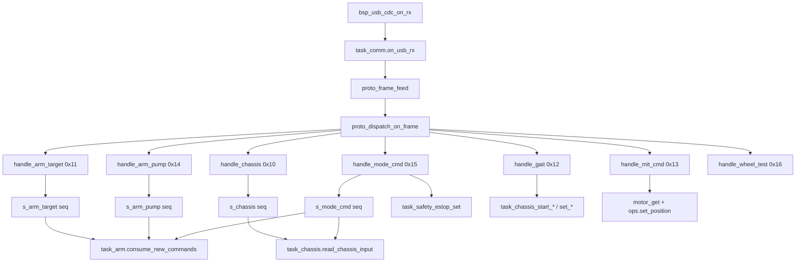
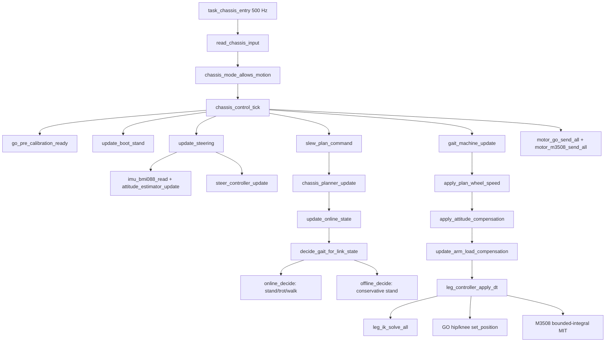
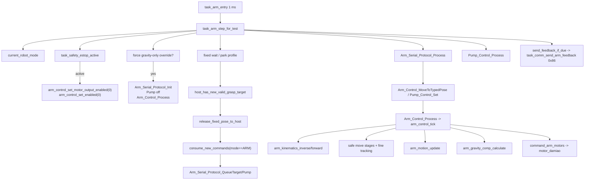
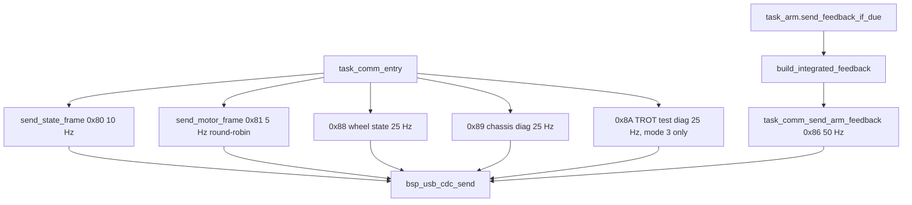

# 统一控制链路代码图

本文档是当前 FengMH 仓库的“代码级控制链路索引”。它只把工作区内固件代码作为事实来源；ROS 或其他上位机工程只按协议参与，不在这里列外部文件路径。

## 一句话模型

`task_comm` 独占 USB CDC 下行解析并缓存命令；`task_chassis` 和 `task_arm` 并行常驻；`ROBOT_MODE_NAV` 释放底盘速度，`ROBOT_MODE_ARM` 释放机械臂目标/泵命令；急停由 mode 和 safety task 双路保护。

## 模式互锁

| Mode | 底盘任务 | 机械臂任务 | 安全动作 |
|---:|---|---|---|
| `IDLE=0` | 速度/目标 yaw/steer mode 清零；无 mode 帧前保留旧调试兼容 | 清空 host 抓放状态、关闭全部气泵并返回 `PARK` 姿态 | 软件回到上电初始状态，电机保持供电 |
| `NAV=1` | 允许 `0x10` 速度进入 `chassis_control` | 不消费新 USB target/pump；保持当前/park 姿态 | 正常 |
| `ARM=2` | 底盘输入清零，保持 stand/hold | 进入第一箱等待姿态；到位且收到合法 GRASP 后消费 target/pump | 正常 |
| `ESTOP=3` | `task_chassis_entry()` 跳过 tick | 禁用达妙输出和控制器，不自动 enable | `task_safety_estop_set(true)` disable 全部电机 |
| `ERROR=4` | 同 ESTOP | 同 ESTOP | 同 ESTOP |

## 协议入口图

## 底盘代码图

### 底盘关键函数

| 文件 | 函数 | 作用 |
|---|---|---|
| `App/app/src/task_chassis.c` | `read_chassis_input()` | 复制 `task_comm` 缓存，并按 mode gate 清零不允许的底盘输入。 |
| `App/control/src/chassis/chassis_control.c` | `chassis_control_tick()` | 一个完整 500 Hz 底盘控制周期。 |
| `App/control/src/chassis/chassis_control.c` | `update_steering()` | 读取 IMU，更新 yaw/roll/pitch；目标 yaw 模式下生成实际 `wz`。 |
| `App/control/src/chassis/chassis_control.c` | `slew_plan_command()` | 对 `vx/vy/wz` 做斜率限制。 |
| `App/control/src/chassis/chassis_planner.c` | `chassis_planner_update()` | 普通行驶生成高频零平移步长和轮速；低速/原地转向保留原 walk 步长。 |
| `App/control/src/chassis/chassis_control.c` | `online_decide()` | moving 时普通移动走 trot，低速 yaw 转向走 walk，停止走 stand。 |
| `App/control/src/leg/leg_controller.c` | `leg_controller_apply_dt()` | IK、前馈分配、GO 命令，以及 M3508 跨腿相位有界积分 DRIVE/stand MIT HOLD。 |

## 机械臂代码图

### 机械臂关键函数

| 文件 | 函数 | 作用 |
|---|---|---|
| `App/app/src/task_arm.c` | `task_arm_step_for_test()` | 机械臂 task 的完整常驻周期：急停、纯重补、固定姿态、mode gate、旧协议处理、控制器、反馈。 |
| `App/app/src/task_arm.c` | `host_has_new_valid_grasp_target()` | 只有新的合法 GRASP 才能打断等待姿态。 |
| `App/app/src/task_arm.c` | `consume_new_commands()` | 非 ARM 模式同步并丢弃 seq；ARM 且已释放时排入旧协议队列。 |
| `App/service/src/protocol/arm_serial_protocol.c` | `Arm_Serial_Protocol_Process()` | 处理 target、pump、PLACE 延迟关泵和旧反馈兼容。 |
| `App/control/src/arm/arm_control.c` | `arm_control_set_target()` | IK、最近等效 J1、三段式/微调重规划。 |
| `App/control/src/arm/arm_control.c` | `arm_control_tick()` | 达妙自动 enable、轨迹、重力补偿、settling/REACHED、MIT 输出。 |
| `App/device/src/motor_damiao.c` | `motor_damiao_process()` | 周期性重发 enable，恢复无反馈/未使能达妙关节。 |

## 上行反馈

`0x86 ARM_FEEDBACK` payload 为 `arm_state,end_x,end_y,end_z,theta1_rad`。`build_integrated_feedback()` 使用兼容层 `Arm_Control_GetCurrentAngles()` + `Arm_Forward_Kinematics()` 生成米制末端坐标。模式 3 的 `0x8A` 输出相位、支撑掩码、四腿目标高度和八关节跟踪误差，可按时间戳与 `0x89` 的 `gyro_z` 对齐。

## 设备输出边界

| 设备 | 控制入口 | 总线 |
|---|---|---|
| GO-8010 髋/膝 | `leg_controller -> motor_go set_position -> motor_go_send_all()` | UART2/UART3/UART4/UART7 |
| M3508 轮毂 | `leg_controller -> motor_m3508 MIT -> motor_m3508_send_all()` | FDCAN1/FDCAN2 |
| 达妙 J1-J4 | `arm_control -> motor_damiao set_position/process()` | FDCAN3 |
| 主气泵 | `arm_control/pump_control -> arm_pump_set()` | GPIO PD11 |

## 测试覆盖索引

重点 host 测试覆盖：

- planner：轮驱零平移步长、前进/转向、`vy` 行为、死区、现场标定的固定 `0.2525 s` 周期和旧模式回退。
- gait：trot `0.055 m` 原地抬腿峰值、yaw 每腿步长、walk 三支撑、脚端字段。
- chassis：端到端、`vx=0.1 m/s` 有界积分 MIT 连续轮驱、stand height/MIT 锁轮、独立轮驱/超时、motion gait 切换、轮速 blend、mode gate、姿态补偿、机械臂载荷补偿。
- protocol：FuncID/长度分区、USB 到 task 缓存、`0x18` TROT 参数、`0x8A` TROT 诊断、ARM feedback TX、拒绝 ARM MIT 旁路。
- arm：IK/FK、五次轨迹、重补、J1 禁区、安全三段式、fine tracking、固定等待姿态、纯重补、ESTOP。
- device：气泵 GPIO、达妙 MIT 打包/反馈/FDCAN3 路由/自动 enable。
